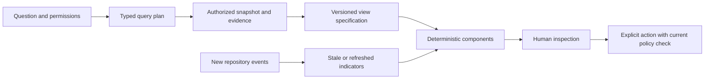

# The Jev canvas: questions become inspectable views

Design proposal, revised 3 October 2026 after feedback that the initial concept was too simple and hid preview build latency. Jev is TypeSafe AI's decision model. Its role is to choose and arrange supplied UI candidates; application code retrieves repository data and renders the chosen components. The current json-render integration is experimental and unreleased, so adoption requires a pinned source/version spike. Jev does not build the target application or invent its missing component props. [Jev integration documentation](https://json-render.dev/docs/jev). See also the workspace's [more detailed Jev proposal](claude-12-jev-canvas-design.md); its separately reported timings have not been reproduced in this pass.

## Show the application itself

The canvas must include rendered **screens and UI elements**: navigation, forms, tables, pricing cards, dialogs, error messages, loading states, and responsive layouts. A collection of repository-status cards does not adequately show what an agent changed.

Start a visual review with a screen or a component gallery. Select “Before / After / Split,” choose a viewport and state, then click a changed element. The adjacent inspector shows its source component, exact revision, associated change, relevant diff and observations. An accessibility change may alter focus or a label without changing pixels, so expose DOM/accessibility evidence as well as visual differences.

There are two different component catalogs: **Beanstalk's own view components**, which Jev selects, and **the repository's application components**, which must actually run in an isolated environment or be represented by a captured image. Do not recreate the target application's UI from a model's guess and call that a branch preview.

Proposed visual surfaces:

| Surface | What it shows | Where the content comes from |
| --- | --- | --- |
| Screen frame | A route such as `/settings/billing`, with desktop/mobile variants | Existing captured route or an authenticated application preview |
| Component gallery | The actual plan card, button, menu, dialog, and their states | Existing Storybook stories or an approved repository-specific harness |
| Before/after comparison | Same route/component, viewport, fixture, theme and scenario across two revisions | Two recorded builds/captures; missing new-side evidence stays missing |
| Interaction replay | Open dialog → validation error → successful submission | Recorded or live scenario, explicitly identified as such |
| Element inspector | Component/file, changes, provenance and evidence | Instrumented preview mapping or a clearly labeled inferred source association |
| Preview readiness | Saved view available, interactive session starting, review build pending | Actual scheduler/runtime events; readiness never implies tests passed |

An isolated component needs its styles, fonts, providers, routing context and fixtures. Prefer existing stories; otherwise start with a full route. Build tooling can attach source identifiers in development, but reliable DOM-to-source mapping needs framework support. A repeated button or portal must not be assigned a file by visual similarity alone. Treat model-suggested associations as hypotheses until verified.

## Do not wait for a full build to answer every question

Render the Beanstalk canvas from already indexed data and available visual captures. Load an existing component bundle or warm development session when interaction is requested. Trigger a production-style, exact-version candidate build when review needs it. A newly changed UI cannot be truthfully shown from a previous capture; while its render is pending, show the prior version, its revision, and the pending source change.

The [preview latency design](09-preview-speed-and-ui-surfaces.md) distinguishes those paths, their expected costs, and the measurements needed before promising timings. A ready UI view, an interactive development session, a pinned review build, and passing checks have separate states.

## A concrete first minute

Open Beanstalk on a project. Its stable home shows the current release, a short decision inbox, recent outcomes, and a conventional code browser. Ask:

> “Show me what is stopping the billing feature from shipping.”

The application uses Jev's choices to show the billing screen, affected UI elements, supporting changes, and missing evidence. An already captured baseline can appear first; a new or combined preview shows preparation progress until it exists. Each surface exposes its source revision, time of observation, and whether its contents are captured, interactive, proposed, or verified.

Click the billing preview. Follow the upgrade flow using a seeded test account. A failed action links to its trace, the contract it violates, and the changes involved. Ask “Compare the compatible migration with the clean break.” Two pinned candidates appear side by side, with consequences, checks, unresolved gaps, and costs. The user chooses an approach; Beanstalk creates or updates the relevant intent. A chat statement alone never silently rewrites the repository.

## Questions determine the layout

| Question | Generated view | Sources required | Useful next action |
| --- | --- | --- | --- |
| “What does this repository do?” | User flows, services, entrypoints, running demo | Code at SHA, manifests, docs, verified runtime observations | Follow a flow into source |
| “What changed since Tuesday?” | Behavioral changes, code changes, decisions, incidents | Explicit time range and timezone, base/head SHAs, event log | Compare a release or individual change |
| “Show the UI changes in this branch.” | Screen/component before-and-after, states, mobile view, source inspector | Exact revisions, component/route mapping, matched captures or runnable environments | Inspect an element or request interaction |
| “Which agents are duplicating work?” | Intent clusters and overlapping actual diffs | Current leases, scope declarations, symbol index, change revisions | Mark alternatives or rescope work |
| “What breaks if we remove this API?” | Callers, contracts, owners, migration candidates | Static references plus trace evidence and coverage gaps | Run a compatibility check |
| “Why is the merge queue stuck?” | Critical path, obsolete jobs, failures, retry history | Queue generations, exact candidate SHAs, runner timestamps | Cancel stale work or inspect a failure |
| “Can A, B, and C ship together?” | Dependency-closed candidate with integrated preview | Exact change revisions, combined tree, policy/check digests | Test and submit the candidate |
| “Is the agent telling the truth?” | Claim-to-evidence table, failed attempts, independent checks | Trusted runner receipts and provenance | Reproduce a check |
| “What can we accomplish for this budget?” | Prioritized intent portfolio and explicit assumptions | Measured costs and acceptance history | Admit a bounded batch |

If information is missing, the panel says what is missing. A graph edge inferred from names must not look identical to an observed runtime call. “No known conflict” must not appear as “compatible.”

## The canvas is a saved query plus a view



Generate a schema-validated view specification from approved components: screen frames, component galleries, before/after comparisons, element inspectors, change cards, requirement tables, dependency graphs, traces, diffs, timelines, check receipts, preview readiness, and decision controls. Repository code executes only inside the isolated preview runtime, never directly in the trusted canvas renderer. Generated links and actions resolve through an authorized registry, not arbitrary JavaScript or URLs supplied by repository content.

A proposed view envelope:

```json
{
  "schema": "beanstalk.view.v1",
  "question": "Can billing changes ship together?",
  "snapshot": {
    "repository_id": "repo_billing",
    "base_sha": "<full-commit-sha>",
    "candidate_id": "cand_42",
    "event_watermarks": {"changes-0": 801, "changes-1": 266},
    "captured_at": "2026-10-03T06:00:00Z"
  },
  "panels": [
    {"id": "requirements", "type": "obligation_table", "query_id": "q_17"},
    {"id": "changes", "type": "dependency_graph", "query_id": "q_18"},
    {"id": "demo", "type": "preview", "preview_id": "prev_42"}
  ],
  "actions": [{"id": "act_9", "kind": "candidate.request_integration"}]
}
```

The envelope is a design example, not a runnable API. Permissions are checked by the server on every query and action; saving an action ID or view does not confer authority. Use a manifest for coherent candidate evidence and per-shard watermarks for live activity. A distributed event stream cannot honestly promise a globally atomic “now” without an explicit snapshot protocol.

## Stable interaction rules

- **Keep the user's bearings.** Stable panel IDs, pinned positions, undo, saved named views, and a clear refresh control. Update values without rearranging the entire canvas.
- **Show evidence depth progressively.** Outcome → claim → check/run/trace → code diff → source. A graph is one view, not a mandatory navigation maze.
- **Make mutation explicit.** “Try this combination” can create a temporary candidate within a granted budget. “Integrate” and “deploy” identify exact revisions and invoke their separate policies.
- **Separate live from pinned.** Live branch preview follows an alias; the review frame pins an immutable candidate. A moving branch displays a new-version badge instead of changing under the reviewer.
- **Scale by aggregation.** Render clusters of intents, components, and blocked decisions; request detail on demand. Ten thousand agent avatars are not ten thousand useful facts.
- **Treat source text as data.** Prompt injection in comments, logs, README files, or screenshots cannot add permissions or change the allowed action registry.
- **Support everyone.** Keyboard navigation, accessible tables behind graphs, screen-reader labels, reduced motion, and a small-screen list mode. The conversation is optional for routine tasks.

## What can be reused locally

The workspace already contains a typed canvas element tool in an internal typed canvas-element tool (private repository, not linked). It defines structured text, chart, table, list, button, and section elements. This is useful precedent for constrained generation rather than evidence of a completed Beanstalk integration.

Before reusing it, inspect the corresponding renderer, license, dependencies, and permissions. Add repository-specific components and query bindings; the existing generic chart data and insertion API do not supply revision consistency, live subscriptions, or mutation authorization. Do not copy an entire application platform merely to get a canvas.

## Challenge the hypothesis

Run the same tasks with three interfaces: conventional PR dashboard, Jev conversation with links, and Jev conversation with a generated canvas. Ask a reviewer to locate a seeded integration bug, explain the shipping blocker, and select the appropriate candidate. Measure correctness, time, clicks, refresh confusion, and unwarranted confidence.

The canvas wins only if it improves a decision. If a table is faster, generate a table. If users spend more time arranging panels than resolving blockers, reduce spatial freedom. If they cannot tell which version they reviewed, the interface fails regardless of how attractive it looks.

The [local concept sketch](canvas-concept.html) uses authored UI elements and invented data to demonstrate visual changes, component selection, source inspection and staged preview readiness. Its application surfaces and builds are simulations, not extracted repository components, measured timings, or a Jev integration.
