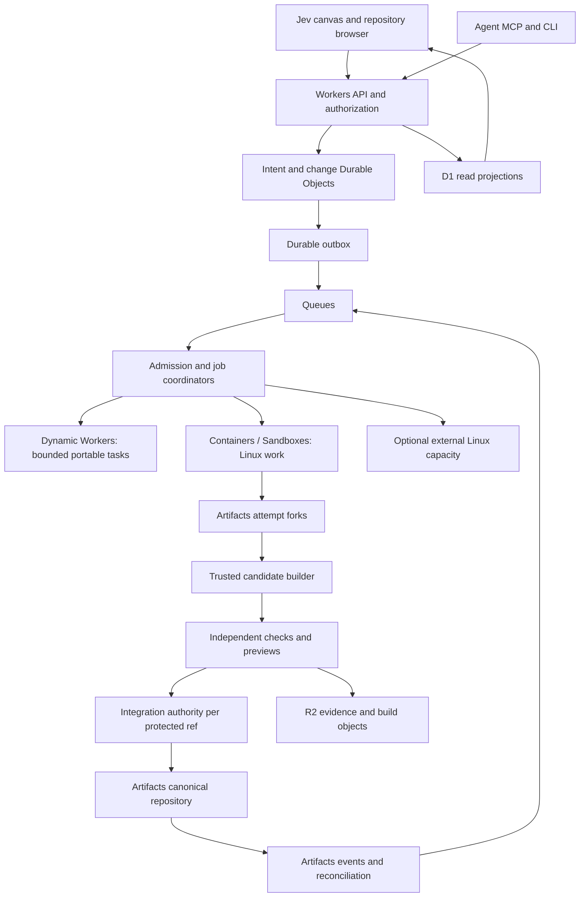

# Cloudflare architecture for agent collaboration

Research date: 3 October 2026. Platform facts below are linked to current documentation. Beanstalk components, algorithms, budgets, and performance targets are proposals; no scale claims have been benchmarked.

## Artifacts is the source layer

Cloudflare Artifacts supplies Git-compatible versioned repositories, programmatic creation/import/forking, repository tokens, and object/file reads. It does not supply Beanstalk's product decisions, review policy, agent scheduler, or Actions compatibility engine. Use **Artifacts** for Git source; use **R2** for CI outputs, screenshots, traces, and larger evidence objects. These are distinct uses of “artifacts.” [Artifacts overview](https://developers.cloudflare.com/artifacts/).

A useful starting layout is one canonical repository per project, one fork per autonomous attempt, and temporary integration repositories or refs controlled by the trusted integrator. The platform's own guidance favors independent repos for autonomous work, with separately stored metadata and deliberately partitioned namespaces. That is consistent with isolation; it does not prove cheap or instantaneous forks at our workload size. [Artifacts best practices](https://developers.cloudflare.com/artifacts/concepts/best-practices/).

The Workers binding exposes repository lifecycle, forking, token management, and reads; its documented surface is not a full Git merge engine. Use ordinary Git in a trusted Linux integration environment for candidate construction and pushes. The documented fork operation does not accept a base SHA: after readiness, verify the required base object and establish a pinned attempt ref before starting an agent. Capture the source SHA separately and reject any mismatch. [Workers binding](https://developers.cloudflare.com/artifacts/api/workers-binding/).

## Proposed topology

Start with Workers, Artifacts, Durable Objects, Queues, R2, and a small Linux execution pool. Add D1 for cross-object search and dashboard queries when needed. Workflows can manage long-running build/preview lifecycles, but must not become another independent authority for the same state. Vector search and graph databases are optional optimizations, not requirements for the first useful product.

| Component | Proposed ownership | Consistency rule |
| --- | --- | --- |
| Organization authority | Membership, budgets, agent delegation, policy versions | Authoritative checks before mutation; cached UI roles are insufficient |
| Intent/change object | Claim lease, revision history, dependencies, decision state | Atomic mutation within its object, optimistic version check |
| Scope index | Advisory impact/conflict discovery, partitioned by repo and scope | Eventual projections; unknown or delayed coverage is visible |
| Candidate manifest | Base SHA, ordered change revisions, result commit/tree, fixture/check/policy versions | Immutable; replacing any input creates a new candidate |
| Job coordinator | Execution lease, attempt count, cancellation generation, terminal status | Duplicate/out-of-order completions cannot resurrect old work |
| Integration authority | Publication to one protected ref | One serialized decision per ref with a remote expected-old check |
| Evidence store | Logs, trusted receipts, traces, screenshots, checksums | Content-addressed objects with separately authorized metadata |
| Query projections | Searchable cross-project summaries and canvas feeds | Rebuildable; no merge authority derived solely from a projection |

## The protocol that keeps concurrency honest

1. **Admit.** A task names its owner, acceptance criteria, dependencies, budget, and baseline. Deduplicate a repeated request using its idempotency key. A budget reservation must precede expensive work.
2. **Claim.** Grant a short lease with a monotonically increasing generation. Claims over files/symbols/contracts are advisory; avoid a global file lock. Task ownership is enforced on result submission.
3. **Isolate.** Prepare the fork, pin the base, and issue a short-lived token only for that fork. The [identity design](06-identity-mcp-and-live-previews.md) handles the native token's repo-wide scope.
4. **Observe.** Record actual changed paths, symbols, dependencies, schema changes, and build inputs. Compare actual scope with the claim. A widened scope triggers renewed conflict analysis.
5. **Propose.** Freeze a change revision and its diff. Preserve a stable change ID across revisions, while approvals/evidence bind immutable revisions.
6. **Compose.** Choose a bounded, dependency-closed set of revisions. Record the exact integration order. Resolve textual conflicts in an isolated candidate; a model-generated resolution becomes another reviewable revision.
7. **Validate.** Independent, trusted execution records results against the candidate and protected check definition. Agent-authored tests are useful additions, not replacements for trusted acceptance checks.
8. **Publish.** The integrator verifies current authorization, policy, approvals, evidence, and expected base. It advances the canonical ref to the exact tested commit.
9. **Reconcile.** Confirm the remote ref and then finalize local state, publish events, release reservations, and expire workspaces. Handle interruption between the remote push and local bookkeeping.

A clean text merge cannot establish semantic compatibility. Static scope analysis prioritizes likely collisions; contractual and behavioral checks establish narrower claims. Unknown interactions stay unknown.

## Ref publication and crash recovery

Serialize protected-ref publication, not every agent action. A project with many independent protected refs can have multiple authorities; one ordered Git branch still has an inherently sequential publication history.

Use a durable integration record with `operation_id`, `expected_old_sha`, `candidate_sha`, `policy_digest`, `lease_generation`, and state `prepared → pushing → confirmed` (or `stale/rejected/indeterminate`). The Git sender reads the remote and proposes an old/new ref update. A mismatching old SHA forces rebuild/revalidation; never overwrite newer work to make the queue appear successful. Git documents explicit expected-value leases, but their exact behavior against Artifacts and proxy paths is a conformance test, not an assumed platform API. [Git push reference](https://git-scm.com/docs/git-push), [Artifacts Git protocol](https://developers.cloudflare.com/artifacts/api/git-protocol/).

After a timeout, read the authoritative ref. If it equals the candidate, mark that operation confirmed. If it differs, inspect ancestry and operation records before retrying; a later successful publication may already descend from this candidate. If it still equals the expected old SHA, the result remains **indeterminate**: an earlier network request may still arrive. One read cannot prove quiescence. Block successor writes until definitive completion, demonstrable termination of the old send path, or a verified upstream fencing guarantee resolves the ambiguity. Escalate prolonged uncertainty rather than blindly retrying.

An old coordinator must not retain a broadly usable canonical write credential. Put the final Git write behind a trusted publication service. Define authorization's linearization point as the durable transition to `pushing`, after checking the current lease, policy, approvals, and exact candidate. That one reserved operation may finish even if permission is revoked after dispatch; revocation blocks new operations and cannot retract an already-sent push. Do not reassign its publication slot while its outcome is unknown. Tokens and expected-old CAS alone do not fence a delayed sender competing for the same old SHA. Test delayed pushes after revocation and publication-service failover explicitly.

There is no distributed transaction spanning a Durable Object, Artifacts, and an external deployment. Keep authority and recovery rules explicit. Persist an outbox with local state; retry delivery and make downstream operations idempotent. Cloudflare Queues delivers at least once and does not guarantee order, so all consumers need deduplication and generation checks. [Queue delivery guarantees](https://developers.cloudflare.com/queues/reference/delivery-guarantees/).

Artifacts emits lifecycle and push events, including the ref and before/after values. Use them as change notifications, then read current authoritative state. Store schema versions, reconcile periodically, and do not assume timestamps provide a total order or every event contains a full commit list. [Artifacts event subscriptions](https://developers.cloudflare.com/artifacts/guides/event-subscriptions/).

## Replace one enormous queue with bounded integration lanes

Use a graph of changes: edges for dependencies, alternative implementations, overlapping contracts, shared migrations, and conflicting requirements. An inverted scope index avoids comparing every pair. A component scheduler selects ready work fairly and reserves capacity for urgent fixes, while a project-level budget bounds aggregate cost.

Create a small number of candidate lanes: for example a conservative release candidate, an alternative architecture, and a compatibility migration. Each lane is a dependency-closed set, not an arbitrary combination of green PRs. If a base changes, stale evidence is invalidated according to exact input dependencies. Cross-component interactions still require combined integration tests before canonical publication.

Lanes converge through one selected, tested batch per protected ref. Competing alternatives do not independently publish against the same old base. For throughput, a later stage may construct an exact speculative prefix: candidate A has parent H, candidate A+B has parent A, and candidate A+B+C has parent A+B. Validate these immutable commits concurrently, then advance refs in order only when their exact prerequisites land. Failure of A invalidates dependent prefixes. The simpler first version integrates one tested batch and rebuilds the next; it must not advertise the speculative optimization before it exists.

Existing systems already speculate over CI and can bypass expensive changes under validated conditions. Uber's SubmitQueue is useful prior art; inventing a speculative queue alone is not differentiation. Beanstalk's opportunity is to connect the candidate graph to agent intent and a runnable decision surface. [Uber: bypassing large diffs](https://www.uber.com/ug/en/blog/bypassing-large-diffs-in-submitqueue/), [Uber: CI cost scheduling](https://www.uber.com/us/en/blog/slashing-ci-costs-at-uber/).

No exhaustive search: 1,000 independent changes have an infeasible number of subsets. Start with deterministic dependency closure, bounded beam width, and measured value per validation dollar. A language model can recommend a candidate; the scheduler owns feasibility and policy.

Cache successful checks only when their true input closure matches: source/tree and relevant commit metadata, dependency lockfiles, workflow and toolchain digests, fixture/environment versions, flags, trusted producer, and policy. CI can depend on commit SHA, history, time, or network state; identical source trees alone are not always sufficient. Cache test results conservatively and keep flaky outcomes visible. Never “retry until green” without recording failed attempts.

## Limits that shape the first version

| Platform fact, retrieved 2026-10-03 | Consequence for Beanstalk |
| --- | --- |
| Artifacts: 1 GB maximum per repository; 32 MB per blob | Preflight imports including history; keep binaries/build output outside Git; large monorepos are outside initial fit |
| Artifacts: 1 TB per account by default, raisable on request | Retained forks consume capacity; measure physical/billed growth and prune by policy |
| Artifacts: 2,000 control operations / 10 seconds / namespace | Smooth fork creation, token minting and cleanup bursts; deliberately partition workloads |
| Artifacts: 2,000 Git requests / 10 seconds / repository | A shared canonical remote can still be hot; use isolated attempts, immutable caching and admission |
| Durable Object: single-threaded with a soft 1,000 requests/second per object; SQLite storage 10 GB/object | One global coordinator is not the whole system; partition state and keep large evidence in R2 |

[Artifacts limits](https://developers.cloudflare.com/artifacts/platform/limits/), [Durable Object limits](https://developers.cloudflare.com/durable-objects/platform/limits/).

A Git operation may make multiple requests, so a request-rate limit is not an agent-throughput promise. Namespace sharding must respect account capacity and supported bindings/routing; it is an architectural partition, not an attempt to evade provider limits. See [Actions capacity](05-github-actions-portability.md) and [preview limits](06-identity-mcp-and-live-previews.md) for execution bounds.

ArtifactFS can hydrate file content on demand using a blobless clone and FUSE. Benchmark it only after ordinary clone performance becomes material, and first prove FUSE works in the selected runtime. A full-repo build may read nearly everything and erase the startup benefit. [ArtifactFS guide](https://developers.cloudflare.com/artifacts/guides/artifact-fs/).

## A capacity model, not a scale claim

Assume 1,000 logical agents each submit an average of one change per ten minutes: arrival rate is about **1.67 changes/second**. If each candidate check takes 120 seconds and cannot reuse results, roughly **200 concurrent jobs** are needed just to match validation demand, before retries, previews, and headroom. Forty admitted jobs provide at most **0.33 validations/second** under these assumptions. These are compute bounds, not accepted throughput. On one protected ref, independently tested candidates sharing the same base stale each other; without batching or the prefix scheme above, publication may approach only **one change per 120 seconds**. A tested batch of ten changes would instead yield at most ten changes per such cycle, before failures and overhead. Backpressure must follow the slower of validation, integration, and human decision capacity.

If a human spends three minutes reviewing each change, 1,000 changes require 50 reviewer-hours. Grouping evidence may help, but blanket autoapproval does not make that requirement disappear. Split low-risk policy-authorized work from decisions requiring a responsible reviewer, and measure escaped errors.

For 10,000 agent sessions, 30-second heartbeats alone average 333 events/second before other operations; at 100,000 they average 3,333. Use partitioned coordinators, longer leases for inactive work, jitter, event batching, scoped subscriptions, and coarse UI aggregation. Avoid all-to-all agent chatter: 1,000 participants already have 499,500 unordered pairs.

## Economics and retention

Artifacts is on Workers Paid; published billing starts 14 October 2026. Rates list 10,000 operations and 1 GB-month included, then $0.15/1,000 operations and $0.50/GB-month. Repository storage persists until deleted; daily peak storage affects monthly averaging. These are storage/operation charges, not total system cost. [Artifacts pricing](https://developers.cloudflare.com/artifacts/platform/pricing/).

Derived examples: one million operations in a month costs about **$148.50** above the stated operation allowance. If 1,000 forks were each billed at 200 MB for a full month, that is about 200 GB-month and **$99.50** above the storage allowance. Cross-fork deduplication and billed copy behavior need measurement; do not assume a shared baseline is free. Short-lived forks can still affect daily peaks.

Budget per accepted intent: model inference + Git operations/storage + Linux execution + Workers/coordination + R2/logs + network + preview residency + failed speculation. Preserve accepted commits and essential receipts before cleaning temporary forks; enforce legal/product retention requirements explicitly. Keep secrets and personal transcripts out of long-lived Git history. Export code plus machine-readable decision/evidence manifests so migration does not require adopting a new VCS.

## Failure cases to demonstrate before trusting the design

- Two agents edit different files but disagree on a schema contract: a combined check must catch the break.
- A candidate passes; the base or protected check changes: previous evidence must not authorize publication.
- An executor restarts after a side effect: no automatic repeat without determining the outcome.
- A lease expires and its original holder reports success late: reject stale ownership.
- An Artifacts event is duplicated or delayed: project state and billing remain correct.
- A tenant submits a huge job matrix: admission bounds both compute and active objects.
- A user loses access while a preview is open: new requests and subscriptions enforce revocation.
- A fork is removed while evidence is under retention: accepted source and required evidence remain recoverable.

These are validation requirements. The repository currently contains research and design documents, not an implementation of this architecture.
