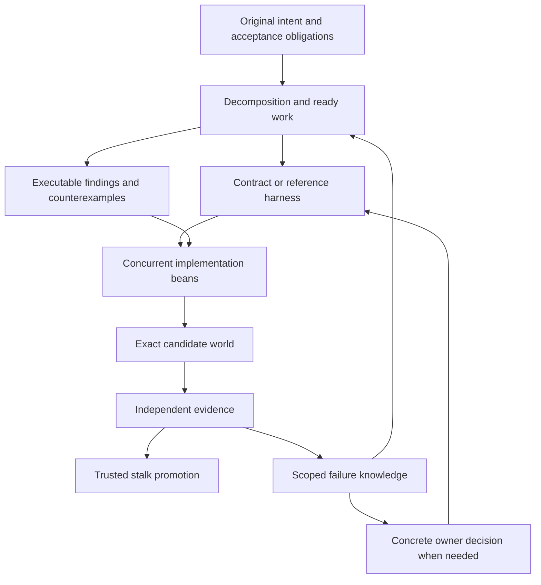

# Making 1,000 agents useful together

Codex research follow-up, 2026-10-06. Reviewed through `3def4a1`, including the scheduler fix and `d4e6bc4` test update. This is a proposed collaboration protocol and experiment plan, not an implemented replacement for v2.5 or a measured thousand-agent result. The companion [capacity calculator](../research/algorithm-review/capacity.py) performs hypothetical arithmetic only.

**Owner's subsequent direction:** [09d](09d-bean-intents-and-agent-communication.md) reframes these ideas around an agent-agnostic forge. Agents choose their own work and use bean intents, approach notes, requests and promises to collaborate. The central planning and agent-allocation suggestions below are research alternatives, not requirements of the contribution model.

**Recommendation:** extend Beanstalk so agents contribute versioned contracts, executable discoveries, counterexamples and implementation operations, alongside ordinary code beans. Use those artifacts to create independent work and stop repeated investigation. Keep the trusted integrator and exact-world validation. The opportunity is to make each agent's work useful to the next hundred agents.

## What the current evidence actually establishes

- [E4 scale replay](claude-opus/exp/e4-scale-replay.md) landed 895 of 3,000 historical changes with 1,000 simulated agents. Its committer was about 3% busy, but 2,101 changes never applied. It used real merge outcomes, simulated work/check durations and no semantic failures. This establishes a dependency problem in that replay; it does not establish capacity for 1,000 productive live writers.
- The [30-agent post-mortem](claude-opus/11-experiments-summary.md#30-agent-post-mortem-2026-10-06-cf-demo-sonnet-30-s7) shows that even a much smaller team can spend substantial capacity rediscovering one shared migration failure. A passing repair waited approximately 11.8 minutes behind the landing window. The [previous review](09b-algorithm-optimization-review.md) gives the raw-run audit and recovery proposals.
- Current dependency starts infer edges from predicted module overlap and declared couplings, then orient them by task priority. Those are useful scheduling signals, but an overlap hazard is different from an actual missing prerequisite. See [v2-start-order.ts](../packages/gateway/src/engine/v2/v2-start-order.ts).
- `d4e6bc4` updates the burst30 fixture after the starvation fix: 36 green / 4 parked, with the 35th green around 20.5 minutes. The previous 37 / 3 and roughly 27-minute fixture expectations are historical. Re-pinning a fixture is not independent validation of a speedup.

The broader evidence also depends on task structure. A controlled study of 180 agent-system configurations found that decomposability and coordination costs strongly affect whether more agents help; those benchmarks were not a thousand coding agents on one repository. [Towards a Science of Scaling Agent Systems](https://arxiv.org/abs/2512.08296).

## What is already in the notes

These broad ideas have already been proposed and should retain their attribution:

| Existing idea | Where | Additional mechanism investigated here |
| --- | --- | --- |
| Recursive planners, intent DAGs, conflict clusters | Claude-11 #8; Opus `03` #1, #8 | Explicit obligations, incremental replanning, and tasks that create parallelism |
| Contract beans and contract-first work | Claude-11 #10; Codex `02`; Opus fable #7 | Conditional receipts, exact provider/consumer versions and bounded unfinished fan-out |
| Recipes, generated registries, migration numbering at commit | Opus `03` #6–7; fable #11 | Typed effects, stable logical identities and invariant checks before materialization |
| Shared context, architecture memory, stigmergy | Codex `02`; Claude-11 #14–17; Opus `03` #10, #23 | Executable findings with dependency invalidation and reusable negative results |
| Challengers, mutation tests, diverse attempts | Claude-11 #20; Opus `03` #24 | Allocate verification by marginal defect detection across evidence channels |
| Decision memory and attention budgets | Claude-11 #17, #24; Codex `02`; review `09b` | Schedule and group questions by the original work an answer can resolve |

The proposals below adapt established systems techniques to Beanstalk. Their value must come from the resulting protocol and measured outcomes; they are not claims of academic novelty.

## 1. Give some agents the job of creating parallelism

Today the scheduler chooses among existing tasks. Add an explicit kind of task whose output makes a blocked problem separable: a reference adapter, a differential test harness, a stable interface, or a narrowly scoped extraction that removes a shared bottleneck.

**Concrete example:** a large migration from one pricing implementation to another has many agents repeatedly debugging the same integrated failure. First build a harness that keeps the old implementation everywhere except one selected component. Agents can then replace different components and compare their outputs against an approved behavior specification. The final run removes the reference substitutions and checks the whole replacement.

There is direct precedent. In Anthropic's compiler experiment, 16 agents converged on the same Linux-kernel failure. A human-built harness compiled most files with GCC and a selected subset with the new compiler, making independent investigations possible. Interacting failures still required additional diagnosis. This is evidence that the harness can create useful parallelism, not evidence that arbitrary tasks become independent. [Anthropic's compiler account](https://www.anthropic.com/engineering/building-c-compiler).

**Protocol:** identify the prerequisite or shared uncertainty blocking the most valuable unfinished intents; propose a bounded harness/interface task; preserve the original acceptance criteria; measure how much verified independent work it enables. The planner may propose a decomposition but cannot weaken the parent requirement to make completion easier.

Track typed edges separately: a hard implementation prerequisite, a conditional interface promise, an overlap hazard, and an unresolved owner choice. A stalled overlap can tolerate speculation; missing required functionality cannot be made available by a timeout. Cycles require integrated work or a legitimate interface split, not fabricated DAG ordering.

**Experiment:** compare ordinary decomposition against one harness-building task plus the same total agent budget on a coupled migration. Include setup, adapter removal, final integration and failures crossing partitions. Keep the original parent acceptance tests independent of the decomposer.

**Reject it if:** the apparent parallelism merely defers all difficult work to final integration, the reference cannot establish the required behavior, or harness costs exceed avoided duplication and waiting. Start with migrations/refactors where a trustworthy reference exists; a new product policy has no automatic oracle.

## 2. Turn contract beans into executable promises

Let agents start against an immutable interface contract before its provider is implemented. Make their evidence explicitly conditional.

For a shipping quote feature, one contract can specify request/response shape, currency units, expiry, error cases and relevant behavior. The provider, checkout, invoices, admin UI and SDK can then be developed concurrently. Merely agreeing a TypeScript shape is insufficient: two implementations can typecheck while disagreeing about rounding or time.

**Protocol:**

1. Publish `contract@revision` with acceptance obligations, fixtures, assumptions, provider task and a speculation budget.
2. Every consumer pins that revision. Test adapters/stubs exist only in its conditional test environment.
3. A consumer's receipt records `conditional on contract@revision`; it never counts as delivered behavior or a green stalk.
4. Verify the real provider against the same contract. Distinguish a proposed unsupported interaction from a regression in an already supported interaction.
5. Assemble exact provider and consumer revisions, remove temporary substitutes, and obtain the required integrated-world evidence.
6. A contract revision invalidates or schedules reassessment for its consumers. It never silently retargets them to “latest.” Circular promises cannot discharge one another.

Pact provides a useful precedent for exact-version compatibility and pending contracts: an unsupported new expectation remains a failed verification even when it does not break the existing provider's build. [Compatibility matrix](https://docs.pact.io/pact_broker/can_i_deploy), [pending contracts](https://docs.pact.io/pact_broker/advanced_topics/pending_pacts). This proposal adds Beanstalk scheduling and conditional work; interaction tests alone do not establish all system invariants.

**Bound the risk:** begin with a small number of consumers per unfinished provider. Expand only when contract stability and provider progress justify it. Price speculative exposure in work minutes and value of affected intents, not just number of branches. A popular unstable contract can create more rework than one bad code bean.

**Experiment:** one provider and 5–10 consumers, comparing current dependency starts, conditional-contract starts and unconstrained parallel starts. Revise the contract halfway through in a separate trial. Equalize total budget and final acceptance.

**Reject it if:** negotiation plus adaptation costs erase the overlap benefit, integrated completion does not improve, or any mock-only result is reported as delivered. For a stable contract the ideal timing is approximately `setup + max(provider, consumers) + integration`; it is only an upper-level planning model, with rework still to be paid.

## 3. Let agents submit certain operations instead of competing over representation

A tiny catalog of typed operations can remove avoidable contention before textual merging. Begin with migration identities and registry entries, extending Claude's numbering and generated-file proposals.

An illustrative operation has `kind`, `logical_id`, `payload_hash`, `requires`, and `invariant_revision`. An agent requests “register this migration after these prerequisites”; the trusted materializer determines its rendered metadata. Its SQL and other implementation remain ordinary code subject to checks.

**Protocol:** stable IDs are derived from project, bean and local operation identity. Delivery retries are idempotent; the same ID with a different payload requires an explicit revision or is rejected. A project-defined materializer renders the registry deterministically. Admission checks current uniqueness and dependency obligations. Residual patches cannot bypass the controlled registry. Receipts include operation inputs, materializer version, policy/invariant revision and resulting tree.

Separate arbitrary unique identity from a particular scarce public name. Internal IDs can use disjoint namespaces. A specific route or exported API name needs an authoritative choice or fenced reservation; an expired holder cannot publish after reassignment. Public names cannot be silently renamed to make two changes fit.

The underlying principle is to coordinate only where the operation and invariant require it. Database invariant-confluence research distinguishes uniqueness through separate namespaces from conflicting claims to a particular value. Its guarantees apply to specified operations and invariants, not arbitrary source programs. [Coordination Avoidance in Database Systems](https://www.vldb.org/pvldb/vol8/p185-bailis.pdf).

**Limits:** unique migration numbers do not establish migration order or SQL compatibility. Exact route registrations may still overlap through wildcards or middleware order. Regenerating a lockfile does not prove dependency updates commute. Start with a narrow effect boundary and retain whole-world validation.

**Experiment:** compare current integration, numbering-at-commit alone, and typed operations on the migration arena. Separately stress the metadata protocol with 1,000 simulated producers, duplicated deliveries, stale revisions and revoked reservations. The stress test establishes protocol behavior, not coding productivity.

**Reject it if:** the richer system yields no improvement over simple numbering, unknown effects bypass checking, valid work is frequently rejected, or the materializer becomes another expensive serial gate. A cheap duplicate-ID and migration-load check remains the first practical step.

## 4. Make discoveries and counterexamples reusable contributions

A useful discovery can be worth more than another patch. Represent it as a small versioned artifact, with a precise claim, input scope, assumptions, reproduction, observed result and provenance. Other agents consume the artifact as a dependency.

Examples include “this loader rejects two distinct filenames with the same sequence number” or “this exact order produces different totals under line and invoice rounding.” A failed optimization should preserve the smallest counterexample, so the next agent does not pay to rediscover it. A failed attempt establishes a local negative result, not that every possible solution is impossible.

**Protocol:** retrieve candidate findings; check their validity; record which tasks consumed them. Start with exact-input reuse. When inputs change, rerun the small reproduction before interrupting all consumers. If the finding's relevant output is unchanged, retain consumers whose assumptions still hold. If it changes, send a compact delta to affected tasks. Keep hypotheses distinct from runner-observed results and owner decisions. Approximate similarity suggests reuse; it cannot certify it.

This borrows explicit dependency tracking and change pruning from incremental build systems. Their correctness relies on recording inputs; arbitrary agent reasoning, ambient environment and network observations do not become hermetic merely because we attach hashes. Unknown dependencies require conservative refresh. [Bazel Skyframe](https://bazel.build/reference/skyframe), [Build Systems à la Carte](https://www.microsoft.com/en-us/research/publication/build-systems-la-carte/).

Give shared investigations a claim generation and timeout so exact duplicate requests can await one result. Preserve deliberate independent verification: it should not unknowingly inherit the author's conclusion as its premise. Minimize/deduplicate executable witnesses so shared knowledge does not simply become an ever-growing CI suite.

**Experiment:** select repeated investigations from actual transcripts; compare ordinary handoffs with executable finding artifacts under equal budgets. Inject a changed dependency and a hidden dependency. Measure repeated tool/model work, stale findings consumed, maintenance cost, and accepted parent intents.

**Reject it if:** stale reuse introduces errors, maintenance exceeds saved investigation, or sharing suppresses the independent evidence needed to detect a mistaken premise. An ambiguous expected result becomes a question; it does not automatically become a regression test.

## 5. Learn which combinations fail, with explicit limits on that knowledge

An ordinary pairwise conflict graph cannot represent every integration problem. For example, A enables a promotion, B enables loyalty credit, and C enables free shipping: all pairs pass, but the triple violates a profitability requirement. A fourth bean may legitimately repair the triple.

Store versioned interaction records connecting multiple beans, contracts, assertions and decisions. Use them to avoid repeated diagnosis, choose candidate worlds and explain unresolved combinations.

**Distinguish two evidence classes:**

- **Derived constraints:** an authoritative rule plus a trusted checker can establish a hard incompatibility, such as two different handlers claiming the same uniquely assigned route in the same policy revision.
- **Observed failures:** a test establishes failure for its exact effective inputs. Cache that observation and use broader associations to prioritize investigation. Do not generalize it into a permanent ban on every future world containing those beans.

The scheduler can solve declared dependencies and derived constraints, then test a small number of promising candidates. Missing tests mean unknown. Repairs, new bean revisions, policy revisions and relevant environment changes require reassessment. Keep a bounded number of candidate worlds; do not enumerate every subset of 1,000 beans. A deterministic greedy selector is an appropriate baseline before adding an optimizing solver.

PubGrub demonstrates conflict-driven reasoning and human-readable incompatibility explanations for dependency versions. Beanstalk's empirical failures are weaker evidence than logically derived solver clauses; that distinction is essential. [PubGrub algorithm](https://github.com/dart-lang/pub/blob/master/doc/solver.md).

For exploration, test small interaction neighborhoods using constrained combinations, escalating interaction strength where observed failures justify it. Pairwise testing is not an assurance boundary, and contract fields must actually represent the behavior under test. [NIST's practical combinatorial testing guide](https://csrc.nist.gov/pubs/sp/800/142/final), [NIST's warning about pairwise sufficiency](https://csrc.nist.gov/Projects/automated-combinatorial-testing-for-software/software-testing-methodology/dos-and-don-ts-of-testing).

**Experiment:** repeated pair failures, a triple-only failure, two independent blockers, a fourth-bean repair, and a test/contract revision. Compare current diagnosis, exact-result caching, and scoped interaction records with identical check budgets. Include the existing unrevertable migration episode.

**Reject it if:** it excludes a valid repair, reports absence of a test as success, or spends more solving/checking combinations than it saves. Start as an advisory diagnosis index; only declared, adequately checked invariants should become hard scheduling constraints.

## 6. Allocate agents across different kinds of evidence

A thousand-agent pool should change composition with the bottleneck. If there are only forty genuinely ready implementation tasks, extra writers cannot manufacture prerequisites by staying busy. Useful remaining jobs may include discovering input partitions, minimizing a failing example, verifying a provider, or testing a cross-contract interaction. Once those jobs also have low expected value, remaining capacity can wait.

Extend the existing challenger design with an evidence ledger. Record which risks have been checked by specification-based tests, reference comparisons, metamorphic properties, migration/load checks, browser flows or narrowly applicable formal checks. Select optional evidence by its measured additional defect detection and cost. Keep mandatory checks and a small exploration/audit allowance so the allocator can discover blind spots.

Three agents agreeing after reading the same rationale is weak evidence. Compare distinct evidence channels against same-model and mixed-model reviewers under an equal budget. Measure joint misses, false escalations and real-bug detection as well as mutant detection. Passing a mutation bank is a useful measurement, not proof of correctness.

Use existing deterministic state transitions to dispatch jobs. A giant supervising model reading every worker transcript would add a costly dependency to every task. Planning agents should wake for decomposition gaps and meaningful contradictions; normal completion, invalidation and retry handling should follow versioned records.

**Experiment:** a held-out fault bank and a fixed compute budget, then a real small-team race. Count total model, runner and human costs. **Reject it if:** the extra checker adds no marginal detection, the allocator repeatedly starves an obligation, or apparent savings come from silently removing required evidence.

## 7. Let one human answer settle a class of work

At scale, even a low per-bean escalation rate can overwhelm a person. Schedule questions around shared uncertainty, using concrete cases and explicit affected contracts.

For rounding, show one order whose line-level and invoice-level results differ, then ask for the intended rule with the affected flows visible. An answer creates a scoped, versioned decision plus executable examples. Update the affected obligations, prompts and tests; retire superseded evidence; wake the consumers. Keep unrelated disagreements separate even if their wording resembles each other.

Rank questions by expected valuable work resolved per human minute, with deadlines and aging. Agents can show the consequences and existing policy. They cannot supply missing authority by voting, inventing policy, or silently treating a timeout as approval. The current pair-oriented decision state is a concrete starting point for this extension: [v2-decisions.ts](../packages/gateway/src/engine/v2/v2-decisions.ts).

**Experiment:** a fixed human-attention budget comparing per-bean cards with grouped, example-backed questions. Measure original intents completed, decision reversals, mistaken scope, omitted consequences and remaining blocked work. **Reject it if:** compression hides meaningful choices or increases decision errors.

## The graph that connects these mechanisms

The existing intent/bean/world model remains. Add versioned edges for consumes-contract, requires-implementation, consumes-finding, satisfies-obligation and governed-by-decision. Keep overlap hazards as predictions rather than silently promoting them to true dependencies.



A task completion must match its current criteria and attempt generation. A timed-out worker's late message cannot satisfy a reassigned task. Duplicate events are idempotent. Parent completion requires its original acceptance obligations; closing every generated child is insufficient if decomposition omitted a requirement.

Physical graph partitioning and the single canonical Git writer are separate decisions. Local work queues and scoped subscriptions can reduce coordination traffic without prematurely introducing multiple authoritative trunks. Benchmark actual useful arrival rates before sharding integration.

## Capacity arithmetic: what productive scale would demand

Assume, purely for illustration, 1,000 ready writing agents each produce one candidate every **20 minutes on average**. That is 50 candidates/minute or 3,000/hour, before rejected work and repair. E4's 20-minute median is not this assumed mean.

The calculator exposes all parameters. These are resource demands, not forecasts of accepted output:

| Resource | Hypothetical assumptions | Derived demand |
| --- | --- | --- |
| Validation | 75-second run; 25 distinct newly evidenced beans per batch; 1.2 runs/batch; 75% target utilization | 4 validation slots |
| Validation | Same, but 10-minute runs | 32 validation slots |
| Committer | 1-second push per bean plus 0.03 seconds other work | 85.8% utilization demand |
| Committer | 3.6-second push per bean plus 0.03 seconds other work | 302.5%; unsustainable without batching or lower arrivals |
| Committer | 3.6-second push shared by 10 beans, plus 0.03 seconds/bean | 32.5% utilization demand |
| Human choices | 5% of candidates need one 3-minute answer each | 450 human-minutes/hour |
| Shared human choices | Each answer genuinely settles 10 such candidates | 45 human-minutes/hour |
| Work exposed during one check | 50 new candidates/minute; a 75-second or 10-minute check | 62.5 or 500 candidates produced during that interval |

The exposure row is volume produced during a duration, not a measured speculative-window size. Validation demand excludes pre-land checks, runner startup and separate repair jobs; constant batch runtime and sustained full batches are assumptions. Push grouping may add fill latency. A repeated snapshot does not count the same already-verified bean as newly evidenced again.

Formulas, with arrival rate `lambda` in beans/minute:

```text
lambda = min(writer_slots, ready_width) / mean_work_minutes
validation_slots = ceil(lambda * rounds * validation_minutes / (batch * utilization_target))
committer_demand = lambda * (push_seconds / push_group + other_seconds_per_bean) / 60
human_minutes_per_hour = lambda * 60 * question_share * minutes_per_question / beans_per_answer
```

Run from the repository root:

```bash
python3 research/algorithm-review/capacity.py --writers 1000
python3 research/algorithm-review/capacity.py --writers 1000 --validation-seconds 600 --push-seconds 3.6 --beans-per-push 10 --beans-resolved-per-decision 10
python3 research/algorithm-review/capacity.py --writers 1000 --ready-width 40
```

When ready width is 40, the last case produces only 120 candidates/hour under the same duration assumption. Registering another 960 agents does not change it. Other roles can improve that width or evidence throughput; their cost still belongs in the total.

## What to test first

| Order | Work | Evidence required before expanding |
| --- | --- | --- |
| 1 | Finish recovery experiments from `09b`; add the migration-load/uniqueness guard | Real stall avoided without losing valid features; restored old green measured separately from feature redelivery |
| 2 | One provider plus consumers using contract promises | Faster integrated parent completion at equal budget; no conditional receipt promoted as green |
| 3 | Reusable executable findings from repeated arena failures | Less repeated investigation, with stale/hidden-dependency cases handled correctly |
| 4 | Typed migration operations, compared with simple numbering | Fewer repair turns; stable identity and stale-generation behavior verified |
| 5 | Multi-party interaction records and question grouping | No permanent exclusion of a later repair; fewer repeated checks and useful decisions per human minute |
| 6 | 1,000-worker metadata load test, then progressively larger live teams | Correctness under duplicate/out-of-order events and changed criteria; bounded dispatch latency, costs and queues |

Separate experiments by one mechanism at a time, use multiple seeded task orders and matched budgets, and keep hidden end-to-end acceptance checks. Simulations can test the coordination protocol; they cannot establish live agents' adaptation, semantic judgment or productivity.

Report original accepted intents and user-visible behaviors, time to comparable milestones, total cost, human minutes, repeated investigations, speculative rework and escaped defects. Count registered agents, executing writers and evidence jobs separately. Splitting one feature into a hundred beans must not produce a hundredfold productivity gain on the dashboard.

The most promising first product demonstration is a provider and several consumers developing concurrently under one explicit contract, an injected contract change invalidating only its consumers, and one concrete owner answer updating the relevant work. That directly shows the new collaboration model while remaining small enough to audit.

## Local verification follow-up

The required repository check exposed two timing assumptions in existing tests. The repository-retention test calculated its young cutoff after running the race, assuming setup took less than one second; it now captures the cutoff before creation. The CPU-heavy 30-agent fixture now has the same 30-second allowance as the related dependency-chain fixture, preserving its outcome assertions. These are test corrections; no runtime integration policy changed. The capacity examples were executed and the report's local links checked. `pnpm check` passed after these corrections.
