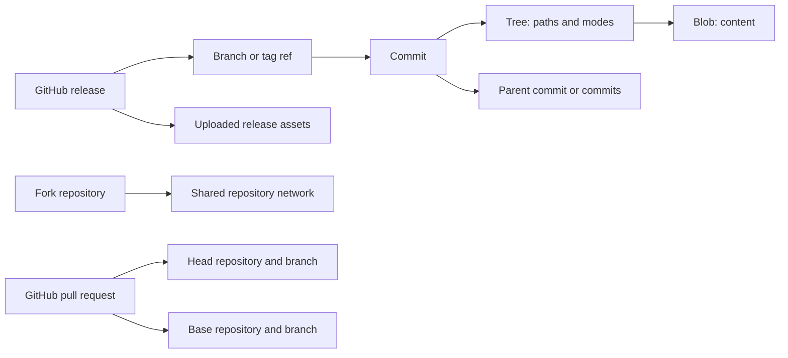

# Code, Git history, branches, forks, tags, and releases

Checked against current GitHub.com documentation on **2026-10-03**. This chapter maps **91 component groups**, C001–C091. It covers repository content and version navigation, changes to files, Git history, forks, and distribution. Settings screens are excluded; policy effects that users encounter while browsing or contributing remain in scope. Pull-request review conversations and merge operations are mapped in the collaboration chapter. The repository shell and Codespaces lifecycle belong to the adjacent chapters.

Evidence labels: **D** = an official article explicitly describes the behavior or component; **I** = an inferred UI arrangement or Beanstalk implementation requirement, not proof of a current GitHub layout; **O** = observed text/markup from a live public GitHub page; **V** would mean a screenshot was visually inspected. No V claims are made here. A D citation to API documentation proves data semantics, not the visual placement of a control. Source IDs below resolve to official links; the machine-readable registry is [research/code-sources.json](research/code-sources.json).

## Objects that the interface must keep distinct

| Object | Meaning and UI consequence | Evidence |
| --- | --- | --- |
| Blob and tree | A blob is file content; a tree supplies paths and modes. The same bytes can appear at different paths. File identity therefore needs repository, revision, and path, not just a filename. | D [CS40], [CS41] |
| Commit | A snapshot with a tree, parents, author, committer, message, and object ID. A displayed changeset is computed against another snapshot; the commit itself is not merely a patch. Author and committer can differ. | D [CS22], [CS39] |
| Branch/ref | A named reference to an object, normally a commit for a branch. Updating the branch changes what a branch URL resolves to. A default branch is a GitHub repository choice, not a universal Git name. | D [CS02], [CS44] |
| Tag | A named reference can be lightweight or point to an annotated tag object with tagger, message, and optional signature. A tag object is immutable content; the named ref can move unless protection forbids it. | D [CS43], [CS44], [CS08] |
| Comparison/changeset | A computed relationship between revisions: commits, changed paths, hunks, additions/deletions, and possibly renamed/binary files. It needs an explicit comparison mode and resolved revisions. | D [CS02]; I data contract |
| Fork | A separate GitHub repository in a repository network, with its own collaboration objects. A branch is inside one repository; a fork has a different repository identity. | D [CS25] |
| Release and asset | A GitHub publishing record associated with a tag, with notes and publication flags. Uploaded assets are separately stored files; generated source archives are downloads of the tagged snapshot. | D [CS28], [CS29], [CS08] |
| LFS object, submodule, symlink | LFS stores a pointer in Git and bytes elsewhere. A submodule pins another repository's commit. A symlink stores a target path. None should silently behave like an ordinary source file. | D [CS36], [CS40], [CS41] |

**Revision is a first-class context.** Beanstalk should carry repository ID, ref kind/name, resolved commit OID, path, renderer mode, and selected line/range through navigation. This is a proposed contract (I). It prevents a line link, blame row, symbol result, and download from accidentally referring to different versions. Commit IDs are the stable choice for a shared file URL; branch links intentionally follow future changes. [CS06]

The diagram is a simplified design model (I), not an exhaustive Git schema: annotated tags insert a tag object between ref and target, and Git tags can technically target objects other than commits. [CS43]

## Content browsing and file understanding

Read-access gates apply to this table. Empty repositories, missing paths, stale refs, and denied access need different outcomes; an empty result must not imply a file never existed (I).

| ID | Surface/component | Data shown | Actions/drilldown | States/gates | Evidence |
| --- | --- | --- | --- | --- | --- |
| C001 | Revision selector | Current branch/tag; available names | Switch revision; open all branches/tags | Default branch; commit context; missing ref | D [CS02], [CS17], [CS03]; I commit treatment |
| C002 | File tree outline | Directory hierarchy; current path | Expand folders; open file; create file entry | Expanded/collapsed; narrow layout | D [CS10], [CS17]; I outline details |
| C003 | Directory table | Names, last commit message/date | Open folder or file | Empty directory listing; lazy metadata | O [CS01]; I loading state |
| C004 | Breadcrumb/path navigation | Repository-relative path segments | Navigate ancestors; retain revision | Root versus nested path | D [CS13]; I read-view placement |
| C005 | Go to file/file finder | Filename/path matches | Type to find; open result; shortcut `t` | No match; keyboard selection | O [CS01]; D [CS03]; I result layout |
| C006 | Latest commit/history strip | Latest commit; history entry and count | Open commit or branch history | Missing metadata; count limits | O [CS01]; D [CS38]; I metadata details |
| C007 | Clone/download Code menu | HTTPS/SSH/CLI connection text | Clone history; open Desktop; selected-ref source ZIP | Clone checkout not determined by browser ref | D [CS59], [CS08] |
| C008 | Snapshot archive entry | Selected ref or commit, ZIP/tarball | Download snapshot | No Git history; content versus byte stability | D [CS08], [CS47] |
| C009 | Repository README panel | Rendered project introduction | Read; follow project links; open source | `.github`, root, `docs` precedence; truncation | D [CS33] |
| C010 | Markdown outline/anchors | Heading hierarchy and section anchors | Open outline; jump/link to section | Heading availability; selected revision | D [CS33] |
| C011 | Repository file-document navigation | README, contribution, conduct, license, security entries | Open selected document | Only available files surfaced | O [CS01]; I conditional rules |
| C012 | Language summary | Detected repository languages | Inspect language breakdown | Default-branch update; detection limitations | D [CS37]; I exact interaction |
| C013 | Blob header | File path; revision; file information | Return to tree; history/edit actions | Text, renderable, binary, unavailable | D [CS05], [CS12]; I header fields |
| C014 | Source code viewer | Syntax-highlighted content and line numbers | Select lines; scroll; jump to line | Text source versus rendered preview | D [CS03], [CS05] |
| C015 | Line selection/menu | Single line or range | Shift-select; copy permalink; line-menu shortcut | Selection survives canonical URL | D [CS07], [CS03] |
| C016 | Raw/copy/download controls | Unstyled file contents | Open raw; copy bytes/text; download | Format-specific rendering separate | D [CS05] |
| C017 | Permanent revision link | Commit-based file URL | Press `y`; share exact revision | Branch URL follows head; commit URL stays pinned | D [CS06] |
| C018 | File history | Commits affecting a path | Open changeset or earlier version | Simplified path history differs from branch history | D [CS21]; I list arrangement |
| C019 | Blame line groups | Last-change author, message, date per group | Open commit; step before change; return to Code | Origin information, not complete authorship | D [CS05]; I interpretation warning |
| C020 | Blame exclusion banner | Ignored-revision notice/config link | Inspect `.git-blame-ignore-revs`; bypass | Excluded revisions; some latest modifications remain | D [CS05] |
| C021 | Symbols pane | Extracted symbols in a file | Select symbol; jump among references | Supported languages; active branch; repository limits | D [CS04] |
| C022 | Definition/reference popover | Candidate definitions and references | Navigate related code | Unresolved/ambiguous parse results | D [CS04]; I ambiguity presentation |
| C023 | Symbol search handoff | Symbol and repository scope | Search this repository or all repositories | Definitions-only `symbol:` search is distinct from references | D [CS04], [CS42] |
| C024 | Repository code-search handoff | Query, path/content/language/repo filters | Open search result at path/line | Login/default branch; nonexhaustive index; 100-result cap; no sorting | D [CS42], [CS58]; I handoff arrangement |
| C025 | Copilot file/line context | Whole file or selected range; chat response | Ask custom/predefined questions; stop; follow up | Copilot entitlement; generated answers need verification | D [CS05]; I verification requirement |
| C026 | Prose source/preview modes | Source markup or rendered document | Switch view; inspect source lines | Rendering timeout; unsupported embedded content | D [CS09] |
| C027 | Rich prose diff | Rendered additions/deletions, attribute changes | Toggle rich/source; inspect attribute tooltip | Source needed for line comments | D [CS09] |
| C028 | Image renderer | PNG/JPG/GIF/PSD/SVG preview | View image | PSD diff unavailable; SVG scripting excluded | D [CS09] |
| C029 | Image comparison controls | Before/after image differences | Use 2-up, swipe, opacity overlay | Dimensions may differ | D [CS09] |
| C030 | STL viewer | 3D model | Rotate, translate, zoom, change mode | Invalid/oversized model; WebGL unavailable | D [CS09] |
| C031 | CSV/TSV table | Header, numbered rows | Filter values; link rows/ranges | Invalid delimiters/columns; renderer size limit | D [CS09] |
| C032 | PDF preview | Document pages | Read preview | Embedded links ignored | D [CS09] |
| C033 | GeoJSON/TopoJSON map | Geographic features/clusters | Zoom; inspect clustered points | Invalid projection; oversized data | D [CS09] |
| C034 | Notebook preview | Static notebook HTML | Read cells/output | Interactive JavaScript unsupported | D [CS09] |
| C035 | Mermaid file viewer | Rendered diagram | Read diagram; inspect source | Invalid syntax; accessibility gaps | D [CS09] |
| C036 | Unrenderable/large file fallback | Explanation and raw/download entry | Retrieve original content | Timeout, binary, size restriction | D [CS38]; I reason taxonomy |
| C037 | LFS file/pointer distinction | Pointer OID/size or available asset | Inspect pointer; retrieve/check out asset | Some PR views show pointer only | D [CS36], [CS46]; I badge/layout |
| C038 | Submodule entry | Linked repository and pinned commit | Navigate target if hosted/accessible | External host; inaccessible commit | D [CS41]; I tree presentation |
| C039 | Symlink/executable entry | Target path or executable file mode | Inspect target/content | Broken/outside-repository target | D [CS40], [CS41]; I UI/state details |

## Creating and changing files

These are repository actions, not Settings. The normal web editor writes a commit or proposes a branch/PR; it is not a local working tree. An edit in a repository without write access can route through a fork proposal. Beanstalk must show where the change will land before submission. [CS10], [CS12]

| ID | Surface/component | Data shown | Actions/drilldown | States/gates | Evidence |
| --- | --- | --- | --- | --- | --- |
| C040 | Add file menu | Create/upload options | Start new file; upload files/folder | Permission/policy dependent | D [CS10], [CS11] |
| C041 | Filename/path editor | Name, extension, directory segments | Name file; create nested path | Path validity; collisions | D [CS10]; I validation presentation |
| C042 | Single-file editor | Editable source text | Edit; find/replace; undo/redo | Protected branch restrictions | D [CS12], [CS03] |
| C043 | Preview changes | Rendered content or proposed edits | Review before committing | Renderer-dependent content | D [CS10], [CS12] |
| C044 | Commit changes dialog | Message; author email selection | Describe commit; choose verified email | Privacy no-reply default; signoff policies | D [CS10], [CS22] |
| C045 | Destination branch choice | Current branch or proposed new name | Commit directly or propose via branch | Rules/protection; new-branch path | D [CS12], [CS10] |
| C046 | Upload drop zone/list | Chosen files/folders | Drag/drop; choose files; propose changes | Per-file and batch limits | D [CS11] |
| C047 | Upload rejection/progress feedback | Invalid file/policy/secret reason | Correct selection/content; retry | Push rules; secret block; protected target | D [CS11]; I progress arrangement |
| C048 | Rename file | Old/new filename | Edit name and optionally content; commit | Some formats require local Git | D [CS14] |
| C049 | Move file | Old/new directory/path | Add/remove path segment; commit | Some files require local move | D [CS13] |
| C050 | Delete file | Target path; commit message | Delete through file menu; commit | History retains previous bytes | D [CS15] |
| C051 | Delete directory review | Files included in deletion | Inspect affected files; commit deletion | Recursive scope; permissions | D [CS15] |
| C052 | Fork/propose transition | Original repository, new fork, branch | Fork; commit; open PR with title/body | Missing upstream write access | D [CS12] |
| C053 | Browser editor source control | Modified/staged files; branch; message | Stage; Commit & Push; create PR | Sign-in; browser-local uncommitted work | D [CS45] |

Upload validation is part of the UI map: current docs specify browser uploads up to 25 MiB/file and 100 files/batch, and say browser uploads ignore `.gitattributes` transformations. A preview label alone is insufficient evidence that push protection is permanently available: the upload article currently calls that protection a public preview. [CS11]

## Branches, history, and comparisons

| ID | Surface/component | Data shown | Actions/drilldown | States/gates | Evidence |
| --- | --- | --- | --- | --- | --- |
| C054 | Branch list views | Yours, Active, Stale, All | Switch list | Yours requires push access; three-month activity boundary | D [CS17] |
| C055 | Branch search | Branch-name substring matches | Filter names | Case-insensitive; no advanced query syntax | D [CS17] |
| C056 | Branch row | Name; tip/update; comparison/status associations | Browse branch; compare; PR/action drilldown | Default/protected/merged/stale | I arrangement; D [CS02], [CS17] for concepts |
| C057 | New branch form | Name and source branch | Create named branch | Write access; source required | D [CS18] |
| C058 | Rename branch flow | New name; local-environment effects | Rename; follow clone migration guidance | Permissions/rules; affected PRs and references | D [CS19] |
| C059 | Branch deletion action | Branch and affected-work warning | Delete after reviewing relationships | Default branch prohibited; open-PR behavior needs audit | D [CS18], [CS20] |
| C060 | Restore branch in closed PR | Deleted head branch | Restore branch | Closed PR and write access | D [CS20] |
| C061 | Branch rule/protection consumer | Relevant restrictions | Understand blocked write/merge reason | Rulesets/protection apply even outside Settings | D [CS02], [CS11]; I badge layout |
| C062 | Commit history list | Messages; authors; dates; OIDs | Open commit; change branch/path context | Missing linked account; long history; pagination | D [CS22]; I list details |
| C063 | Commit metadata/detail | Full message; author/committer; parents; tree | Copy OID; visit parent/snapshot/profile | Root versus merge commit | D [CS39]; I UI arrangement |
| C064 | Commit branch/tag/PR labels | Containing branches/tags and PR relation | Browse associated branch/tag/PR | Default-branch membership changes labels | D [CS22] |
| C065 | Signature badge/details | Verification result, reason, verification time | Inspect signature explanation | Verified, partial, unverified, unsigned | D [CS23] |
| C066 | Commit file tree/path filter | Changed paths; selected diff | Filter paths; jump between changes | Hidden on narrow screens or single-file commit | D [CS22] |
| C067 | Base/compare selectors | Repositories and branches/tags/OIDs | Choose direction; compare across forks | Same-name branch/tag ambiguity | D [CS21] |
| C068 | Comparison summary | Selected revisions; commits and files | Open commit/file; start PR | No changes; unrelated/missing revisions | D [CS21]; I result states |
| C069 | Diff view controls | Unified/split; source/rich; whitespace choice | Change view; filter files | Format and diff limits | D [CS02] |
| C070 | Changed file/hunk | Path; added/removed lines; line positions | Expand context; inspect source; open revision | Rename/delete/binary/mode changes | D [CS02], [CS40]; I hunk details |
| C071 | Generated-file collapse | Generated classification | Expand hidden diff; inspect attributes | `.gitattributes` changes default visibility | D [CS16] |
| C072 | Diff/commit omission notice | Partial display and reason | Open raw/local comparison | File/line/byte/commit limits | D [CS38] |

**Comparison semantics cannot be encoded only as a colored arrow.** For `git diff A..B`, compare the snapshots at A and B. For `git diff A...B`, compare the merge base of A/B to B; GitHub PRs use this three-dot view. If main gains an unrelated change after a feature diverges, the direct snapshot comparison can include that difference even though the feature did not introduce it. The UI should name the mode and show the resolved merge base (I). [CS02]

The dot syntax for **commit reachability lists** is a different operation from snapshot diffs. `git log A..B` selects commits reachable from B but not A; `git log A...B` selects commits reachable from either side but not both. `git diff` compares endpoints instead of selecting those ranges. [CS56], [CS57] GitHub's compare page supports refs, explicit OIDs, owner-qualified fork branches, and ancestry expressions. If a branch and tag have the same name, the documented disambiguation is `tags/NAME`. File history may omit commits shown in branch history because it follows path-specific simplification. [CS21]

A signature badge establishes the documented verification status of a signature; it is not a code-quality or vulnerability guarantee (I). GitHub persists commit verification within a repository network even after key expiration/revocation. Signing is distinct from adding a signoff trailer. [CS23]

## Forks and repository networks

| ID | Surface/component | Data shown | Actions/drilldown | States/gates | Evidence |
| --- | --- | --- | --- | --- | --- |
| C073 | Fork parent indication | Upstream repository beneath fork name | Visit upstream | Fork has separate collaboration identity | D [CS25] |
| C074 | Create fork form | Owner, name, description, branch-copy choice | Create fork with default-only/all branches | Visibility, account, organization policies | D [CS24], [CS25] |
| C075 | Fork divergence/context | Current/upstream branch relationship | Inspect incoming/outgoing changes | Ahead, behind, diverged, up to date | D [CS26] for incoming details; I state layout |
| C076 | Sync fork menu | Upstream commits to incorporate | Update branch; create conflict-resolution PR | Fork write permission; conflicts | D [CS26] |
| C077 | Fork-to-upstream comparison | Base/head repository and branches | Compare contribution; open PR | Network relationship; owner-qualified refs | D [CS21] |
| C078 | Network graph | Branch histories across fork owners/time | Pan older history; keyboard navigation | At most 100 recent pushed-to branches; plan gate | D [CS27] |
| C079 | Fork list/filter/sort | Stars, forks, open issues/PRs, push/creation times | Filter type/period; sort; save defaults | Archived/inactive; saved-default state | D [CS27] |

A Git remote named `upstream` is a local convention; GitHub's fork relationship is server-side repository metadata. Syncing a remote fork in the web UI and fetching/merging a local clone are different operations. After local synchronization, a push is still required to update the GitHub copy. [CS26], [CS25]

## Tags, releases, assets, and special-file consumers

| ID | Surface/component | Data shown | Actions/drilldown | States/gates | Evidence |
| --- | --- | --- | --- | --- | --- |
| C080 | Releases/tags navigation and feed | Release entries or tag history; jump list | Switch Releases/Tags; jump/open entry | No releases; tag without release | D [CS30]; O [CS55]; I empty state |
| C081 | Release search | Title/body/tag matches | Find release; filter draft/prerelease/tag/date | Read access; draft visibility follows permissions | D [CS31]; I visibility treatment |
| C082 | Release detail and reactions | Title, notes, author, tag, dates, contributors; emoji/user counts | Read notes; open tag/commit; share; inspect reactions | Latest/prerelease/draft are separate facts; signed-out reaction gate | D [CS28], [CS29], [CS32]; O [CS55]; I reaction gate |
| C083 | Tag row and release comparison | Tag/version; snapshot downloads; compare menu | Open tag; download ZIP/tarball; compare releases | Annotated/lightweight; tag/release dates differ | D [CS30], [CS34], [CS43] |
| C084 | Release form and notes generation | Existing/new tag, target, previous tag, title/body | Generate notes; edit categories/content | Writer; previous-tag choice affects changelog | D [CS29], [CS35] |
| C085 | Release asset upload and publication | Attached binaries; publication/latest/prerelease choices | Attach files; save draft; publish; create discussion | Discussion feature gate; immutable publication boundary | D [CS29], [CS35] |
| C086 | Release edit/delete | Existing notes and publication fields | Update release; delete release | Writer; immutable tag/assets locked | D [CS29], [CS48] |
| C087 | Assets/download/integrity panel | Names, SHA256, sizes/dates, count, archives, immutable status | Show all assets; download binaries/source/attestation JSON | Uploaded asset differs from generated archive | D [CS28], [CS08], [CS48], [CS49]; O [CS55] |
| C088 | License/citation consumers | Detected license; APA/BibTeX citation | Read license; copy citation; inspect source file | Detection ambiguity; default-branch CFF | D [CS50], [CS51] |
| C089 | File code-owner indicator/CODEOWNERS diagnostics | Owner/team; matching source line; parse errors | Inspect ownership/source/errors | Branch-specific; PR uses base branch; draft notification gate | D [CS52] |
| C090 | Behavioral special-file consumers | Ignore rules, attributes, release-note configuration | Inspect `.gitignore`, `.gitattributes`, `.github/release.yml` | Already tracked files stay tracked; generated-file classification | D [CS53], [CS16], [CS35] |
| C091 | Conditional action Marketplace publication | Root action metadata, primary/secondary categories, validation messages | Draft release from metadata banner; publish/unpublish action per release | Public repo; unique name; accepted developer agreement; 2FA | D [CS60] |

Release publication is a flow with real transitions: choose/create tag → specify target when creating it → draft notes and attach binaries → set prerelease/latest intent and optional discussion → save draft or publish. Generated notes enumerate merged PRs, contributors, and a full-changelog link; label/author exclusions and categories come from `.github/release.yml`. Generated output should remain reviewable before publishing (I design requirement). [CS35]

Current immutability locks the associated tag and assets after publication while allowing title, notes, prerelease, and latest flags to change. It also creates a release attestation tying the tag, commit, and assets together. A deleted immutable release does not make its old tag name reusable, including after repository deletion/recreation. The page exposes an Immutable indicator. [CS48]

Verification instructions distinguish release/asset authenticity from downloads generated on demand: `gh release verify-asset` does not verify the automatically generated source ZIP/tarball. Generated archive content at a commit can stay stable while compression bytes differ later. Beanstalk should label these two download families explicitly (I). [CS49], [CS08]

The release-asset API exposes name, label, state, size, content type, digest, uploader, timestamps, and download count. These are available backing data for Beanstalk; they are **not evidence that GitHub displays each field**. The live CLI release feed did expose asset SHA256 digests, sizes, timestamps, an expansion control, and an attestation download. [CS55] An upload can fail, leave a `starter` asset, or collide on filename. A digest/download-count visualization needs actual asset metadata. [CS54]

CODEOWNERS is an ordinary versioned file with unusual consumers. File ownership uses the currently viewed branch; automatic review requests use the PR base branch. Invalid lines are highlighted/skipped, oversized configuration is not loaded, and owners need qualifying access. A shield tooltip is not proof that required reviews are enabled. [CS52]

## Route families and navigation contracts

The following patterns are illustrative; they are not a promise that undocumented query parameters or every route is stable. Treat slashes in refs and paths carefully, and resolve the ref rather than splitting an ambiguous URL by intuition (I).

| Intent | Illustrative GitHub route | Context worth preserving |
| --- | --- | --- |
| Root, directory, file | `/OWNER/REPO`, `/tree/REF/PATH`, `/blob/REF/PATH` | Repository ID; ref kind; resolved OID; path |
| Blame, history, commit | `/blame/REF/PATH`, `/commits/REF/PATH`, `/commit/OID` | Path history scope; parent chosen for a changeset |
| Branch or tag list | `/branches`, `/tags` | Filters; branch versus tag distinction |
| Compare | `/compare/BASE...HEAD`, `/compare/BASE..HEAD` | Both repositories/OIDs; comparison mode; merge base |
| Release | `/releases`, `/releases/tag/TAG`, `/releases/latest` | Release ID distinct from tag; publish state |
| Asset/archive | `/releases/download/TAG/NAME`, `/archive/refs/tags/TAG.zip` | Uploaded asset ID/digest versus generated snapshot |
| Forks/network | `/forks`, `/network` | Network repository IDs; visible owner scope |
| Exact line range | `/blob/OID/PATH#LSTART-LEND` | Immutable commit plus line positions |

Permanent file/snippet, compare, latest-release, and archive forms are explicitly documented. Other route-family examples above are inferred from their feature surfaces and should be checked while implementing. [CS06], [CS07], [CS21], [CS32], [CS08]

## Alternative visualization candidates for Beanstalk

These are **design hypotheses**, not descriptions of shipped GitHub features. Each should be offered beside a dependable list/source view, with a task and success measure.

| Candidate | Task and possible benefit | Data required | Failure mode and familiar fallback |
| --- | --- | --- | --- |
| Revision context ribbon | Make branch, resolved commit, upstream, and compare direction visible together; reduce “I reviewed the wrong version” errors. | Ref resolution, OID, repo identity, merge base, timestamps. | An overfilled ribbon hides content. Collapse details; preserve branch selector and canonical URL. |
| Directory activity overlay | Tint file-tree rows by recent change frequency and surface files needing attention. Compare time-to-find a recently changed subsystem. | Path history windows, rename mapping, explicit period, excluded generated paths. | High churn is not high importance or low quality. Keep alphabetical tree/list and explain the metric. |
| Commit lanes with release markers | Show ancestry, merge points, and versions while navigating a feature's history. Measure ancestry-task accuracy. | Parent DAG, branch tips, release/tag targets, omitted-node accounting. | Dense graph becomes unreadable; dates alone misorder ancestry. Provide expandable history and chronological list. |
| Comparison mode explainer | Small A/B/merge-base diagram with a labeled “introduced changes” or “snapshot difference” choice. Test whether users predict which changes appear. | Resolved base/head/merge base, computed diff mode. | False implication that a three-dot diff predicts every merge result. Keep exact textual definition and source diff. |
| Change overview by subsystem | Group changed paths by folder, type, or configured owner before opening hunks. Help choose a review route. | Changed files, modes, renames, owner matches, generated classification, unresolved threads from collaboration data. | Incorrect groups can hide cross-cutting changes. Provide complete flat list, counts, and explicit ungrouped bucket. |
| History alongside code | Show selected line's change timeline without replacing the code pane; jump from provenance to rationale/PR. | Blame ranges, parent versions, commits, PR associations, exclusion config. | Blame can misattribute moved code and mechanical changes. Retain plain blame and reveal exclusions. |
| Release comparison ladder | Place versions in lanes for stable/prerelease, link predecessor to changelog, mark latest and immutable independently. Help select upgrade path. | Tags/releases, publish times, version interpretation, compare targets, user-defined release relationships. | Version strings need not be semantic or linear. Keep chronological feed and do not invent predecessor relationships. |
| Asset chooser with provenance | Filter downloads by declared OS/architecture/format and show digest/immutable provenance. Measure correct-download rate. | Maintainer-declared asset metadata, asset IDs/digests, attestation, actual bytes/size. | Guessing platform from filename can offer the wrong binary. Show original filename, manual selection, and source-archive distinction. |
| Ownership matrix | Cross folders with owners and changed-file coverage; expose unowned areas during contribution planning. | Effective branch-specific CODEOWNERS evaluation, access eligibility, path counts. | Ownership is not expertise, availability, or required approval. Keep source file and rule line accessible. |
| Fork convergence view | Summarize ahead/behind and pending contributions across selected forks to find maintained alternatives. | Accessible network IDs, branch DAG relationships, recent pushes, PR relationships. | Stars or recency do not prove trust or compatibility. Keep fork table, scope labels, and precise diff drilldown. |

An attractive graphic is useful only if it improves a concrete task. Start with revision context, explicit comparison semantics, and the asset chooser: each addresses an observable decision users already make. Activity and ownership maps require careful metric definitions; full network graphs are strongest when ancestry is the user's actual question.

## Accessibility and cross-surface states

The following are Beanstalk requirements (I), informed by GitHub's documented keyboard behaviors [CS03] and renderer limitations [CS09]. Tree items, popovers, line menus, dialogs, and compare selectors must work by keyboard, expose names and expanded/selected state, restore focus after closing, and avoid requiring hover. Character shortcuts need a way to disable them; ordinary navigation still needs to work.

Added/removed code must use text/symbol/position cues as well as red/green. Split diffs need intelligible reading order; unified view is a useful screen-reader fallback. Announce upload, renderer, and ref-resolution errors without moving focus unpredictably. Offer raw/source access and a textual explanation alongside maps, 3D previews, diagrams, or graph canvases. The image swipe/onion controls need labeled keyboard-operable controls if implemented.

Model **loading**, **partial**, **empty**, **not found**, **permission denied**, **unsupported renderer**, **policy blocked**, and **stale revision** separately. Carry pagination/omission state into exports and summaries. A network graph's 100-branch cap, a truncated API tree, and a limited compare view are partial data, never evidence that all history is visible. [CS27], [CS38], [CS40]

## Coverage audit and remaining validation

- [x] Code root/tree/blob; revision context; file finder; history; clone/archive; README/document navigation.
- [x] Source lines, raw/download, permalinks, blame/exclusions, symbol definitions/references, repository search handoff, Copilot context.
- [x] Prose, image/image diff, STL, CSV/TSV, PDF, geographic, notebook, Mermaid, binary/oversize, LFS, submodule, symlink/executable categories.
- [x] Create/edit/preview/commit/upload/move/rename/delete; branch targeting; fork proposal; browser editor source control.
- [x] Branch list/filter/create/rename/delete/restore, policy consumers, commits/signatures/parents/labels, compare/diff/omission semantics.
- [x] Fork creation/upstream/sync/divergence, cross-fork compare, forks list, network visualization.
- [x] Tags/releases/search/compare/forms/notes/assets/drafts/prerelease/latest/immutability/attestation; license/citation/CODEOWNERS/special-file consumers.
- [ ] Inspect authenticated current layouts at desktop and narrow widths for action ordering, disabled explanations, draft visibility, branch-row indicators, pagination, and editor form details. D coverage does not establish pixel parity.
- [ ] Validate submodule/symlink/LFS and each renderer against fixture repositories. API documentation proves object distinctions; inferred UI badges are not visually verified.
- [ ] Validate merge-commit diff parent selection, rename/copy detection, executable-bit-only changes, and deleted-file links in the live UI. Current mapping marks these arrangements I.
- [ ] Audit branch deletion explicitly: the management article first advises merging/closing an open PR before deletion, then describes a warning that deletion closes open PRs. The PR-specific article says its Delete branch button is absent with an open PR. These may be distinct entry points, but the docs do not settle the inconsistency. [CS18], [CS20]
- [ ] Confirm release asset upload limit at implementation time. “About releases” says each asset is under 2 GiB; other large-file guidance can describe different limits. No size limit should be inferred from LFS's plan limit. [CS28], [CS36]
- [ ] Verify live signature tooltip and Immutable placement. Official articles describe both; wording/placement can change independently of semantics. [CS23], [CS48], [CS49]

## Verified source references

Cross-review additions CS58–CS60 clarify code-search coverage, cloning versus selected-ref archives, and conditional action publication.

Action repositories can expose a publication banner on the root metadata file and an additional checkbox/category section in the release form. An unaccepted developer agreement disables the checkbox; metadata problems show errors or warnings. Unpublishing requires editing each published release. The global Marketplace listing and installation product remain a boundary. [CS60]

[CS58]: https://docs.github.com/en/search-github/github-code-search/about-github-code-search "About GitHub Code Search"
[CS59]: https://docs.github.com/en/repositories/creating-and-managing-repositories/cloning-a-repository "Cloning a repository"

All linked articles below were opened and read, rather than inferred solely from search snippets. The live examples CS01 and CS55 were read as HTML/text, with no screenshot inspection. Git's own manuals CS56/CS57 validate the range-versus-diff distinction. Navigation indexes were used to crawl linked articles; failed URL attempts are deliberately absent from the verified registry.

[CS01]: https://github.com/github/docs "Live github/docs repository markup"
[CS02]: https://docs.github.com/en/pull-requests/reference/branches "Branches and Git diff comparison semantics"
[CS03]: https://docs.github.com/en/get-started/accessibility/keyboard-shortcuts "Keyboard shortcuts"
[CS04]: https://docs.github.com/en/repositories/working-with-files/using-files/navigating-code-on-github "Navigating code on GitHub"
[CS05]: https://docs.github.com/en/repositories/working-with-files/using-files/viewing-and-understanding-files "Viewing and understanding files"
[CS06]: https://docs.github.com/en/repositories/working-with-files/using-files/getting-permanent-links-to-files "Getting permanent links to files"
[CS07]: https://docs.github.com/en/get-started/writing-on-github/working-with-advanced-formatting/creating-a-permanent-link-to-a-code-snippet "Creating a permanent link to a code snippet"
[CS08]: https://docs.github.com/en/repositories/working-with-files/using-files/downloading-source-code-archives "Downloading source code archives"
[CS09]: https://docs.github.com/en/repositories/working-with-files/using-files/working-with-non-code-files "Working with non-code files"
[CS10]: https://docs.github.com/en/repositories/working-with-files/managing-files/creating-new-files "Creating new files"
[CS11]: https://docs.github.com/en/repositories/working-with-files/managing-files/adding-a-file-to-a-repository "Adding a file to a repository"
[CS12]: https://docs.github.com/en/repositories/working-with-files/managing-files/editing-files "Editing files"
[CS13]: https://docs.github.com/en/repositories/working-with-files/managing-files/moving-a-file-to-a-new-location "Moving a file to a new location"
[CS14]: https://docs.github.com/en/repositories/working-with-files/managing-files/renaming-a-file "Renaming a file"
[CS15]: https://docs.github.com/en/repositories/working-with-files/managing-files/deleting-files-in-a-repository "Deleting files in a repository"
[CS16]: https://docs.github.com/en/repositories/working-with-files/managing-files/customizing-how-changed-files-appear-on-github "Customizing how changed files appear on GitHub"
[CS17]: https://docs.github.com/en/repositories/configuring-branches-and-merges-in-your-repository/managing-branches-in-your-repository/viewing-branches-in-your-repository "Viewing branches in your repository"
[CS18]: https://docs.github.com/en/pull-requests/how-tos/commit-changes/managing-branches-within-your-repository "Managing branches within your repository"
[CS19]: https://docs.github.com/en/repositories/configuring-branches-and-merges-in-your-repository/managing-branches-in-your-repository/renaming-a-branch "Renaming a branch"
[CS20]: https://docs.github.com/en/repositories/configuring-branches-and-merges-in-your-repository/managing-branches-in-your-repository/deleting-and-restoring-branches-in-a-pull-request "Deleting and restoring branches in a pull request"
[CS21]: https://docs.github.com/en/pull-requests/how-tos/commit-changes/comparing-commits "Comparing commits"
[CS22]: https://docs.github.com/en/pull-requests/reference/commits "Commits"
[CS23]: https://docs.github.com/en/authentication/managing-commit-signature-verification/about-commit-signature-verification "About commit signature verification"
[CS24]: https://docs.github.com/en/pull-requests/how-tos/work-with-forks/fork-a-repo "Fork a repository"
[CS25]: https://docs.github.com/en/pull-requests/reference/forks "Forks"
[CS26]: https://docs.github.com/en/pull-requests/how-tos/work-with-forks/syncing-a-fork "Syncing a fork"
[CS27]: https://docs.github.com/en/repositories/viewing-activity-and-data-for-your-repository/understanding-connections-between-repositories "Understanding connections between repositories"
[CS28]: https://docs.github.com/en/repositories/releasing-projects-on-github/about-releases "About releases"
[CS29]: https://docs.github.com/en/repositories/releasing-projects-on-github/managing-releases-in-a-repository "Managing releases in a repository"
[CS30]: https://docs.github.com/en/repositories/releasing-projects-on-github/viewing-your-repositorys-releases-and-tags "Viewing your repository's releases and tags"
[CS31]: https://docs.github.com/en/repositories/releasing-projects-on-github/searching-a-repositorys-releases "Searching a repository's releases"
[CS32]: https://docs.github.com/en/repositories/releasing-projects-on-github/linking-to-releases "Linking to releases"
[CS33]: https://docs.github.com/en/repositories/managing-your-repositorys-settings-and-features/customizing-your-repository/about-readmes "About the repository README file"
[CS34]: https://docs.github.com/en/repositories/releasing-projects-on-github/comparing-releases "Comparing releases"
[CS35]: https://docs.github.com/en/repositories/releasing-projects-on-github/automatically-generated-release-notes "Automatically generated release notes"
[CS36]: https://docs.github.com/en/repositories/working-with-files/managing-large-files/about-git-large-file-storage "About Git Large File Storage"
[CS37]: https://docs.github.com/en/repositories/managing-your-repositorys-settings-and-features/customizing-your-repository/about-repository-languages "About repository languages"
[CS38]: https://docs.github.com/en/repositories/creating-and-managing-repositories/repository-limits "Repository limits"
[CS39]: https://docs.github.com/en/rest/git/commits "REST API endpoints for Git commits"
[CS40]: https://docs.github.com/en/rest/git/trees "REST API endpoints for Git trees"
[CS41]: https://docs.github.com/en/rest/repos/contents "REST API endpoints for repository contents"
[CS42]: https://docs.github.com/en/search-github/github-code-search/understanding-github-code-search-syntax "Understanding GitHub Code Search syntax"
[CS43]: https://docs.github.com/en/rest/git/tags "REST API endpoints for Git tags"
[CS44]: https://docs.github.com/en/rest/git/refs "REST API endpoints for Git references"
[CS45]: https://docs.github.com/en/codespaces/the-githubdev-web-based-editor "Using VS Code for the Web from GitHub"
[CS46]: https://docs.github.com/en/repositories/working-with-files/managing-large-files/collaboration-with-git-large-file-storage "Collaboration with Git Large File Storage"
[CS47]: https://docs.github.com/en/repositories/working-with-files/using-files/downloading-files-from-github "Downloading files from GitHub"
[CS48]: https://docs.github.com/en/code-security/concepts/supply-chain-security/immutable-releases "Immutable releases"
[CS49]: https://docs.github.com/en/code-security/how-tos/secure-your-supply-chain/secure-your-dependencies/verify-release-integrity "Verifying the integrity of a release"
[CS50]: https://docs.github.com/en/repositories/managing-your-repositorys-settings-and-features/customizing-your-repository/licensing-a-repository "Licensing a repository"
[CS51]: https://docs.github.com/en/repositories/managing-your-repositorys-settings-and-features/customizing-your-repository/about-citation-files "About CITATION files"
[CS52]: https://docs.github.com/en/repositories/managing-your-repositorys-settings-and-features/customizing-your-repository/about-code-owners "About code owners"
[CS53]: https://docs.github.com/en/get-started/git-basics/ignoring-files "Ignoring files"
[CS54]: https://docs.github.com/en/rest/releases/assets "REST API endpoints for release assets"
[CS55]: https://github.com/cli/cli/releases "Live cli/cli release feed markup"
[CS56]: https://git-scm.com/docs/gitrevisions "Git revision range semantics"
[CS57]: https://git-scm.com/docs/git-diff "Git diff endpoint semantics"

[CS60]: https://docs.github.com/en/actions/how-tos/create-and-publish-actions/publish-in-github-marketplace "Publishing actions in GitHub Marketplace"
