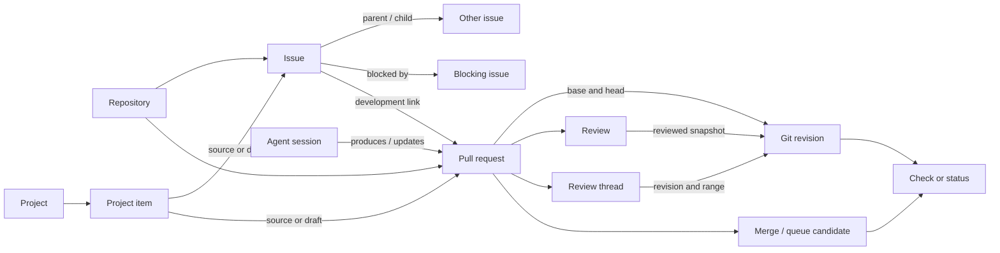

# Work items, reviews, planning, and repository conversations

Research snapshot: **2026-10-03**. This inventory maps usage surfaces rather than repository Settings pages. It covers issues, pull requests and their changesets, discussions, linked Projects, Wiki, shared conversation controls, and repository-adjacent Copilot sessions. Configuration still matters: where an administrator's choice changes a button, a gate, or visibility, the resulting capability is included. The screen used to configure that choice is excluded.

There are **149 component groups** below. A group is a coherent UI/data responsibility, not a count of individual buttons. Shared comment controls are listed once and apply to relevant issue, PR, discussion, and review surfaces. The repository shell, code browser, analytics/people/search, and detailed automation/security producers are mapped in the other documents in this directory.

**Evidence legend:** D means behavior or availability documented in an official GitHub article actually read during this crawl. I means a grouping, arrangement, interaction detail, or proposed clone safeguard inferred from the described capability. V would mean an interface actually inspected visually; **no row in this document claims V**. Screenshot descriptions in documentation are useful evidence of an affordance, but do not establish a current pixel-accurate layout. Linked source IDs resolve to direct official articles; the [source ledger](research/collaboration-sources.json) records all 99 source records.

The inventory intentionally separates state from appearance. “Closed,” “merged,” “answered,” “resolved thread,” “viewed file,” “approved,” “check succeeded,” and “archived” describe different objects or dimensions. Likewise, issue forms, organization issue fields, project custom fields, labels, and issue types are different data systems even when all appear as fields to a user.

## Shared writing, conversation, and moderation

| ID | Surface/component | Data shown | Actions/drilldown | States/gates | Evidence |
| --- | --- | --- | --- | --- | --- |
| W001 | Rendered description and comment | Markdown paragraphs, headings, lists, code, links, images with alternative text, emoji, and references. | Read source-backed discussion; follow links; collapse long material where offered. | Rendering varies by surface; Wiki does not support every comment feature. | D [COL65] [COL84]; I grouping |
| W002 | Comment composer and preview | Draft body, formatting toolbar, suggestion menus, and rendered preview. | Format text, use keyboard shortcuts, switch writing/preview, submit or cancel. | Keep drafts separate from published content; permission and locked-state gates affect submission. | D [COL65]; I placement and draft persistence |
| W003 | Markdown checklist | Checkbox items, order, completion progress, and referenced issue state. | Toggle or reorder tasks; turn a task into an issue; follow referenced issues. | Ordinary Markdown checklists remain. Tasklist blocks are retired; structured hierarchy uses sub-issues. | D [COL68] |
| W004 | Attachment upload and embed | Image, video, document, data, and supported code-file previews or attachment links. | Drag, paste, or choose files; inspect uploaded content. | Upload happens before comment submission; limits and access follow file type, plan, and repository visibility. | D [COL67] |
| W005 | Emoji reaction strip | Reaction choices, counts, and participating users where available. | Add/remove reaction; inspect engagement. | Reactions are independent of approval and answer status; locks can disable reactions. Discussion upvotes are separate. | D [COL47] [COL70]; I shared placement |
| W006 | Mention autocomplete | Matching users/teams and the selected mention. | Type @, navigate suggestions by keyboard, insert a mention. | Mention notifications depend on visibility and notification rules; merely drafting text is not publication. | D [COL65] |
| W007 | Reference chips and crosslinks | Issue/PR number, repository-qualified reference, commit SHA, title/state previews, and referenced-by events. | Type # or paste references; follow a source or related item. | Automatic shorthand links do not work identically in Wiki and repository files; external autolinks depend on configuration. | D [COL66] |
| W008 | Closing reference versus ordinary link | A PR-to-issue development relation or an ordinary textual cross-reference. | Add/remove a closing keyword; inspect the linked issue or PR. | Automatic closure applies when a qualifying PR merges into the default branch; an ordinary reference alone does not close work. | D [COL11] |
| W009 | Quote reply | Quoted selected text or previous comment plus a new reply draft. | Quote a reply or selected passage; edit context before publishing. | Quoted content is copied context, not an automatically synchronized source object. | D [COL65] |
| W010 | Saved-reply picker | Reusable reply names, searchable choices, and inserted text. | Choose a reply; customize inserted text before posting. | Reply creation/preferences are settings-adjacent and excluded; using an existing reply belongs to the composer. | D [COL72] |
| W011 | Edit title/body/comment | Editable current content and, for issue title changes, timeline events. | Edit permitted content; save or cancel. | Authors and eligible maintainers have different rights; the opening issue/PR description cannot be deleted as an ordinary comment. | D [COL09] [COL69] |
| W012 | Edited history menu | Previous revisions, editor, time, and revision differences. | Inspect changes; eligible users remove sensitive historical content. | Removal retains the edit record; long edit histories are bounded. Do not show removed text through an alternative view. | D [COL71] |
| W013 | Hide or delete disruptive comment | Minimized comment, moderation reason/context, and deletion events. | Hide/unhide, expand minimized content, edit, or delete as permitted. | Hidden is readable on expansion and differs from deletion; restricted viewers may see anonymized moderation events. | D [COL69] |
| W014 | Lock/unlock conversation | Lock state, reason, and timeline event. | Lock/unlock; eligible maintainers continue commenting. | Issue/PR locks restrict participation and reactions; discussion locks additionally expose a reaction allowance. Repository archive is a different state. | D [COL70] [COL46] |
| W015 | Report content | Report target, category/reason, and eligible destination. | Report through a content menu to GitHub or, where enabled, repository administrators. | Destination depends on feature availability and reporter role. The moderation inbox/configuration screens are outside scope. | D [COL83] |
| W130 | Composer slash-command prompts | Code language, details content, table dimensions, personal saved replies or repository template choices | Insert /code, /details, /table, /saved-replies or /template; follow prompts | Public preview; supported issue/PR/discussion fields | D [COL87] |

## Issues, labels, milestones, and work relationships

| ID | Surface/component | Data shown | Actions/drilldown | States/gates | Evidence |
| --- | --- | --- | --- | --- | --- |
| W016 | Issues landing list | Open/closed counts, item title/number, author, age/activity, metadata, and status indicators. | Open an issue; use authored/assigned/mentioned presets; create an issue. | Issues must be enabled and visible. Exact row density and metadata placement need live verification. | D [COL05]; I row arrangement |
| W017 | Search and filter builder | Query, active qualifiers, Boolean grouping, type/field values, assignee, author, labels, and relationships. | Build AND/OR queries; combine qualifiers; copy a shareable URL. | Permissions filter results; unavailable/private fields must not leak through suggestions or result counts. | D [COL05] [COL06] |
| W018 | List sorting and bulk selection | Sort order and selected issue/PR set. | Sort by creation, update, comments, or reactions; select rows for supported metadata operations. | Changing assignees/labels/types requires the relevant role; bulk selection must expose skipped/ineligible items. | D [COL05] [COL08] [COL18] [COL07] |
| W019 | New-issue template chooser | Available templates/forms, descriptions, and optional blank-issue route. | Choose Get started; open a blank issue if permitted. | Templates come from the default branch. The chooser is usage UI; configuring templates is excluded. | D [COL01] [COL81] |
| W020 | Issue form input | Required/optional text, textarea, dropdown, checkbox, upload, and instructional content. | Complete fields and validation; submit a generated Markdown description. | Form schema is a preview capability. Form inputs are not organization issue fields; required validation has documented surface/repository gates. | D [COL80] [COL81] |
| W021 | Issue creation draft | Title, body, suggested duplicates, and permitted metadata. | Edit before creating; use query-prefilled values where supported. | Duplicate suggestions are advisory. Organization issue fields cannot currently be prefilled by URL parameters or issue templates. | D [COL01] [COL06] |
| W022 | Create from source context | Selected code/comment/task/discussion context and a backlink. | Create an issue from supported source menus; retain the original discussion when creating from it. | Code-line creation uses the same repository; other routes have distinct permissions. Creating from discussion differs from converting an issue to discussion. | D [COL01] [COL43] [COL68] |
| W023 | Issue identity/header | Stable number, title, author, opened time, and open/closed state. | Edit title; copy/follow the canonical issue link; close or reopen where permitted. | Closed reason distinguishes completed from not planned. Exact header/reopen placement is inferred. | D [COL09] [COL15]; I header arrangement |
| W024 | Issue body and event timeline | Opening description, comments, references, assignment/metadata changes, and close/transfer events. | Read a chronological audit trail; inspect related work or an edited body. | An event stream is not the current metadata snapshot; each event retains actor/time and visibility rules. | D [COL09] [COL11] [COL14] [COL06]; I unified timeline grouping |
| W025 | Assignee selector | Current responsible people and eligible suggestions. | Assign/unassign one or more people, individually or in bulk. | Mutation requires write access; eligibility and the multi-assignee limit apply. Copilot assignment creates a distinct agent workflow. | D [COL08] [COL79] |
| W026 | Label selector and labels index | Label name, description, color, and applied set. | Apply/remove labels; browse/filter by label; eligible maintainers manage shared labels. | Labels are repository-scoped and usable across issues, PRs, and discussions. Triage application and write-level management differ. | D [COL18] |
| W027 | Milestones index and detail | Title, description, due date, open/closed work counts, and completion progress. | Open a milestone; filter its issue/PR list; prioritize eligible items. | Milestones group both issues and PRs. Drag prioritization has an open-item scale limit; progress is a count, not effort estimation. | D [COL19] [COL20] |
| W028 | Milestone assignment | Current milestone and available repository milestones. | Add, change, or remove a milestone from an issue/PR. | A milestone belongs to one repository; matching on transfer uses name and due date. | D [COL19] [COL14]; I selector placement |
| W132 | Milestone creation/edit/deletion | Title, Markdown description and due date | New Milestone; edit/save; delete | Associated issues/PRs survive deletion; precise role gate needs verification | D [COL89]; I exact role gate |
| W029 | Issue type | Organization-defined type, including common task/bug/feature choices. | Set/change type; filter and display it in lists or Projects. | Types are organization-scoped; administration is excluded. They describe an issue, not a PR or project-only draft. | D [COL07] |
| W030 | Organization issue fields | Typed text, number, date, or single-select values and type-pinned fields. | Add, edit, or clear field values; search by supported field qualifiers. | These shared fields belong to issues, not PRs. Values save directly and produce actor/time/value timeline events. | D [COL06] |
| W031 | Issue-field visibility and creation | Public versus organization-only fields and fields pinned to the selected type. | Fill exposed fields during issue creation or from the sidebar. | Organization-only fields disappear from unauthorized sidebar, timeline, and search suggestions. A missing field must not be treated as an empty accessible value. | D [COL06] |
| W032 | Sub-issue add/create control | Available children, parent link, and candidate existing issues. | Create a child or select an existing issue, including an accessible issue in another repository. | Triage permission is required. Limits bound children and nesting; hierarchy is separate from dependency direction. | D [COL02] |
| W033 | Sub-issue tree and progress | Nested children, their status, parent breadcrumb, and aggregate completion. | Expand/collapse hierarchy; navigate up/down; inspect progress. | Closing children affects completion, not necessarily parent closure. Preserve hidden/inaccessible relations without exposing private titles. | D [COL04] [COL58]; I redacted-relation behavior |
| W034 | Dependency relationship selector | Blocked-by and blocking issue links. | Add/remove directed dependencies; navigate to a blocker. | Triage permission applies. Dependency is an independent graph edge, not a child relationship or ordinary mention. | D [COL03] |
| W035 | Blocked-state indicators | Whether an issue is blocked and the accessible blocking relationships. | Inspect Relationships from an issue or blocked indicators in supported lists/boards. | State can change as a blocking issue closes; unavailable source data must remain unknown rather than falsely unblocked. | D [COL03]; I unknown-state presentation |
| W036 | Development branches | Branches associated with the issue and their eventual PR links. | Create a branch from an issue; choose repository/base/name and a local or Desktop handoff. | Branch creation is a preview, requires write access, and obeys repository/base eligibility. A resulting PR replaces its branch association. | D [COL10] |
| W037 | Development linked PRs | PRs linked manually or by qualifying closing keywords. | Link/unlink PRs; inspect work intended to resolve the issue. | Manual and keyword links have different removal routes and cross-repository rules. Merge into the default branch controls automatic closure. | D [COL11] |
| W038 | Pinned issues | A small featured set above the issue list. | Pin/unpin eligible issues; open featured work. | Write access is required, with a documented three-issue cap. Pinning does not alter priority or assignment data. | D [COL12] |
| W039 | Duplicate declaration | Duplicate-of relation and audit event. | Post the supported duplicate reference; undo the resulting duplicate event. | Write permissions govern marking. Duplicate is a semantic relation, not merely two issues sharing a label. | D [COL13] |
| W040 | Close/reopen and reason | Open, completed, or not-planned state and close event. | Close with a reason; reopen when allowed. | Authors/maintainers have role-based rights. Reason must remain distinct from project Status or a custom type. | D [COL15]; I reopen control details |
| W041 | Transfer issue | Destination repository, retained history/assignees, matched labels/milestone, and redirect. | Choose a permitted same-owner destination; inspect resulting metadata. | Open issues only; write access to both; private-to-public transfer is disallowed. Target access may replace content with an inaccessible banner. | D [COL14] |
| W042 | Clone issue | Editable copy of title/body and supported target-compatible metadata. | Choose a destination; adjust fields; create a separate issue. | Requires triage on both and target blank-issue support. Original remains unchanged; copied references do not constitute copied history. | D [COL17] |
| W147 | Applied automation-change rationale | Explanation and high/medium/low confidence on supported issue changes | Reveal rationale from action icon | Public preview; metadata may be absent on API/Agentic Workflow outputs | D [COL95] [COL96] |
| W148 | Pending-suggestion issue search | Issues with held proposals | Filter with has:suggestions | Suggestions differ from ordinary issue state and PR review requests | D [COL96] |
| W149 | Issue suggestion approvals panel | Proposed labels/type/fields/assignee/closure, rationale/confidence | Accept/Decline individually or all | Accept applies immediately; decline leaves issue unchanged; convenience, not server security boundary | D [COL95] [COL96]; I exact accepting-role capability |
| W043 | Convert or permanently delete issue | Discussion destination/category or deletion confirmation. | Convert supported issues to discussions; eligible administrators delete an issue. | Conversion preserves a conversation differently from cloning. Deletion is permanent and returns unavailable content; authorization is substantially narrower. | D [COL46] [COL16] |

## Pull requests, changesets, reviews, and integration

| ID | Surface/component | Data shown | Actions/drilldown | States/gates | Evidence |
| --- | --- | --- | --- | --- | --- |
| W044 | Pull-request landing list | Open/closed/merged PRs, draft status, authors, reviewers, labels, activity, and check/review filters. | Search, sort, select, open a PR, or start comparison. | PR queries include merge/draft/review/check qualifiers. Archived PR visibility is restricted; row placement is inferred. | D [COL05] [COL41]; I arrangement |
| W045 | Compare and create PR | Base repository/branch, head repository/branch, proposed commits/diff, title/body, and template. | Change base/head; compare; create ready or draft PR. | Branches must differ and the contributor needs an eligible writable head; fork creation supports contributors without base-repository write access. | D [COL22] [COL81] |
| W046 | Comparison semantics | Merge base, head revision, and the proposed change relative to their common ancestor. | Inspect comparison before submitting; follow branches and commits. | A PR uses a three-dot comparison; endpoint two-dot comparisons answer a different question. Do not sum per-commit diffs as the aggregate proposal. | D [COL30] |
| W047 | PR identity and base/head header | Number/title, author, draft/open/closed/merged state, target branch, and source branch. | Edit title or base; follow branches; inspect the source repository. | Changing base can remove commits and make line comments outdated; confirm the change and preserve its consequences. | D [COL21] [COL35]; I header placement |
| W129 | Personal-fork maintainer-edit permission | Permission checkbox and workflow-specific consequence | Allow upstream maintainers to edit compare branch; change on existing PR | Personal fork; upstream push access; workflow variant also permits secret access | D [COL86] |
| W048 | Conversation tab and timeline | Description, comments, review summaries, commits/events, check summaries, and merge controls. | Discuss the whole proposal; inspect event history; jump to reviews or related issues. | Timeline events are historical; current merge eligibility can differ from older approvals/check results. | D [COL21] [COL26] [COL31] |
| W049 | Commits tab and commit detail | Ordered proposed commits, authors, SHAs, messages, and commit-specific changes. | Open a commit or its check/diff context. | Rebase/squash changes commit identity; commit-specific evidence must stay attached to its actual SHA. | D [COL21] [COL31]; I detailed row fields |
| W050 | Checks tab and annotations | Rich check runs by commit, execution progress, conclusions, logs/details, and annotations. | Select a commit/check; inspect details or annotated file lines. | Checks and simpler commit statuses are distinct. Not every status appears as a rich check; archived required checks can need a rerun. | D [COL39] |
| W051 | Conditional Findings tab | Automated review findings for proposed changes, including code scanning and supported quality/dependency findings. | Inspect a finding and its file/rule/remediation context; follow its producer. | Availability depends on enabled products and analyses. Findings are distinct from execution checks and human review; detailed scanner coverage belongs to the automation inventory. | D [COL85]; I product aggregation |
| W052 | Files-changed overview | Changed paths, additions/deletions, file tree/list, and aggregate diff. | Navigate files; filter changed paths/types; open a file or source. | Large/generated/binary changes can omit textual rendering. File presence and reviewed state must remain visible even when a diff is suppressed. | D [COL85] [COL30]; I summarized omission state |
| W053 | Diff presentation controls | Unified/split modes, rich/source representations, and whitespace-dependent view. | Choose a diff presentation; ignore whitespace; reveal hidden changes where supported. | Presentation changes do not change the patch. Exact toolbar order, responsive behavior, and persistence need live verification. | D [COL24] [COL30]; I toolbar arrangement |
| W054 | Text hunk and source context | Old/new line anchors, additions/removals, unchanged context, and changed ranges. | Expand context; navigate to source or a review anchor. | Line anchors must bind to revision and side. Placement of controls and unsupported-context limits are inferred. | D [COL25] [COL30]; I hunk controls |
| W055 | File-level and range comment | Whole-file feedback or a selected line/range with code context. | Start a comment on a file, line, or selected range; quote code. | Single comments publish immediately; pending-review comments remain private until submission. Removed code may become outdated. | D [COL25] |
| W056 | Pending review draft | Unsubmitted comments, suggested patches, and reviewer summary. | Add multiple comments; submit together or discard pending review. | Draft feedback is private to its reviewer; discarding removes the pending material, not prior published reviews. | D [COL25] |
| W057 | Suggested change block | A replacement code patch embedded in a review comment. | Apply an eligible suggestion or batch suggestions into a commit. | Only compatible suggestions can be committed; applying creates new source revisions and may affect check/approval currency. | D [COL27] |
| W058 | Review submission | Summary and Comment, Approve, or Request changes outcome. | Choose an outcome and submit the accumulated review. | Authors cannot approve their own PR. Whether an approval/change request blocks merging depends on policy and reviewer eligibility. | D [COL24] |
| W059 | Review summary and inline inspection | Reviewer/outcome, submitted text/comments, timestamp, and reviewed snapshot. | View reviewed changes; jump from summary to a comment or code. | The review snapshot shows what was actually reviewed, which can differ from today's head. | D [COL26] |
| W060 | Conversation-resolution index | Unresolved, resolved, and outdated threads. | Navigate the conversation menu; resolve or reopen eligible threads. | Resolution and outdatedness are different dimensions. Resolved threads can remain visible for audit; approval does not automatically resolve discussion. | D [COL27] |
| W061 | Viewed-file review progress | Per-file Viewed state and overall reviewed-file progress. | Mark files viewed/unviewed; collapse completed files. | New changes reset affected file review state. Viewed is personal navigation progress, not a submitted approval or sufficient evidence of correctness. | D [COL24] |
| W062 | Review versions and change currency | Historical review snapshot versus current code. | Inspect the reviewed revision, then compare with current head. | Current docs confirm reviewed snapshots. An exact 'since last review' selector and force-push comparison controls remain live-UI gaps. | D [COL26]; I potential version affordance |
| W063 | Reviewer request and re-request | Suggested reviewers, requested people/teams, and their current review state. | Request a review; re-request after revision; inspect pending requests. | Eligibility, plan, and role restrictions apply. A request is an assignment signal, not an approval or guaranteed response. | D [COL28] |
| W064 | CODEOWNERS review coverage | Owners relevant to changed paths and automatically requested reviewers. | Inspect/ask for owners; satisfy required owner-review gates where configured. | CODEOWNERS is read from the base branch; draft PRs defer automatic requests. Required ownership approval is a policy result, not universal behavior. | D [COL40] |
| W065 | Dismissed/stale review | Previous review, dismissal actor/reason, or invalidation after new code. | Eligible maintainers dismiss a review; request another review. | Dismissal is audited and permission/policy gated. Stale-approval dismissal depends on protection rules; do not silently erase prior feedback. | D [COL42] [COL24] |
| W066 | Draft/ready transition | Draft badge, readiness action, and review-request consequences. | Mark ready for review; convert back to draft. | Drafts cannot merge. Ready transition can request code-owner review; existing subscribers continue to receive relevant activity. | D [COL29] [COL40] |
| W067 | Merge-readiness summary | Required approvals, changes requested, checks, unresolved conflicts, branch currency, and merge permissions. | Open each blocker; request review, update code, or wait for checks. | Show each gate independently and identify the evaluated revision. A green optional check does not satisfy an unrelated required check. | D [COL31] [COL39] [COL40]; I combined explanatory presentation |
| W068 | Check/status state model | Queued/running/waiting lifecycle; success/failure/neutral/skipped/cancelled/timeout/action-required conclusions; required flag. | Inspect the producing integration and revision; rerun via its supported surface. | Execution state, conclusion, and policy requirement are independent; checks/statuses can use different producers and details. | D [COL39] |
| W069 | Update branch | Behind-base condition, available update method, and resulting merged/rebased head. | Update using merge or rebase when offered. | Head must be writable and conflict-free for the easy route; protected heads and policy can block it. Updating does not merge the PR. | D [COL34] |
| W070 | Conflict-resolution editor | Conflicted file list, conflict markers, and resolved-file progress. | Edit simple line conflicts; mark each resolved; commit the merge into head. | Complex conflicts need local Git. Resolving merges base into head; protected heads can require a new branch rather than direct commit. | D [COL37] |
| W071 | Merge-method picker and confirmation | Permitted merge, squash, or rebase choice; commit title/body and identity. | Choose an allowed method; confirm merge; optionally delete source branch. | Repository policy controls methods. Rebase creates new SHAs; merge/squash/rebase preserve different history and identity semantics. | D [COL31] |
| W072 | Auto-merge enrollment | Enabled/disabled request, chosen method, and unmet requirements. | Enable auto-merge; eligible author/maintainer disables it. | Requires repository support and write permission. New code from a non-writer or base changes can disable enrollment. | D [COL32] |
| W073 | Merge-queue enrollment and list | Queue position, own queued PR, and merge-group validation. | Request Merge when ready; inspect queue; remove an eligible queued PR. | Availability depends on organization/repository plan. Queue checks validate the combined candidate; head-only checks do not establish that candidate's result. | D [COL33] |
| W074 | Queue failure or ejection | Failed/timed-out requirements, removal cause, and required next action. | Inspect failed checks; repair and re-enter when eligible. | User, timeout, policy, or validation changes can eject an item. Queue position is not a guaranteed merge time. | D [COL33] |
| W075 | Close without merge | Closed-unmerged state and retained branch/discussion history. | Close or reopen as permitted; follow remaining development. | Closed, merged, and archived are distinct. A closed PR does not prove its patch was integrated. | D [COL21] [COL31]; I control placement |
| W076 | Revert merged PR | Original merge and a new proposal containing its inverse. | Create a revert PR; review and merge it separately. | Write access is required. Conflicts or merges outside GitHub may require local reverts; revert does not erase the original history. | D [COL36] |
| W077 | Native stack map | Layer numbers, trunk/base, linked PRs, and each layer's status. | Navigate the stack from the PR header or merge-box map. | Stacked PRs are public preview and same-repository only. Each layer targets the layer below and shows its incremental diff. | D [COL23] |
| W078 | Stack update/rebase | Dependent layers and whether the stack is linear/current. | Rebase the stack; inspect the cascading changes across dependent PRs. | Rebasing changes revisions and downstream layers; root-trunk protection applies to stack layers. Do not confuse this with independent PR updates. | D [COL23] [COL38] |
| W079 | Merge stack or contiguous prefix | Selected layer and all lower layers included in the integration. | Merge bottom-up or choose a supported prefix; inspect all relevant gates. | All included layers need required approvals/checks and linear history. Auto-merge is unsupported; queue ejection can remove dependent upper layers. | D [COL38] |
| W080 | Agent and human review attribution | Human versus Copilot review, comments/suggestions, and optional approval effect. | Request an assisted review; inspect its linked session and feedback. | Default Copilot review comments do not approve. Opt-in Copilot approvals are documented in public preview; see the source-conflict note below. | D [COL78] |
| W081 | Archive/unarchive PR | Admin-only archived state, locked/closed conversation, and archive-filter results. | Administrator archives or unarchives a PR. | Archive removes public visibility; others receive unavailable content. Unarchiving restores visibility but leaves it closed and locked; this differs from repository archive. | D [COL41] |
| W082 | Merged-source cleanup and retargeting | Deleted/restored head branch and downstream PR base relationships. | Delete an eligible source branch; inspect affected dependent PRs. | Branch cleanup is separate from merge history; other open PRs may be retargeted after branch deletion. | D [COL31]; I cleanup grouping |

## Discussions and community question flows

| ID | Surface/component | Data shown | Actions/drilldown | States/gates | Evidence |
| --- | --- | --- | --- | --- | --- |
| W083 | Discussions landing list | Discussion title/category, engagement, reply/activity context, and answer/closed state. | Search/filter; sort by latest activity, creation, or top engagement with a time window. | Feature enablement and repository visibility apply. Contributor rankings depend on privacy/visibility and are secondary list context. | D [COL43] |
| W084 | Category/section navigation | Emoji, name, description, category sections, and conversation format. | Choose a category; browse its discussions. | Formats include open conversation, Q&A, announcement, and poll. Announcement creation is restricted; category administration is excluded. | D [COL44] |
| W085 | New discussion and category form | Category, title/body, instructional form, and permitted fields. | Create from a category; complete a supported category form. | Forms come from repository templates and do not apply to poll categories. Configuration files are sources, not a settings screen to clone. | D [COL48] [COL80] |
| W086 | Discussion detail and replies | Opening post, top-level comments, nested replies, and activity. | Comment/reply; quote and react; sort top-level comments. | Oldest/newest/top sorting applies to top-level comments; adding a reply does not reorder its parent through that rule. | D [COL47] |
| W087 | Discussion/comment upvote | Upvote count and current user vote separately from emoji reactions. | Vote on a discussion or eligible top-level comment; remove own vote. | Upvotes are engagement, not an accepted answer or review outcome. Locks and eligibility affect participation. | D [COL47] [COL46] |
| W088 | Q&A accepted answer | Highlighted answer, nested context, and answered status. | Author or eligible maintainer marks/unmarks an answer, including a nested reply. | A minimized comment cannot be selected as the answer. Answer status and closed reason are separate dimensions. | D [COL47] [COL46] |
| W089 | Poll options and results | Question, options, current vote, and vote totals. | Create/edit supported poll content; vote and inspect results. | Polls require options and use a dedicated format. Moving between poll and other category formats is restricted. | D [COL43] [COL45] |
| W090 | Discussion metadata | Labels, category, and the current format. | Apply supported labels; move to another compatible category. | Category movement changes organization context, not discussion identity. Poll format restrictions and role gates apply. | D [COL45] [COL18] |
| W091 | Pinned discussion cards | Featured discussion links, placement, and customized pin presentation. | Pin/unpin globally or within a category; open a featured discussion. | Global and per-category pins have separate caps; a pin is editorial prominence rather than a correctness signal. | D [COL45] |
| W092 | Close and moderation state | Closed status with resolved, no-longer-relevant, or duplicate reason; lock state. | Close/reopen, lock/unlock, hide content, or moderate as permitted. | Closing and locking differ; discussion locks can allow reactions. Permission wording for category management needs explicit resolution. | D [COL45] [COL46] |
| W093 | Transfer discussion | Destination, retained conversation, and visibility consequences. | Transfer an eligible discussion to another same-owner repository. | Private-to-public transfer and announcement transfers are disallowed; destination creation permissions apply. | D [COL45] |
| W094 | Issue/discussion transition | Converted issue conversation or an issue created from a discussion. | Convert an issue into a selected discussion category; create actionable issue work from a discussion. | Creating an issue from discussion retains the original; converting an issue is a different workflow and identity transition. | D [COL46] [COL43] |
| W095 | Delete discussion | Deletion confirmation and unavailable-content result. | Eligible maintainers delete a discussion. | Deletion is distinct from closure and locking; alternative views must not retain content that the source removes. | D [COL45] |

## Repository-linked Projects

| ID | Surface/component | Data shown | Actions/drilldown | States/gates | Evidence |
| --- | --- | --- | --- | --- | --- |
| W096 | Repository Projects tab | Linked projects visible to the user and their owner/context. | Open an existing project from the repository. | Projects are user/organization-owned, not repository-owned containers; linking uses eligible same-owner projects. The tab is a doorway to a cross-repository workspace. | D [COL50] [COL49] |
| W097 | Project overview and item detail | Description/README, views, and issue/PR/draft items with synchronized source fields. | Open the source issue/PR; inspect an item detail panel; edit permitted data. | A project can span repositories/organizations. Changing shared source metadata updates the issue/PR; project-only fields remain local. | D [COL49]; I item-panel arrangement |
| W098 | Add item search and bulk add | Repository candidates, search results, URLs, and selected issue/PR items. | Add by repository search, URL, source sidebar, bulk dialog, or command palette. | Source access and project write permission apply. Project membership is a separate relation from source ownership. | D [COL51] |
| W099 | Create project draft or issue | Draft title/body, assignees, local fields, or a new issue with repository metadata. | Create a lightweight draft; convert it to an issue; create an issue from a grouped view. | Drafts lack repository labels/milestones until conversion; draft mentions do not notify until issue creation. | D [COL51] [COL52] |
| W100 | Saved views and unsaved changes | Named view tabs, filters/layout/fields, and unsaved-change indicator. | Create, duplicate, rename, reorder, delete, and save a view. | Unsaved modifications initially affect only the editor. Stable named views should not silently acquire another person's transient arrangement. | D [COL56] |
| W101 | Project search, filter, and slice | Query-filtered items and a slice panel grouped by an eligible field. | Narrow by field values; intersect a slice with a filter. | Unsupported fields cannot be used for slicing/grouping; private source data remains inaccessible. Empty result and unavailable data need distinct explanations. | D [COL53] [COL56]; I empty-state wording |
| W102 | Table rows and columns | Source metadata and custom text/number/date/single-select/iteration values. | Show/hide/reorder fields; edit cells; reorder unsorted rows. | Not all fields exist for all item types. Column order is a view property, while cell changes can mutate source or project data. | D [COL53] [COL49] |
| W103 | Multi-cell editing and undo | Selected cells, copied values, fill ranges, and mutation results. | Copy/paste, fill, clear, and undo supported edits. | Different cell types require valid values; bulk errors and undo should preserve which source objects actually changed. | D [COL52]; I partial-error presentation |
| W104 | Grouping, sorting, and summaries | Field groups, sort order, item counts, and numeric aggregate values. | Group/sort rows; move items between groups; inspect summaries. | Moving a grouped item changes its field. Automatic sorting limits manual ordering; labels/reviewers/title/linked PRs have grouping limitations. | D [COL53] |
| W105 | Board columns and cards | Columns from single-select/iteration values and cards showing chosen fields. | Move one or many cards; choose visible fields and column order. | Movement mutates the grouping field. Sorting can disable manual in-group order; board arrangement is view-specific. | D [COL54] |
| W106 | Board limits and horizontal grouping | Column counts/soft limits, over-limit warning, and row groups. | Inspect overloaded stages; regroup cards or adjust eligible work. | Limits warn rather than block moves. A warning is a flow signal, not a policy rejection or hard capacity guarantee. | D [COL54] |
| W107 | Roadmap timeline | Item date/iteration spans, group lanes, and time scale. | Zoom month/quarter/year; drag dates/ranges; inspect an item. | Moving a bar changes date fields. Dates are planning data, not evidence of actual delivery; undated/inaccessible items need a usable list route. | D [COL55]; I undated-state route |
| W108 | Roadmap markers | Configured date, iteration, and milestone markers. | Inspect planned boundaries alongside work bars. | Markers can combine repository and project data; a milestone due date differs from an issue target date or iteration boundary. | D [COL55] |
| W109 | Iteration field and rollover | Named date ranges, breaks, current/previous/next iteration, and grouped items. | Assign an iteration; filter relative periods; move items into another iteration with confirmation. | Iteration membership is planned allocation and can shift; it does not close source work automatically. | D [COL57] [COL53] |
| W110 | Hierarchy and PR-derived fields | Parent issue, sub-issue completion, linked PRs, and reviewers. | Navigate parent/children or associated PR review context. | Hierarchy, implementation link, and review state have distinct sources. A progress percentage does not summarize merge readiness. | D [COL58] [COL59] |
| W111 | Organization issue fields in Projects | Shared issue-field columns, values, and applicability. | Expose supported fields; edit values and observe synchronization. | Only same-organization issues support them. Public/internal projects expose public fields only; PRs, drafts, and foreign-organization issues are inapplicable rather than empty. | D [COL64] |
| W112 | Project insights chart | Current distributions or historical state counts, field grouping, and numeric aggregates. | Choose chart axes/grouping; inspect counts or numeric summaries. | Historical categories distinguish completed issues/merged PRs, not-planned issues, and closed PRs. Archived/deleted project items are excluded from charts. | D [COL60] [COL62] |
| W113 | Archive, restore, or remove item | Archived item list and current project membership. | Archive to hide from views; restore; remove from project. | Project archive preserves membership/context; removal affects membership, not the issue/PR itself. Neither is PR moderation archive. | D [COL61] |
| W114 | Project health/status updates | On-track/at-risk-style update status, dates, Markdown narrative, author, and update history. | Read or subscribe; eligible members publish a status update. | This project-level update is independent of per-item Status and issue state. Status claims require time/context, not a permanent green badge. | D [COL63] |
| W115 | Project/source activity relation | Add/remove membership and project-status events visible in source timelines. | Follow the project from an issue/PR event; inspect automation attribution. | Events are visible only with project access. Automation attribution is distinct from the person who initially added work. | D [COL52]; I grouped activity presentation |
| W131 | Project view export | Current view data | View → Export view data; download TSV | Anyone with project access; separate from chart CSV/PNG export | D [COL88] |

## Wiki

| ID | Surface/component | Data shown | Actions/drilldown | States/gates | Evidence |
| --- | --- | --- | --- | --- | --- |
| W116 | Wiki landing and page reading | Rendered Home/page content, page title, and navigation. | Read documentation; follow links; open another page. | Wiki feature and visibility/plan gates apply. It is a separate Git-backed documentation repository, not the main code directory. | D [COL73] |
| W117 | Page list, custom sidebar, footer | Available pages and repository-authored navigation/footer content. | Navigate pages; follow custom links. | Custom sidebar/footer are Wiki content. Their arrangement and responsive collapse need live verification. | D [COL75]; I placement |
| W118 | New/edit Wiki page | Title, content, markup mode, and edit/commit message. | Create or edit a page; preview where offered; save an edit. | Write permission is standard; optional public editing changes eligibility. Configuration screens are excluded, but the resulting affordance is conditional. | D [COL74] |
| W119 | Wiki Git handoff | Separate .wiki.git remote and page files on the live default branch. | Clone/edit/push using Git; inspect the authoritative file history. | Non-default-branch local edits are not the live Wiki. Keep documentation revisions separate from code-repository commits. | D [COL73] [COL74] |
| W120 | Page history and revision snapshot | Edit list with author, time, message, and specific revision. | Open History; select a revision and read its snapshot. | A historical page is immutable revision context, not necessarily current documentation; reading is distinct from editing permission. | D [COL76] |
| W121 | Compare/revert Wiki revisions | Selected revisions and added/removed/modified lines. | Compare two revisions; eligible editor reverts changes. | Revert produces a new edit, preserving history. Unsupported shorthand references/footnotes and large-Wiki limits require explicit content handling. | D [COL76] [COL66] [COL74] |

## Repository-adjacent Copilot work and review

| ID | Surface/component | Data shown | Actions/drilldown | States/gates | Evidence |
| --- | --- | --- | --- | --- | --- |
| W122 | Repository Agents task entry | Repository/base selection, prompt, model/custom agent, and optional reasoning or image input. | Start a supported cloud-agent task from the repository Agents surface. | Paid-plan, organization policy, managed-user, and repository access gates apply. Agent availability is a capability state, not a generic assignee. | D [COL77] [COL82] [COL79] |
| W123 | Assign issue to Copilot | Issue context and target repository/starting branch plus optional instructions. | Select Copilot; confirm an eligible target; launch a task. | Issue assignment is preview. Existing title/body/comments seed the task; later issue comments are not automatically forwarded—use PR/session feedback. | D [COL79] |
| W124 | Agent session list and detail | Task state, repository, optional PR, progress/logs, model and context | Open session/PR; create PR from session logs after changes are pushed | Pushed changes can exist without a PR; visibility/steering follow origin and sharing capabilities | D [COL82] [COL79] |
| W125 | Steer, stop, or archive session | Active/stopped session, follow-up input, and retained work. | Send follow-up instructions; stop execution; archive supported stopped sessions. | Stopping keeps pushed commits. Cloud sessions can be archived, not deleted; third-party coding agents cannot be steered. | D [COL82] |
| W126 | Agent-produced PR and trace | Proposed commits, agent authorship, human co-author attribution, and linked session. | Review ordinary diffs; submit review feedback; follow the session trace. | Cloud-agent proposals still have normal PR gates; source attribution is not evidence of correctness. Human feedback may trigger agent follow-up work. | D [COL77] [COL79] |
| W127 | Copilot review request and findings | Assisted review effort, severity, suggested patches, and session/tool/skill attribution. | Request/re-request review; inspect findings; give thumbs feedback. | The review bot does not treat arbitrary thread replies as a new review request. Approval availability is separately configured and in preview. | D [COL78] |
| W128 | Delegate review fix | Selected suggested fix and target of a new commit or follow-up PR. | Apply an eligible suggestion or ask cloud agent to implement a fix. | Confirm which branch/PR receives work; preserve new revision identity and rerun applicable checks. Assisted review and cloud execution are distinct roles. | D [COL78] [COL27] |
| W133 | Agent-kind/app selector | Copilot, third-party coding agents, custom profile or installed agent app | Select task agent; invoke through issue assignment or PR mention | Paid-plan/policy gates; third-party agents and apps public preview; kind differs from model | D [COL90] [COL91] [COL97] |
| W134 | Agent-app first-use authorization | App identity and authorization request | Complete OAuth handoff before task starts | Installed/enabled app; account/enterprise policy; installation administration excluded | D [COL91] |
| W135 | Session sharing and view scopes | Cloud/local origin, shared state, All sessions | Share/unshare local session; inspect permitted trace | Cloud sessions visible to repository readers by default; shared local sessions view-only | D [COL82] |
| W136 | Synced-session history query | Viewer’s synced history and source sessions | Ask history questions; follow authorized session | Initiator-only query scope; another user’s shared local sessions are not indexed | D [COL82] |
| W137 | Local session continuation | Selected session and available client | Open in VS Code; Continue in Copilot CLI | Required client/extensions; handoff differs from Codespace creation | D [COL92] |
| W138 | Agent PR workflow trust approval | Withheld workflows for agent changes | Approve and run workflows from merge box | Required by default unless configured otherwise; distinct from fork/environment review | D [COL79] |
| W139 | Review-comment delegation batch | Selected comments, instructions/model, destination | Add to batch; Manage batch; Fix and commit or open PR | New attempt/revision; result still needs review | D [COL79] |
| W140 | PR agent invocation/model picker | Comment request, chosen model and started-work event | Mention agent; follow session | Copilot responds to writers; ordinary PR comments have model picker | D [COL79] [COL90] |
| W141 | Agent conflict-resolution entry | Conflicted PR and resulting proposal | Fix with Copilot in merge box; inspect new diff | Delegation starts work; it does not certify resolution | D [COL79]; I evidence interpretation |
| W142 | Agents → Automations list/detail | Viewer-created automations and spawned sessions | Open definition or session | Definitions creator-private even from admins; resulting sessions shared with repo readers | D [COL93] [COL94] |
| W143 | Automation creation/editor | Name, prompt, model and chosen tools/triggers | Create new; save; edit | Paid access, enabled cloud agent/automations, private/internal repo, write access; definition outside Git | D [COL93] [COL94] |
| W144 | Automation trigger/filter editor | Hourly/daily/weekly or issue-created/PR-opened/PR-synchronized events | Choose triggers; query filter; PR changed-file filter | Non-writer events ignored by default; opt-in can change behavior | D [COL93] [COL94] |
| W145 | Automation tools selector | Allowed actions and suggested tools | Select tools; Suggest tools | Scope limited to this repository; model output does not grant permission | D [COL94]; I capability interpretation |
| W146 | Automation execution/lifecycle | Enabled/disabled definition and linked executions | Run now; open session; disable/enable/delete | Definition visibility differs from session visibility; spawned work still reviewable | D [COL94] |

## Data relationships and state boundaries

The repository contains several overlapping graphs. Parent/child edges express scope; blocked-by edges express dependency; references express context; a Development link expresses implementation intent; project membership expresses planning placement. Preserve the edge's kind, direction, source, visibility, and actor/time instead of flattening all connections into “related.” Cross-repository links require permission checks on both endpoints. [COL02] [COL03] [COL11] [COL51]

A PR is a proposal between Git revisions, with a discussion attached. File lists and hunks project the selected comparison. Reviews have an author, outcome, time, and reviewed snapshot; threads have revision/side/range anchors and independent resolved/outdated states. Checks have a producer, revision, lifecycle, conclusion, and policy role. Queue validation can concern a combined candidate rather than the author's head. Historical results do not establish today's eligibility. [COL26] [COL30] [COL33] [COL39]

Project items wrap an issue, PR, or local draft with planning fields; their Status need not match source open/closed state. Saved views are queries/presentations, not work copies. Discussion answers and closure also remain separate. Wiki content has separate Git history. Agent sessions are attempts associated with changes, not replacements for changes or review evidence. [COL49] [COL56] [COL47] [COL73] [COL82]

This analytical model is not a claim that GitHub exposes one unified graph UI. A schema also needs discussions/answers, Wiki revisions, metadata dictionaries, attachments, permissions, and event records.

## Representative flows

- **Report a problem:** choose a template/form, complete title/body, inspect suggested duplicates, and create an issue. Triage adds metadata. Form answers become Markdown; organization issue fields stay structured. Work created from discussion preserves a source relation. [COL01] [COL06] [COL80]
- **Decompose blocked work:** add children for scope, then directed dependencies for sequencing. Browse the tree and blockers independently. Child completion does not establish dependency satisfaction, integration, or real-world outcome. [COL02] [COL03] [COL04]
- **Propose and review:** choose base/head, inspect comparison, and create a draft or ready PR. Reviewers accumulate feedback and submit an outcome. Revisions can make comments outdated and approvals stale; preserve reviewed snapshot and current head. [COL22] [COL25] [COL26] [COL29]
- **Integrate:** inspect each gate, update/resolve conflicts, then merge, auto-merge, or queue where supported. Queue evidence belongs to the candidate tested. Stack readiness concerns the selected contiguous lower layers, not one layer's green check. [COL31] [COL32] [COL33] [COL38]
- **Plan and communicate:** add work to a project, select table/board/roadmap views, and publish dated health updates. Answering a discussion, closing an issue, moving a card, and declaring on-track each describe a different state. Wiki edits retain a separate revision trail. [COL49] [COL63] [COL47] [COL76]

## Alternative visualizations for Beanstalk

These are hypotheses to evaluate. They fit the existing exploration of intent, attempt, change, candidate, and evidence: begin with a concrete question, select a focused view, and retain direct access to standard lists, source, and diffs. A large canvas should not become mandatory for routine work.

| Question / concept | View and required data | Failure modes / guardrails | Familiar view to retain |
| --- | --- | --- | --- |
| What blocks this outcome? | Small directed graph of selected intent/issue, immediate blockers, parent scope, and implementation PRs. Requires typed edges, source links, permissions, and observation time. | Make hierarchy and dependency look different. Label missing data; “no known blocker” does not establish compatibility. | Filtered issue table and relationship/tree sidebar. |
| What still needs review? | File/reviewer matrix of unresolved threads, viewed progress, and annotations, bound to revisions; cells open a conventional diff. | Viewed is navigation progress; ownership is responsibility; annotations are partial observations. None proves complete review. | Split/unified diff, file tree, and thread list. |
| What changed since the decision? | Compact revision strip distinguishing base/head changes, review snapshots, and candidate checks; compare selected SHAs. | Rebase/force-push changes ancestry. Similar text is not identical revision; old green evidence must not appear current. | Commit list, reviewed snapshot, and ordinary comparison. |
| Can this stack integrate? | Vertical lanes with each layer's incremental diff and gates, plus the selected integration prefix and candidate evidence. | Layer checks do not automatically prove the combined result. Distinguish native stacks from other dependency relations and unavailable previews. | Stack map and each PR's merge box. |
| Which change has supporting evidence? | Claim/evidence table linking outcome, proposal revision, candidate, observation, and uncertainty. Requires test inputs, producer, environment, time, and artifacts. | A passing test supports a bounded claim, not general correctness. Label inferred impact; expose exact revisions and sources. | Checks/logs, review comments, and source diff. |
| Where is planning stuck? | Small flow views by type/component plus age bands and blocked/unassigned queues, derived from events. | Archived/deleted items bias history; metadata is incomplete. Counts do not measure effort; throughput should not rank people. | Project table, board, and underlying item list. |
| What did the community decide? | Question/answer card with accepted response, alternatives, linked implementation, and unresolved follow-up; source anchors retained. | Votes do not prove correctness. Preserve disagreement and distinguish generated inference; refresh when the answer changes. | Threaded discussion, poll, and chronological comments. |
| What are agents doing for this intent? | Grouped table or compact lane showing attempts, produced changes, blockers, and required decisions. Requires session/PR links and task states. | Logs/token activity are not acceptance progress. Stopping preserves commits; multiple attempts may compete rather than combine. | Session log, ordinary PR, and review queue. |
| Which documentation applies? | Wiki/documentation revision lens for a selected candidate, with explicit mapping and ordinary text comparison. | Wiki/code histories are separate; a recent page edit does not establish relevance to the selected code. | Wiki reader, history, and comparison. |

Compare each concept with the standard interface on seeded tasks: find a blocker, identify unreviewed revised code, choose evidence for an exact candidate, or distinguish an answer from completed implementation. Measure correctness, time, navigation cost, and unwarranted confidence. Prefer a table when it performs better. Keep stable panel identities and user-pinned placement; refresh values without silently rearranging the workspace.

## Accessibility requirements

Provide keyboard-operable list/table equivalents for every graph, matrix, and timeline. Preserve focus during updates, announce save/error outcomes, and distinguish status with text/icons rather than color alone. Diff signs, revision side, review outcome, and dependency direction need explicit semantics. Support reduced motion, narrow screens, zoom, and predictable navigation.

Drag interactions need keyboard/menu routes. Hierarchies need disclosure and search. Charts need units, scope, time range, aggregation, missing-data labels, and underlying rows. These are clone requirements, not verified claims about every current GitHub control.

## Validation, unresolved details, and source conflicts

This crawl followed official feature links and read article bodies, rather than relying on snippets. The ledger covers 85 sources across all seven surface families. Inventory/source references and contiguous IDs were checked locally. This is a semantic coverage baseline, not a screenshot audit.

Before implementing parity, inspect public/private repositories, relevant plans, enabled/disabled features, and reader/author/triage/write/maintain/admin roles. Unresolved live details include:

- Current list metadata, pagination, bulk-selection failures, menus, responsive layouts, and unavailable relation presentation.
- Diff toolbar ordering, rename/binary/large-file behavior, context expansion, commenting gestures, force-push comparison, and an exact “since last review” control.
- Conditional Findings links to security, quality, dependency/license/malware, and assisted analysis; producer details belong to the automation map.
- Stacked-PR preview enrollment, agent-session controls, and optional Copilot approvals.
- Project detail layout, undated roadmaps, partial bulk errors, TSV export menu/contents, and chart omissions.
- Lock/reaction effects, anonymous moderation events, transfer redirects, PR archive/unarchive, and Wiki mobile navigation.

**Copilot approval conflict:** the generic review article says Copilot does not satisfy required approvals; the specialized article now documents opt-in Copilot approvals in public preview that can satisfy them. Model a capability: default comment-only, optional approval when enabled. Do not hard-code a universal answer. [COL24] [COL78]

**Discussion permissions conflict:** the category article's eligibility header includes write access, while its prose names maintain/admin roles. Read the actual capability and handle refusal; category administration itself remains excluded. [COL44]

**Retirement and preview:** tasklist blocks are retired; Markdown checklists remain. Native stacked PRs, shared issue fields, and PR moderation archiving are included because current official docs describe them. Preview features stay conditional. [COL68] [COL23] [COL06] [COL41]

No authenticated screenshots, browser interactions, API permission experiments, or external write actions were performed.

## Source register

All articles were read on 2026-10-03. The [JSON ledger](research/collaboration-sources.json) records feature coverage and verification metadata.

- **COL01** — [Creating an issue](https://docs.github.com/en/issues/tracking-your-work-with-issues/using-issues/creating-an-issue)
- **COL02** — [Adding sub-issues](https://docs.github.com/en/issues/tracking-your-work-with-issues/using-issues/adding-sub-issues)
- **COL03** — [Creating issue dependencies](https://docs.github.com/en/issues/tracking-your-work-with-issues/using-issues/creating-issue-dependencies)
- **COL04** — [Browsing sub-issues](https://docs.github.com/en/issues/tracking-your-work-with-issues/using-issues/browsing-sub-issues)
- **COL05** — [Filtering and searching issues and pull requests](https://docs.github.com/en/issues/tracking-your-work-with-issues/using-issues/filtering-and-searching-issues-and-pull-requests)
- **COL06** — [Adding and managing issue fields](https://docs.github.com/en/issues/tracking-your-work-with-issues/using-issues/adding-and-managing-issue-fields)
- **COL07** — [Managing issue types in an organization](https://docs.github.com/en/issues/tracking-your-work-with-issues/using-issues/managing-issue-types-in-an-organization)
- **COL08** — [Assigning issues and pull requests to other GitHub users](https://docs.github.com/en/issues/tracking-your-work-with-issues/using-issues/assigning-issues-and-pull-requests-to-other-github-users)
- **COL09** — [Editing an issue](https://docs.github.com/en/issues/tracking-your-work-with-issues/using-issues/editing-an-issue)
- **COL10** — [Creating a branch to work on an issue](https://docs.github.com/en/issues/tracking-your-work-with-issues/using-issues/creating-a-branch-for-an-issue)
- **COL11** — [Linking a pull request to an issue](https://docs.github.com/en/issues/tracking-your-work-with-issues/using-issues/linking-a-pull-request-to-an-issue)
- **COL12** — [Pinning an issue to your repository](https://docs.github.com/en/issues/tracking-your-work-with-issues/administering-issues/pinning-an-issue-to-your-repository)
- **COL13** — [Marking issues or pull requests as a duplicate](https://docs.github.com/en/issues/tracking-your-work-with-issues/administering-issues/marking-issues-or-pull-requests-as-a-duplicate)
- **COL14** — [Transferring an issue to another repository](https://docs.github.com/en/issues/tracking-your-work-with-issues/administering-issues/transferring-an-issue-to-another-repository)
- **COL15** — [Closing an issue](https://docs.github.com/en/issues/tracking-your-work-with-issues/administering-issues/closing-an-issue)
- **COL16** — [Deleting an issue](https://docs.github.com/en/issues/tracking-your-work-with-issues/administering-issues/deleting-an-issue)
- **COL17** — [Cloning an issue](https://docs.github.com/en/issues/tracking-your-work-with-issues/administering-issues/cloning-an-issue)
- **COL18** — [Managing labels](https://docs.github.com/en/issues/using-labels-and-milestones-to-track-work/managing-labels)
- **COL19** — [About milestones](https://docs.github.com/en/issues/using-labels-and-milestones-to-track-work/about-milestones)
- **COL20** — [Viewing your milestone's progress](https://docs.github.com/en/issues/using-labels-and-milestones-to-track-work/viewing-your-milestones-progress)
- **COL21** — [About pull requests](https://docs.github.com/en/pull-requests/get-started/about-pull-requests)
- **COL22** — [Creating a pull request](https://docs.github.com/en/pull-requests/how-tos/create-pull-requests/creating-a-pull-request)
- **COL23** — [About stacked pull requests](https://docs.github.com/en/pull-requests/get-started/about-stacked-prs)
- **COL24** — [Reviewing proposed changes in a pull request](https://docs.github.com/en/pull-requests/how-tos/review-pull-requests/reviewing-proposed-changes-in-a-pull-request)
- **COL25** — [Commenting on a pull request](https://docs.github.com/en/pull-requests/how-tos/review-pull-requests/commenting-on-a-pull-request)
- **COL26** — [Viewing a pull request review](https://docs.github.com/en/pull-requests/how-tos/review-pull-requests/viewing-a-pull-request-review)
- **COL27** — [Incorporating feedback in your pull request](https://docs.github.com/en/pull-requests/how-tos/review-pull-requests/incorporating-feedback-in-your-pull-request)
- **COL28** — [Requesting a pull request review](https://docs.github.com/en/pull-requests/how-tos/create-pull-requests/requesting-a-pull-request-review)
- **COL29** — [Changing the stage of a pull request](https://docs.github.com/en/pull-requests/how-tos/create-pull-requests/changing-the-stage-of-a-pull-request)
- **COL30** — [Branches](https://docs.github.com/en/pull-requests/reference/branches)
- **COL31** — [Merging a pull request](https://docs.github.com/en/pull-requests/how-tos/merge-and-close-pull-requests/merging-a-pull-request)
- **COL32** — [Automatically merging a pull request](https://docs.github.com/en/pull-requests/how-tos/merge-and-close-pull-requests/automatically-merging-a-pull-request)
- **COL33** — [Merging a pull request with a merge queue](https://docs.github.com/en/pull-requests/how-tos/merge-and-close-pull-requests/merging-a-pull-request-with-a-merge-queue)
- **COL34** — [Keeping your pull request in sync with the base branch](https://docs.github.com/en/pull-requests/how-tos/create-pull-requests/keeping-your-pull-request-in-sync-with-the-base-branch)
- **COL35** — [Changing the base branch of a pull request](https://docs.github.com/en/pull-requests/how-tos/create-pull-requests/changing-the-base-branch-of-a-pull-request)
- **COL36** — [Reverting a pull request](https://docs.github.com/en/pull-requests/how-tos/merge-and-close-pull-requests/reverting-a-pull-request)
- **COL37** — [Resolving a merge conflict on GitHub](https://docs.github.com/en/pull-requests/how-tos/merge-and-close-pull-requests/resolving-a-merge-conflict-on-github)
- **COL38** — [Merging stacked pull requests](https://docs.github.com/en/pull-requests/how-tos/merge-and-close-pull-requests/merging-stacked-pull-requests)
- **COL39** — [Status checks](https://docs.github.com/en/pull-requests/reference/status-checks)
- **COL40** — [About code owners](https://docs.github.com/en/repositories/managing-your-repositorys-settings-and-features/customizing-your-repository/about-code-owners)
- **COL41** — [Archive pull requests](https://docs.github.com/en/communities/moderating-comments-and-conversations/archive-pull-requests)
- **COL42** — [Dismissing a pull request review](https://docs.github.com/en/pull-requests/how-tos/review-pull-requests/dismissing-a-pull-request-review)
- **COL43** — [Collaborating with maintainers using discussions](https://docs.github.com/en/discussions/collaborating-with-your-community-using-discussions/collaborating-with-maintainers-using-discussions)
- **COL44** — [Managing categories for discussions](https://docs.github.com/en/discussions/managing-discussions-for-your-community/managing-categories-for-discussions)
- **COL45** — [Managing discussions](https://docs.github.com/en/discussions/managing-discussions-for-your-community/managing-discussions)
- **COL46** — [Moderating discussions](https://docs.github.com/en/discussions/managing-discussions-for-your-community/moderating-discussions)
- **COL47** — [Participating in a discussion](https://docs.github.com/en/discussions/collaborating-with-your-community-using-discussions/participating-in-a-discussion)
- **COL48** — [Creating discussion category forms](https://docs.github.com/en/discussions/managing-discussions-for-your-community/creating-discussion-category-forms)
- **COL49** — [About Projects](https://docs.github.com/en/issues/planning-and-tracking-with-projects/learning-about-projects/about-projects)
- **COL50** — [Adding your project to a repository](https://docs.github.com/en/issues/planning-and-tracking-with-projects/managing-your-project/adding-your-project-to-a-repository)
- **COL51** — [Adding items to your project](https://docs.github.com/en/issues/planning-and-tracking-with-projects/managing-items-in-your-project/adding-items-to-your-project)
- **COL52** — [Editing items in your project](https://docs.github.com/en/issues/planning-and-tracking-with-projects/managing-items-in-your-project/editing-items-in-your-project)
- **COL53** — [Customizing the table layout](https://docs.github.com/en/issues/planning-and-tracking-with-projects/customizing-views-in-your-project/customizing-the-table-layout)
- **COL54** — [Customizing the board layout](https://docs.github.com/en/issues/planning-and-tracking-with-projects/customizing-views-in-your-project/customizing-the-board-layout)
- **COL55** — [Customizing the roadmap layout](https://docs.github.com/en/issues/planning-and-tracking-with-projects/customizing-views-in-your-project/customizing-the-roadmap-layout)
- **COL56** — [Managing your views](https://docs.github.com/en/issues/planning-and-tracking-with-projects/customizing-views-in-your-project/managing-your-views)
- **COL57** — [About iteration fields](https://docs.github.com/en/issues/planning-and-tracking-with-projects/understanding-fields/about-iteration-fields)
- **COL58** — [About parent issue and sub-issue progress fields](https://docs.github.com/en/issues/planning-and-tracking-with-projects/understanding-fields/about-parent-issue-and-sub-issue-progress-fields)
- **COL59** — [About pull request fields](https://docs.github.com/en/issues/planning-and-tracking-with-projects/understanding-fields/about-pull-request-fields)
- **COL60** — [About insights for Projects](https://docs.github.com/en/issues/planning-and-tracking-with-projects/viewing-insights-from-your-project/about-insights-for-projects)
- **COL61** — [Archiving items from your project](https://docs.github.com/en/issues/planning-and-tracking-with-projects/managing-items-in-your-project/archiving-items-from-your-project)
- **COL62** — [Configuring charts](https://docs.github.com/en/issues/planning-and-tracking-with-projects/viewing-insights-from-your-project/configuring-charts)
- **COL63** — [Sharing project updates](https://docs.github.com/en/issues/planning-and-tracking-with-projects/sharing-project-updates)
- **COL64** — [About issue fields in projects](https://docs.github.com/en/issues/planning-and-tracking-with-projects/understanding-fields/about-issue-fields)
- **COL65** — [Basic writing and formatting syntax](https://docs.github.com/en/get-started/writing-on-github/getting-started-with-writing-and-formatting-on-github/basic-writing-and-formatting-syntax)
- **COL66** — [Autolinked references and URLs](https://docs.github.com/en/get-started/writing-on-github/working-with-advanced-formatting/autolinked-references-and-urls)
- **COL67** — [Attaching files](https://docs.github.com/en/get-started/writing-on-github/working-with-advanced-formatting/attaching-files)
- **COL68** — [About tasklists](https://docs.github.com/en/get-started/writing-on-github/working-with-advanced-formatting/about-tasklists)
- **COL69** — [Managing disruptive comments](https://docs.github.com/en/communities/moderating-comments-and-conversations/managing-disruptive-comments)
- **COL70** — [Locking conversations](https://docs.github.com/en/communities/moderating-comments-and-conversations/locking-conversations)
- **COL71** — [Tracking changes in a comment](https://docs.github.com/en/communities/moderating-comments-and-conversations/tracking-changes-in-a-comment)
- **COL72** — [Using saved replies](https://docs.github.com/en/get-started/writing-on-github/working-with-saved-replies/using-saved-replies)
- **COL73** — [About wikis](https://docs.github.com/en/communities/documenting-your-project-with-wikis/about-wikis)
- **COL74** — [Adding or editing wiki pages](https://docs.github.com/en/communities/documenting-your-project-with-wikis/adding-or-editing-wiki-pages)
- **COL75** — [Creating a footer or sidebar for your wiki](https://docs.github.com/en/communities/documenting-your-project-with-wikis/creating-a-footer-or-sidebar-for-your-wiki)
- **COL76** — [Viewing a wiki's history of changes](https://docs.github.com/en/communities/documenting-your-project-with-wikis/viewing-a-wikis-history-of-changes)
- **COL77** — [About GitHub Copilot cloud agent](https://docs.github.com/en/copilot/concepts/agents/cloud-agent/about-cloud-agent)
- **COL78** — [Using GitHub Copilot code review](https://docs.github.com/en/copilot/how-tos/use-copilot-agents/use-code-review)
- **COL79** — [Using Copilot cloud agent on GitHub](https://docs.github.com/en/copilot/how-tos/use-copilot-agents/cloud-agent/use-cloud-agent-on-github)
- **COL80** — [Syntax for GitHub's form schema](https://docs.github.com/en/communities/using-templates-to-encourage-useful-issues-and-pull-requests/syntax-for-githubs-form-schema)
- **COL81** — [About issue and pull request templates](https://docs.github.com/en/communities/using-templates-to-encourage-useful-issues-and-pull-requests/about-issue-and-pull-request-templates)
- **COL82** — [Managing agent sessions](https://docs.github.com/en/copilot/how-tos/copilot-on-github/use-copilot-agents/manage-and-track-agents)
- **COL83** — [Reporting abuse or spam](https://docs.github.com/en/communities/maintaining-your-safety-on-github/reporting-abuse-or-spam)
- **COL84** — [About writing and formatting on GitHub](https://docs.github.com/en/get-started/writing-on-github/getting-started-with-writing-and-formatting-on-github/about-writing-and-formatting-on-github)
- **COL85** — [Pull requests](https://docs.github.com/en/pull-requests/reference/pull-requests)

[COL01]: https://docs.github.com/en/issues/tracking-your-work-with-issues/using-issues/creating-an-issue "Creating an issue"
[COL02]: https://docs.github.com/en/issues/tracking-your-work-with-issues/using-issues/adding-sub-issues "Adding sub-issues"
[COL03]: https://docs.github.com/en/issues/tracking-your-work-with-issues/using-issues/creating-issue-dependencies "Creating issue dependencies"
[COL04]: https://docs.github.com/en/issues/tracking-your-work-with-issues/using-issues/browsing-sub-issues "Browsing sub-issues"
[COL05]: https://docs.github.com/en/issues/tracking-your-work-with-issues/using-issues/filtering-and-searching-issues-and-pull-requests "Filtering and searching issues and pull requests"
[COL06]: https://docs.github.com/en/issues/tracking-your-work-with-issues/using-issues/adding-and-managing-issue-fields "Adding and managing issue fields"
[COL07]: https://docs.github.com/en/issues/tracking-your-work-with-issues/using-issues/managing-issue-types-in-an-organization "Managing issue types in an organization"
[COL08]: https://docs.github.com/en/issues/tracking-your-work-with-issues/using-issues/assigning-issues-and-pull-requests-to-other-github-users "Assigning issues and pull requests to other GitHub users"
[COL09]: https://docs.github.com/en/issues/tracking-your-work-with-issues/using-issues/editing-an-issue "Editing an issue"
[COL10]: https://docs.github.com/en/issues/tracking-your-work-with-issues/using-issues/creating-a-branch-for-an-issue "Creating a branch to work on an issue"
[COL11]: https://docs.github.com/en/issues/tracking-your-work-with-issues/using-issues/linking-a-pull-request-to-an-issue "Linking a pull request to an issue"
[COL12]: https://docs.github.com/en/issues/tracking-your-work-with-issues/administering-issues/pinning-an-issue-to-your-repository "Pinning an issue to your repository"
[COL13]: https://docs.github.com/en/issues/tracking-your-work-with-issues/administering-issues/marking-issues-or-pull-requests-as-a-duplicate "Marking issues or pull requests as a duplicate"
[COL14]: https://docs.github.com/en/issues/tracking-your-work-with-issues/administering-issues/transferring-an-issue-to-another-repository "Transferring an issue to another repository"
[COL15]: https://docs.github.com/en/issues/tracking-your-work-with-issues/administering-issues/closing-an-issue "Closing an issue"
[COL16]: https://docs.github.com/en/issues/tracking-your-work-with-issues/administering-issues/deleting-an-issue "Deleting an issue"
[COL17]: https://docs.github.com/en/issues/tracking-your-work-with-issues/administering-issues/cloning-an-issue "Cloning an issue"
[COL18]: https://docs.github.com/en/issues/using-labels-and-milestones-to-track-work/managing-labels "Managing labels"
[COL19]: https://docs.github.com/en/issues/using-labels-and-milestones-to-track-work/about-milestones "About milestones"
[COL20]: https://docs.github.com/en/issues/using-labels-and-milestones-to-track-work/viewing-your-milestones-progress "Viewing your milestone's progress"
[COL21]: https://docs.github.com/en/pull-requests/get-started/about-pull-requests "About pull requests"
[COL22]: https://docs.github.com/en/pull-requests/how-tos/create-pull-requests/creating-a-pull-request "Creating a pull request"
[COL23]: https://docs.github.com/en/pull-requests/get-started/about-stacked-prs "About stacked pull requests"
[COL24]: https://docs.github.com/en/pull-requests/how-tos/review-pull-requests/reviewing-proposed-changes-in-a-pull-request "Reviewing proposed changes in a pull request"
[COL25]: https://docs.github.com/en/pull-requests/how-tos/review-pull-requests/commenting-on-a-pull-request "Commenting on a pull request"
[COL26]: https://docs.github.com/en/pull-requests/how-tos/review-pull-requests/viewing-a-pull-request-review "Viewing a pull request review"
[COL27]: https://docs.github.com/en/pull-requests/how-tos/review-pull-requests/incorporating-feedback-in-your-pull-request "Incorporating feedback in your pull request"
[COL28]: https://docs.github.com/en/pull-requests/how-tos/create-pull-requests/requesting-a-pull-request-review "Requesting a pull request review"
[COL29]: https://docs.github.com/en/pull-requests/how-tos/create-pull-requests/changing-the-stage-of-a-pull-request "Changing the stage of a pull request"
[COL30]: https://docs.github.com/en/pull-requests/reference/branches "Branches"
[COL31]: https://docs.github.com/en/pull-requests/how-tos/merge-and-close-pull-requests/merging-a-pull-request "Merging a pull request"
[COL32]: https://docs.github.com/en/pull-requests/how-tos/merge-and-close-pull-requests/automatically-merging-a-pull-request "Automatically merging a pull request"
[COL33]: https://docs.github.com/en/pull-requests/how-tos/merge-and-close-pull-requests/merging-a-pull-request-with-a-merge-queue "Merging a pull request with a merge queue"
[COL34]: https://docs.github.com/en/pull-requests/how-tos/create-pull-requests/keeping-your-pull-request-in-sync-with-the-base-branch "Keeping your pull request in sync with the base branch"
[COL35]: https://docs.github.com/en/pull-requests/how-tos/create-pull-requests/changing-the-base-branch-of-a-pull-request "Changing the base branch of a pull request"
[COL36]: https://docs.github.com/en/pull-requests/how-tos/merge-and-close-pull-requests/reverting-a-pull-request "Reverting a pull request"
[COL37]: https://docs.github.com/en/pull-requests/how-tos/merge-and-close-pull-requests/resolving-a-merge-conflict-on-github "Resolving a merge conflict on GitHub"
[COL38]: https://docs.github.com/en/pull-requests/how-tos/merge-and-close-pull-requests/merging-stacked-pull-requests "Merging stacked pull requests"
[COL39]: https://docs.github.com/en/pull-requests/reference/status-checks "Status checks"
[COL40]: https://docs.github.com/en/repositories/managing-your-repositorys-settings-and-features/customizing-your-repository/about-code-owners "About code owners"
[COL41]: https://docs.github.com/en/communities/moderating-comments-and-conversations/archive-pull-requests "Archive pull requests"
[COL42]: https://docs.github.com/en/pull-requests/how-tos/review-pull-requests/dismissing-a-pull-request-review "Dismissing a pull request review"
[COL43]: https://docs.github.com/en/discussions/collaborating-with-your-community-using-discussions/collaborating-with-maintainers-using-discussions "Collaborating with maintainers using discussions"
[COL44]: https://docs.github.com/en/discussions/managing-discussions-for-your-community/managing-categories-for-discussions "Managing categories for discussions"
[COL45]: https://docs.github.com/en/discussions/managing-discussions-for-your-community/managing-discussions "Managing discussions"
[COL46]: https://docs.github.com/en/discussions/managing-discussions-for-your-community/moderating-discussions "Moderating discussions"
[COL47]: https://docs.github.com/en/discussions/collaborating-with-your-community-using-discussions/participating-in-a-discussion "Participating in a discussion"
[COL48]: https://docs.github.com/en/discussions/managing-discussions-for-your-community/creating-discussion-category-forms "Creating discussion category forms"
[COL49]: https://docs.github.com/en/issues/planning-and-tracking-with-projects/learning-about-projects/about-projects "About Projects"
[COL50]: https://docs.github.com/en/issues/planning-and-tracking-with-projects/managing-your-project/adding-your-project-to-a-repository "Adding your project to a repository"
[COL51]: https://docs.github.com/en/issues/planning-and-tracking-with-projects/managing-items-in-your-project/adding-items-to-your-project "Adding items to your project"
[COL52]: https://docs.github.com/en/issues/planning-and-tracking-with-projects/managing-items-in-your-project/editing-items-in-your-project "Editing items in your project"
[COL53]: https://docs.github.com/en/issues/planning-and-tracking-with-projects/customizing-views-in-your-project/customizing-the-table-layout "Customizing the table layout"
[COL54]: https://docs.github.com/en/issues/planning-and-tracking-with-projects/customizing-views-in-your-project/customizing-the-board-layout "Customizing the board layout"
[COL55]: https://docs.github.com/en/issues/planning-and-tracking-with-projects/customizing-views-in-your-project/customizing-the-roadmap-layout "Customizing the roadmap layout"
[COL56]: https://docs.github.com/en/issues/planning-and-tracking-with-projects/customizing-views-in-your-project/managing-your-views "Managing your views"
[COL57]: https://docs.github.com/en/issues/planning-and-tracking-with-projects/understanding-fields/about-iteration-fields "About iteration fields"
[COL58]: https://docs.github.com/en/issues/planning-and-tracking-with-projects/understanding-fields/about-parent-issue-and-sub-issue-progress-fields "About parent issue and sub-issue progress fields"
[COL59]: https://docs.github.com/en/issues/planning-and-tracking-with-projects/understanding-fields/about-pull-request-fields "About pull request fields"
[COL60]: https://docs.github.com/en/issues/planning-and-tracking-with-projects/viewing-insights-from-your-project/about-insights-for-projects "About insights for Projects"
[COL61]: https://docs.github.com/en/issues/planning-and-tracking-with-projects/managing-items-in-your-project/archiving-items-from-your-project "Archiving items from your project"
[COL62]: https://docs.github.com/en/issues/planning-and-tracking-with-projects/viewing-insights-from-your-project/configuring-charts "Configuring charts"
[COL63]: https://docs.github.com/en/issues/planning-and-tracking-with-projects/sharing-project-updates "Sharing project updates"
[COL64]: https://docs.github.com/en/issues/planning-and-tracking-with-projects/understanding-fields/about-issue-fields "About issue fields in projects"
[COL65]: https://docs.github.com/en/get-started/writing-on-github/getting-started-with-writing-and-formatting-on-github/basic-writing-and-formatting-syntax "Basic writing and formatting syntax"
[COL66]: https://docs.github.com/en/get-started/writing-on-github/working-with-advanced-formatting/autolinked-references-and-urls "Autolinked references and URLs"
[COL67]: https://docs.github.com/en/get-started/writing-on-github/working-with-advanced-formatting/attaching-files "Attaching files"
[COL68]: https://docs.github.com/en/get-started/writing-on-github/working-with-advanced-formatting/about-tasklists "About tasklists"
[COL69]: https://docs.github.com/en/communities/moderating-comments-and-conversations/managing-disruptive-comments "Managing disruptive comments"
[COL70]: https://docs.github.com/en/communities/moderating-comments-and-conversations/locking-conversations "Locking conversations"
[COL71]: https://docs.github.com/en/communities/moderating-comments-and-conversations/tracking-changes-in-a-comment "Tracking changes in a comment"
[COL72]: https://docs.github.com/en/get-started/writing-on-github/working-with-saved-replies/using-saved-replies "Using saved replies"
[COL73]: https://docs.github.com/en/communities/documenting-your-project-with-wikis/about-wikis "About wikis"
[COL74]: https://docs.github.com/en/communities/documenting-your-project-with-wikis/adding-or-editing-wiki-pages "Adding or editing wiki pages"
[COL75]: https://docs.github.com/en/communities/documenting-your-project-with-wikis/creating-a-footer-or-sidebar-for-your-wiki "Creating a footer or sidebar for your wiki"
[COL76]: https://docs.github.com/en/communities/documenting-your-project-with-wikis/viewing-a-wikis-history-of-changes "Viewing a wiki's history of changes"
[COL77]: https://docs.github.com/en/copilot/concepts/agents/cloud-agent/about-cloud-agent "About GitHub Copilot cloud agent"
[COL78]: https://docs.github.com/en/copilot/how-tos/use-copilot-agents/use-code-review "Using GitHub Copilot code review"
[COL79]: https://docs.github.com/en/copilot/how-tos/use-copilot-agents/cloud-agent/use-cloud-agent-on-github "Using Copilot cloud agent on GitHub"
[COL80]: https://docs.github.com/en/communities/using-templates-to-encourage-useful-issues-and-pull-requests/syntax-for-githubs-form-schema "Syntax for GitHub's form schema"
[COL81]: https://docs.github.com/en/communities/using-templates-to-encourage-useful-issues-and-pull-requests/about-issue-and-pull-request-templates "About issue and pull request templates"
[COL82]: https://docs.github.com/en/copilot/how-tos/copilot-on-github/use-copilot-agents/manage-and-track-agents "Managing agent sessions"
[COL83]: https://docs.github.com/en/communities/maintaining-your-safety-on-github/reporting-abuse-or-spam "Reporting abuse or spam"
[COL84]: https://docs.github.com/en/get-started/writing-on-github/getting-started-with-writing-and-formatting-on-github/about-writing-and-formatting-on-github "About writing and formatting on GitHub"
[COL85]: https://docs.github.com/en/pull-requests/reference/pull-requests "Pull requests"

## Cross-review source additions

[COL86]: https://docs.github.com/en/pull-requests/how-tos/work-with-forks/allowing-changes-to-a-pull-request-branch-created-from-a-fork "Allowing changes to a pull request branch created from a fork"
[COL87]: https://docs.github.com/en/issues/tracking-your-work-with-issues/using-issues/about-slash-commands "About slash commands"
[COL88]: https://docs.github.com/en/issues/planning-and-tracking-with-projects/managing-your-project/exporting-your-projects-data "Exporting your project data"
[COL89]: https://docs.github.com/en/issues/using-labels-and-milestones-to-track-work/creating-and-editing-milestones-for-issues-and-pull-requests "Creating and editing milestones for issues and pull requests"
[COL90]: https://docs.github.com/en/copilot/concepts/agents/about-third-party-coding-agents "About third-party coding agents"
[COL91]: https://docs.github.com/en/copilot/concepts/agents/agent-apps "About agent apps"
[COL92]: https://docs.github.com/en/copilot/concepts/agents/cloud-agent/agent-management "About agent management"

[COL93]: https://docs.github.com/en/copilot/concepts/agents/cloud-agent/about-automations "About Copilot automations"
[COL94]: https://docs.github.com/en/copilot/how-tos/use-copilot-agents/cloud-agent/create-automations "Creating automations with Copilot cloud agent"
[COL95]: https://docs.github.com/en/copilot/concepts/agents/cloud-agent/about-automation-rationale-and-approvals "About rationale, confidence, and approvals for issues"
[COL96]: https://docs.github.com/en/copilot/how-tos/use-copilot-agents/cloud-agent/manage-rationale-confidence-approvals "Managing rationale, confidence, and approvals for issues"
[COL97]: https://docs.github.com/en/copilot/how-tos/use-copilot-agents/cloud-agent/use-agent-apps "Using agent apps"
[COL98]: https://docs.github.com/en/copilot/concepts/agents/about-github-agentic-workflows "About GitHub Agentic Workflows"
[COL99]: https://docs.github.com/en/copilot/how-tos/github-agentic-workflows/creating-github-agentic-workflows "Creating GitHub Agentic Workflows"
