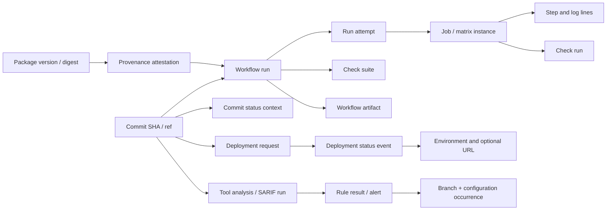

# Automation, delivery, supply chain, security, and code quality

Validated against current official GitHub Docs on **2026-10-03**. This inventory covers repository usage surfaces, including gated features and repository-adjacent drilldowns. Settings forms, billing administration, runner provisioning, environment configuration, and policy configuration are excluded. Operational consequences of those settings remain necessary to understand the interface.

**Evidence:** **D** = documented behavior or field; **I** = proposed/inferred presentation rather than an observed GitHub arrangement. No row claims screenshot verification. Documentation describes capabilities, not a guaranteed pixel layout. Source identifiers resolve to official links below and to the machine-readable [source registry](research/automation-sources.json). Routes are illustrative, not contractual.

## Entry points and visibility

The current documentation calls the repository tab **Security and quality**. Some older articles still describe “Security,” “Vulnerability alerts,” or “Environments”; the newer deployment guide uses **Deployments**. A clone must resolve labels against actual enabled features and viewport overflow instead of rendering every capability as an always-visible tab. Actions can be disabled, alert access depends on roles, and previews can differ by organization. [Quickstart][AS01] [Deployment history][AS26] [Older deployment entry][AS27] [Secret alert access][AS62]

Example route families: `/{owner}/{repo}/actions`, `/actions/workflows/{file}`, `/actions/runs/{run_id}`, `/actions/runs/{run_id}/job/{job_id}`, `/deployments`, `/security`, `/security/advisories`, `/security/dependabot`, `/security/code-scanning`, `/security/secret-scanning`, `/network/dependencies`, and owner-scoped package pages. Code Quality routes, nested request routes, and current sidebar grouping require authenticated UI inspection; do not manufacture route stability from a label. **I**.

## Actions: workflow discovery, live execution, and output

| ID | Surface/component | Data shown | Actions/drilldown | States/gates | Evidence |
| --- | --- | --- | --- | --- | --- |
| A001 | Actions landing / initial workflow selection | Existing automation or suggested templates based on repository language | Choose template; inspect/edit workflow file; commit or propose PR | No workflows; disabled Actions can hide tab; write gates creation | D [AS01] |
| A002 | Workflow sidebar | All workflows and named workflow entries | Scope run history to a workflow | Workflow absent, renamed, disabled, or deleted; distinguish file identity from displayed name | D [AS02]; I identity presentation |
| A003 | Run list and filter controls | Run title, workflow, event, branch, status, timing/actor context | Filter/search; open run; change workflow scope | Empty repository versus zero matching runs; historical runs can outlive workflow edits | D [AS02], [AS16] |
| A004 | Run header / summary identity | Run number/title, workflow, trigger, actor, SHA/ref, status/conclusion | Open source commit, workflow, related PR where available | API identity fields are documented; exact header arrangement requires UI inspection | D [AS16]; I arrangement |
| A005 | Execution history and trigger provenance | Push, pull request, schedule, dispatch or other event; referenced revision | Follow event, commit, branch or PR context | Trigger actor and rerun actor may differ; removed branch does not erase SHA | D [AS16]; I links when not documented |
| A006 | Attempt selector | Latest execution or earlier run attempts | Choose Latest dropdown / prior attempt | Attempt changes execution history, retaining original run/revision identity | D [AS07], [AS16] |
| A007 | Run and job status indicators | Scheduling state separated from eventual conclusion | Open job, waiting requirement or failed step | Queued, pending, waiting and in-progress differ; completed can succeed, fail, cancel, skip or time out | D [AS16], [AS18] |
| A008 | Live visualization graph | Jobs, dependency edges, current status icons | Select graph node to open job logs | Graph updates as execution progresses; dependency blockage differs from execution failure | D [AS03] |
| A009 | Job navigation / execution detail | Job names, statuses, steps, timestamps, runner identity | Select graph node; inspect job | Skipped jobs may lack executed steps; API metadata is not guaranteed header placement | D [AS03], [AS17]; I placement |
| A010 | Matrix job expansion | Multiple job instances from parameter combinations | Inspect individual platform/version variant | Fail-fast can cancel siblings; continue-on-error allows soft failure; max-parallel limits simultaneous jobs | D [AS24]; I matrix grouping control |
| A011 | Job-condition diagnostics | Evaluated expression, expanded expression and boolean result | Download logs; inspect job system.txt | Skipped condition is distinct from skipped because dependency failed; diagnostic availability depends on execution | D [AS22] |
| A012 | Reusable versus composite execution | Reusable workflow jobs/steps separately; composite action as caller step | Traverse called workflow/job logs; inspect composite step log | Do not promise a separate composite job or graph node for every nested action | D [AS25] |
| A013 | Step progress and lifecycle | Step names, status and start/end times | Inspect step output; expand/collapse | Later steps absent/skipped after failure; timestamps unavailable before start | D [AS17] metadata; I interaction arrangement |
| A014 | Failure focus | Failed step expanded; error output near failure | Read surrounding lines; move among jobs | One failed step does not prove every job failed; cancellation can interrupt output | D [AS04] |
| A015 | Runner setup and teardown output | Set up job, Complete job and runner-image details | Follow preinstalled-tool link | Hosted VM decommissioned after job; image varies per runner | D [AS04], [AS20] |
| A016 | Log search | Matching text in expanded steps | Enter query; navigate results; expand more steps | Collapsed steps are excluded from search; no match is not proof text is absent everywhere | D [AS04] |
| A017 | Log line deep link | Specific log line and surrounding output | Select line number; copy permalink | Signed-in account required to view run information, including public repositories | D [AS04] |
| A018 | Log archive download | ZIP of available run/attempt logs | Download archive; inspect offline | Partial rerun archive contains rerun jobs only; deleted/expired logs unavailable | D [AS04], [AS07] |
| A019 | Log groups and redaction | Expandable grouped output; masked values displayed as *** | Expand relevant group | Emission depends on workflow commands; masking is not a substitute for secret-access permissions | D [AS15] |
| A020 | Notices, warnings and errors | Annotation message, optional file/line/column and title | Open annotated source or log context | Workflow must emit annotations; third-party checks may also emit them | D [AS15], [AS18] |
| A021 | Job summaries / test output | Workflow-authored Markdown, links, tables, images | Read summary; follow test-report or artifact links | Summaries grouped after job completion, ordered by completion; no universal native test-result schema | D [AS15] |
| A022 | Duration / Run details → Usage | Job execution time and billable minutes | Inspect job time; open Usage breakdown | Billable minutes only private hosted jobs, rounded up; excludes minute multipliers; public/self-hosted have no billable minutes | D [AS05] |
| A023 | Run workflow form | Selected branch and declared workflow inputs | Choose ref; enter inputs; dispatch | Requires workflow_dispatch, workflow on default branch, and write access; form absent otherwise | D [AS06] |
| A024 | Rerun whole workflow | New attempt for original SHA/ref | Re-run all jobs; optionally enable debug logging | Write required; within 30 days; maximum 50 reruns; original actor privileges apply | D [AS07] |
| A025 | Rerun failed / selected job | Failed jobs or selected job and dependent jobs | Re-run failed jobs or specific job | Preserve prior successful attempt output; rerun is not a new commit or new original event | D [AS07] |
| A026 | Cancel run | In-flight execution and cancellation request | Cancel workflow from run or list menu | Write required; cancellation request and terminal cancelled state are different moments | D [AS08]; I pending feedback |
| A027 | Delete run | Historical run record and its artifacts | Delete with confirmation | Write required; run must be completed or more than two weeks old; output links then disappear | D [AS09] |
| A028 | Delete all logs | Run logs currently available | Delete all logs; confirm | Write required; logs irreversibly removed and delete button no longer shown | D [AS04] |
| A029 | Artifact summary / download | Produced artifact name; API can supply size, expiry and digest metadata | Select artifact download | Signed-in read access; artifact must exist; default retention 90 days, configurable; no assumed exact expiry placement | D [AS10], [AS80]; I extra metadata layout |
| A030 | Artifact deletion | Artifact associated with run | Trash/delete artifact | Write required; irreversible; deleting run also deletes associated artifacts | D [AS11] |
| A031 | Actions → Management → Caches | Cache entries, size, creation and last-used context | Filter branch or key; delete cache | Write needed to delete; cache is reusable build input, not downloadable run artifact | D [AS12] |
| A032 | Available runners in Actions | Hosted runners / self-hosted runners and runner scale sets, labels/groups | Switch runner tab; copy label; inspect eligible execution target | Write required for documented repository list; labels/groups constrain routing; provisioning excluded | D [AS20], [AS21] |
| A033 | Concurrency wait / replacement | Run/job waiting behind same concurrency group | Inspect wait and eventual start/cancellation; broader current-jobs link is org/enterprise | Default pending slot replaced; queue:max allows 100 pending; full queue cancels extra; group not inherently environment | D [AS14], [AS31]; I wait explanation layout |
| A034 | Fork workflow approval | Run awaiting maintainer approval | Review submitted changes; approve run | Write required; approval needed for configured outside contributors; trust decision differs from environment approval | D [AS13] |
| A035 | Workflow badge on README | Passing/failing workflow indicator | Follow badge to workflow history; copy badge Markdown | Default branch, falling back to most recent branch if none; branch/event query scopes supported | D [AS23] |
| A036 | Commit / PR checks bridge | Check suites, check runs and legacy status contexts | Open check details or Actions run from commit/PR | Actions suite represents workflow, run represents job; other apps own checks too; legacy statuses are separate entities | D [AS04], [AS81], [AS19]; I grouping arrangement |

## Deployment history, environment review, and Pages

| ID | Surface/component | Data shown | Actions/drilldown | States/gates | Evidence |
| --- | --- | --- | --- | --- | --- |
| A037 | Repository Deployments entry | Active deployment environments and history | Open right-sidebar Deployments link | Older guide calls entry Environments and labels preview; current naming/placement should be visually checked | D [AS26], [AS27] |
| A038 | Environment sidebar / pinning | Available environment names and selected environment | Select environment; admin pin/unpin up to ten | Active environment is not synonymous with latest successful run; absent history gives no invented environment | D [AS26] |
| A039 | Deployment timeline | Success, failure, active/inactive context, commit and source branch/PR when available | Open commit, related PR or branch | Deployments from external forks omit corresponding source branch/PR links | D [AS26] |
| A040 | Deployment filter builder | Qualifier, operator, value and applied filter chips | Add filters; Apply; inspect matching activity | No matches differs from no deployments; filter affordances documented without exhaustive current qualifier inventory | D [AS26] |
| A041 | Deployment detail links | Environment, deploying revision, status; optional environment URL and logs | Visit deployed site or deployment logs | URLs may be absent or external; third-party integrations can originate records independently of Actions | D [AS28], [AS29] |
| A042 | Deployment status history | Deployment request plus successive status events | Inspect event history and active/inactive result | pending/queued/in_progress/success/failure/error/inactive; transient inactive environments can be “destroyed” | D [AS29] |
| A043 | Waiting deployment review | Waiting banner, affected environments, optional review comment | Review deployments; select environments; Approve and deploy / Reject | Authorized reviewer; self-approval can be prevented; rejection fails workflow; unapproved job fails after 30 days | D [AS30], [AS31] |
| A044 | Protection-rule bypass | Pending jobs subject to protection | Start all waiting jobs; select affected environments; confirm bypass | Admin bypass only when permitted; unavailable if environment prohibits bypass or jobs no longer pending | D [AS30] |
| A045 | Nonhuman gates / environment-only job | Waiting timer, custom app gate, approval or rejection output | Follow rule/log/error context | deployment:false still enforces timer/review but creates no history; custom app protections then fail; environment and concurrency independent | D [AS31]; I gate detail arrangement |
| A046 | Published Pages site access | Site URL and build/deployment relationship | Open environment/site URL; documented Visit site control is in Settings → Pages | Runtime URL in scope; setup excluded. Public Free or private eligible paid plans; publication can lag ten minutes | D [AS33] |
| A047 | Pages build failure / recovery | Actions build/deploy logs; checks where workflow runs on PR | Open failed run; inspect build errors; rerun | A successful build is not proof URL has propagated; no repository-native Pages traffic dashboard established here | D [AS32], [AS33] |

## Packages connected to the repository

| ID | Surface/component | Data shown | Actions/drilldown | States/gates | Evidence |
| --- | --- | --- | --- | --- | --- |
| A048 | Repository Packages sidebar | Packages linked to repository | Open package; search package listings from owner profile | Only linked/published packages appear; package may have independent visibility/access | D [AS34], [AS35] |
| A049 | Package overview | README/description, license, downloads, install instructions and version history | Read usage; open linked repository or version | Metadata varies registry and publication; download statistics are package usage, not code traffic | D [AS37] |
| A050 | Package versions / version detail | Recent versions, publication/version metadata and available assets | View and manage all versions; open version | Registry-dependent layout; container versions/tags are not Git release tags | D [AS34], [AS36] |
| A051 | Installation and permission context | Registry-native install command and package identity | Copy command; use authenticated client | Read downloads/metadata, write publishing, admin management; most registries authenticate public installs, public containers allow anonymous pull | D [AS35], [AS37] |
| A052 | Delete individual package version | Selected version and confirmation target | Version menu/Delete; type package name confirmation | Admin required; public version over 5,000 downloads normally cannot be deleted without support; registry controls differ | D [AS36] |
| A053 | Deleted version / restore boundary | Deleted version eligibility and unavailable downloads | Restore from documented management path or API | Within 30 days and namespace/version not reused; whole-package Settings management excluded, not presumed absent feature | D [AS36] |

## Security policy, private reporting, and advisories

| ID | Surface/component | Data shown | Actions/drilldown | States/gates | Evidence |
| --- | --- | --- | --- | --- | --- |
| A054 | Security and quality landing / conditional navigation | Security reporting, findings, quality and request entry points appropriate to access | Open enabled subsection | Zero visible findings differs from disabled tool or denied alert access; organization overview is a separate scope | D [AS61], [AS69], [AS79]; I unified arrangement |
| A055 | Reporting → Security policy | SECURITY.md content, supported versions and reporting instructions | Read policy; authorized user edits/adds file and commits change | Policy file is independent of private-reporting enablement; absent policy provides setup flow | D [AS38] |
| A056 | Repository advisory listing | Published advisories and authorized private draft/report entries | Open advisory; new draft; private report entry where enabled | Repository security advisories apply to public repos; unpublished records limited to participants/maintainers | D [AS39] |
| A057 | Report vulnerability form | Summary, description, proof of concept, impact, policy context; AI-assisted disclosure option | Submit private report; continue private discussion | Available only when private reporting enabled; reporter gets pending credit and collaboration access | D [AS41] |
| A058 | Private report triage | Submitted report, reporter and conversation | Accept and open as draft; request more information; close | Triage differs from accepted draft; creating private fork alone leaves report in Triage | D [AS42] |
| A059 | Advisory draft editor | Title, description, severity/CVSS, CWE, affected ecosystem/package/version/functions, CVE and credits | Add affected product; calculate severity; save draft | Multiple affected products possible; CVE request and publication are separate actions | D [AS40] |
| A060 | Advisory collaboration / credit | Private discussion, collaborator identities and typed credits | Invite collaborator; comment; accept or decline credit | Private comments stay restricted; publication exposes current advisory and accepted credits, not conversation transcript | D [AS39], [AS40], [AS44] |
| A061 | Temporary private fork | Private remediation branches, files, commits and PRs | Start fork; collaborate; merge eligible remediation PRs from advisory | No CI/check integration in temporary fork; all open PRs must be mergeable; publication deletes fork | D [AS43] |
| A062 | CVE and publication transition | Advisory state, CVE request status and final public advisory | Request CVE; Publish advisory; maintain final text | Request CVE may replace Publish action until requirement met; same advisory URL becomes public; private fork removed | D [AS44] |

## Dependency graph, SBOM, Dependabot alerts, and updates

| ID | Surface/component | Data shown | Actions/drilldown | States/gates | Evidence |
| --- | --- | --- | --- | --- | --- |
| A063 | Insights → Dependency graph | Dependencies and public dependents; supported manifest and submission data | Switch dependencies/dependents; inspect manifest | Detected graph is not every runtime dependency; submission data can expand detected build dependencies | D [AS45] |
| A064 | Dependency rows / ecosystem filters | Package, version, license, manifest, vulnerability indicator and relationship | Open public package repo; filter ecosystem/relationship | Private/unrecognized packages appear as text; vulnerability data visibility gated by permission | D [AS45] |
| A065 | Transitive dependency path | Direct/transitive/inconclusive relation, ancestor path; submission detector/time | Show paths; inspect how package enters graph | Multiple paths possible; incomplete metadata cannot establish full reachability | D [AS45] |
| A066 | Dependents list | Public repositories/packages depending on repository | Open dependent or switch repository/package view | Count approximate and may differ from listed results; no complete private-consumer list | D [AS45] |
| A067 | Export SBOM | Current repository dependency inventory in SPDX form | Export SBOM; download machine-readable inventory | Includes versions/licenses/dependency relationships; not dependents, vulnerability verdict or proof all runtime components discovered | D [AS46] |
| A068 | Dependabot vulnerability alert list | Numeric alert records associated with dependency vulnerability | Open alert; inspect open/closed views | Alerts require enabled detection/supported ecosystem and authorized visibility; version updates are a separate capability | D [AS48] |
| A069 | Dependabot prioritization / filters | “Most important” ordering, packages, ecosystems, manifests, scope and alert labels | Search/filter; click attribute label | Multiple alerts for a dependency possible; no results differs from no supported dependency or no access | D [AS47] |
| A070 | Dependabot alert detail | Advisory, severity, affected package/version, manifest and vulnerable usage context where supplied | Read full advisory; follow package and manifest | Some advisories have no fixed version; source metadata completeness varies | D [AS47], [AS48] |
| A071 | Security-update action / linked PR | Available fixed version and suggested security update | Create Dependabot security update; inspect resulting PR | Feature/configuration and fix availability gate action; a suggested update is not a merged fix | D [AS47] |
| A072 | Dependabot dismissal / reopen | Resolution reason, optional comment and alert activity | Dismiss open alerts individually/bulk; reopen dismissed unresolved alert | Fixed closed alerts cannot be reopened; dismissal is a review decision, not dependency removal | D [AS47] |
| A073 | Dependabot assignee / agent session | User/team/AI agent assignee; proposed task context and eventual PR | Assign authorized agent; optional prompt/model/repo/agent; open draft PR or View Session | Agent may produce no fix; assignment persists until removed; licensing/policy gates vary | D [AS47] |
| A074 | Dependabot Malware view | Malicious-package alerts and package/advisory detail | Findings → Dependabot → Malware; assess, dismiss/reopen | Supported ecosystems and enabled capability; public-name collision can produce false positive; separate from vulnerability scoring | D [AS49], [AS50] |
| A075 | Dependency graph → Dependabot monitoring | Configured package managers/manifests and recent update jobs | Inspect monitored dependency set and Recent update jobs | Version-update configuration needed; do not infer universal “all dependencies monitored” from list | D [AS51] |
| A076 | Dependabot update-job logs | Job type (version/security/rebase), time, dependencies, resolution trace, errors and PR links | Open recent job; read logs | Write access to documented logs; version updates enabled; update-job identity is not automatically an Actions run identity | D [AS52], [AS53] |

## Code scanning: findings, branch state, tool health, and PR results

| ID | Surface/component | Data shown | Actions/drilldown | States/gates | Evidence |
| --- | --- | --- | --- | --- | --- |
| A077 | Code scanning alert list / filters | Tool, rule, severity, branch/state; application/test/library/generated/documentation categorization | Filter and search; Only application code; open alert or linked issue | Summary access needs write; public available, private org Code Security gated. Most filters AND; multiple branch refs OR | D [AS54], [AS55] |
| A078 | Code scanning alert detail | Message, source location, introduction time, tool, rule explanation and security/general severity | Open code; read remediation; Development PR/branch links; link issue | Critical/high/medium/low security severity differs from error/warning/note; third-party metadata can be sparse | D [AS55] |
| A079 | Affected branches / configurations | Per-branch alert state and configuration counts/timestamps | Select branch; inspect Configurations analyzing modal | Main status describes default branch; nondefault-only alert reads in branch/in pull request; stale configs can disagree | D [AS55] |
| A080 | Data-flow trace | Numbered steps linking source to sink and related source locations | Show paths; switch related code paths | Only tools/results supplying flow data; multiple paths grouped into one alert rather than independent alerts | D [AS54], [AS59] |
| A081 | Tool-status page / warning banner | Analysis tools/configurations, last run and errors, extraction coverage, analyzed files and rule counts | Open Tool status; select tool; export supported CSV lists | Analysis failed/stale/incomplete differs from zero alerts; language extraction percentage is not test coverage | D [AS56] |
| A082 | PR Code scanning results | New findings on changed lines, tool-specific check and annotations | Open annotation or check; View all branch alerts | Analysis workflow execution check differs from findings check; PR can be blocked by configured requirement | D [AS58] |
| A083 | Fix, Autofix, dismissal and remediation | Suggested change, fix branch/PR and dismissal reason/activity | Manually fix/rescan; Generate fix; create draft PR; dismiss/reopen; conditional agent/bulk fix | Suggestion is best effort; dismissal affects all branches; one unchanged/stale configuration can keep alert open | D [AS57] |
| A084 | SARIF third-party result identity | Tool/rule/result, locations, fingerprints and optional flow metadata | Inspect tool/rule and mapped code; relate recurring result | SARIF run is analysis container, not Actions run; inconsistent filepaths/fingerprints can duplicate alerts; result ingestion can truncate | D [AS59] |
| A085 | AI Scan in PRs | AI-labelled advisory findings, reasoning, optional Autofix and feedback alongside CodeQL | Read Conversation/Files changed finding; thumb feedback; fix proposal | Public preview; Advanced Security and AI/Copilot gates; no fork/Dependabot PRs; cannot enforce merge rules; no repository backlog | D [AS60] |

## Secret scanning, push protection, and request queues

| ID | Surface/component | Data shown | Actions/drilldown | States/gates | Evidence |
| --- | --- | --- | --- | --- | --- |
| A086 | Secret-scanning list / filters | Default alerts, secret type/provider, state, validity, locations and bypass context | Filter/search; open alert | Admin/owner/security-manager or authorized alert role; private/internal org Secret Protection. Provider-only partner alerts do not appear here | D [AS61], [AS62] |
| A087 | Generic / AI-detected secrets | Separate generic alert list with source locations | Switch generic view; inspect location | Generic list limit 5,000; first five locations for generic, first one for AI patterns; not in org summary | D [AS62] |
| A088 | Secret detail / validity check | Secret/location/timeline and active/inactive/unknown validity | Verify secret when supported; inspect locations | Validity independent of open/closed; unknown can mean unsupported or verification failure, not safe | D [AS63] |
| A089 | Token metadata / ownership | Supported token name/owner, creation/expiry/last-use and org access; selected partner owner/contact | Inspect token context to route remediation | Preview/plan/provider dependent; active-token metadata only; revoked or unknown token may lack metadata | D [AS63] |
| A090 | Resolve secret alert | Resolution reason and comment, reported-leak context | Revoke/rotate externally; close alert; conditional Report leak for private GitHub PAT | Removing file text alone neither revokes secret nor automatically resolves alert; preview report action has confirmation | D [AS64] |
| A091 | Secret scanning PR merge gate | Head-commit scanning status and configured open secret alerts | Follow alert; remediate/resolve; await scan completion | Preview/conditional requirement; closed alerts alone do not pass while head scan pending | D [AS64] |
| A092 | Blocked web edit / upload | Dialog, detected secret source and underlined offending code | Remove secret; review one detection at a time; conditional upload protection | Existing alerted secret may not block; detection coverage differs from retrospective scanning | D [AS65] |
| A093 | Direct push-protection bypass | Bypass reason: tests, false positive, or fix later | Allow detected secret; complete push | Test/false-positive generates closed alert, fix-later open alert; personal-only protection differs and need not create repo alert | D [AS65] |
| A094 | Requests → Push protection bypass | Requester, approver, timeframe, status, details and audit timeline | Filter queue; comment; Approve bypass request / Deny bypass request | Delegated bypass/reviewer role required; expires after seven days; approved-but-unpushed remains Open in repository guide | D [AS66] |
| A095 | Delegated alert-dismissal review | Requested dismissal, supporting reason/comment and timeline | Open request; Review request; approve/deny and Submit review | Organization/enterprise queues cover code, secrets and Dependabot; authorized reviewer required; repository alert carries request context | D [AS68] |

## Code Quality: distinct from security findings

Code Quality is a current repository interface, not a synonym for code scanning security alerts. The documented repository results require **GitHub Team or Enterprise**, enabled Code Quality, and write access. Standard CodeQL-backed findings, recent-merge AI suggestions, PR feedback, and optional line coverage have different coverage and lifecycles. Several AI interactions remain public preview. [Interpreting results][AS69] [Recent merges][AS71] [Coverage][AS74]

| ID | Surface/component | Data shown | Actions/drilldown | States/gates | Evidence |
| --- | --- | --- | --- | --- | --- |
| A096 | Quality → Standard findings | Default-branch reliability/maintainability summary; findings grouped by rule then alphabetic file | Filter language/category/severity/open state; open rule group | Enabled feature and write access; unsupported/generated code limits conclusions; absence of findings does not prove complete analysis | D [AS69] |
| A097 | Reliability and Maintainability scores | Excellent, Good, Fair or Poor based on worst finding severity | Inspect underlying category/rule findings | Excellent means no findings; notes → Good, warnings → Fair, errors → Poor; not a numerical universal quality grade | D [AS72] |
| A098 | Standard finding detail | Rule title, file/code location and rule explanation/references | Show more; open source; manually fix | Regenerated results depend on new analysis; present findings represent default-branch backlog | D [AS70] |
| A099 | Quality → AI findings in recent merges | Recently merged file rows, finding count and merge timing, suggested changes | Open file suggestions; Open pull request for selected file | Preview; up to five findings/file and five files; no findings/inactive state differs from proven clean code | D [AS71] |
| A100 | Assign quality findings to Copilot | Selected findings and ensuing session/PR links | Assign individual or up to 25 Standard findings; assign multi-file AI work | AI credits/policy apply; Standard backlog assignment need not require individual Copilot license; multi-file recent-merge workflow does | D [AS70], [AS71] |
| A101 | Quality Actions / PR bot feedback | CodeQL workflow attributed to github-code-quality; CodeQL - Code Quality / Analyze check; github-code-quality[bot] comment | Open run; inspect findings/Autofix; open change proposal | Analysis execution failure and detected quality findings differ; shared CodeQL name does not merge quality/security objects | D [AS73] |
| A102 | Quality line coverage in PR | Branch/default aggregates, ten most impacted files, expandable per-file percentages/deltas | Inspect coverage summary comment and file breakdown | Requires Cobertura upload; line coverage only; summary can include unchanged files; latest branch report compared with default | D [AS74], [AS88] |

## Conditional repository context and organization drilldowns

These are necessary edges of the repository map. They are not promised as additional universal repository tabs.

| ID | Surface/component | Data shown | Actions/drilldown | States/gates | Evidence |
| --- | --- | --- | --- | --- | --- |
| A103 | Production context on alerts | Runtime-risk attributes and linked production artifact/registry/deployment context | Dependabot/code scanning filters artifact-registry, artifact-registry-url, has:deployment, runtime-risk | Needs uploaded/integrated artifact data; missing metadata does not prove undeployed; security access still applies | D [AS75] |
| A104 | PR open-source license findings | Dependency policy violation annotations; exception request context | Read violation; request exception with rationale; follow review | Enterprise-owned org plus Code Security preview; Active blocks, Evaluate reports; resolution requirements can separately block conversation | D [AS76] |
| A105 | Organization Packages → Linked artifacts | Storage/deployment metadata, source repository, registry, provenance/build links | Open artifact; follow attestation to workflow run; export records via API | Org any plan/read; does not host files or describe consumed dependencies; deployment records differ from repo dashboard | D [AS77], [AS78] |
| A106 | Organization Security overview drilldown | Cross-repository detection/remediation/prevention and campaigns | Follow relevant repository alert or production-risk subset | Org/enterprise scope and licensed permissions; charts are not a default repo Insights feature; campaign administration remains outside this repository view | D [AS79] |

## Additional operational controls, metrics, and reviewer workflows

These controls were added during the one-hop completeness audit. They use the same data and permission contracts as the main inventory.

| ID | Surface/component | Data shown | Actions/drilldown | States/gates | Evidence |
| --- | --- | --- | --- | --- | --- |
| A107 | Workflow options → Disable / Enable | Active or disabled workflow | Disable workflow from contextual menu; Enable workflow from disabled view | File retained; write gate; public forks disable scheduled workflows, and public schedules auto-disable after 60 inactive days | D [AS82], [AS93] |
| A108 | Insights → Actions Usage Metrics | Consumption by workflow/job, OS and runner type; organization also has repository breakdown | Change tab/scope; inspect high-use category | Base repository role sees repository metrics; minutes are utilization, not complete multiplied bill | D [AS83], [AS84] |
| A109 | Insights → Actions Performance Metrics | Average runtime, queue time and failure rates by workflow/job/OS/runner type | Inspect bottleneck/failure category; filter | Repository and organization scopes distinct; job count can differ between workflow and job tabs without minute mismatch | D [AS83], [AS84] |
| A110 | Actions metrics period / filters / CSV | Selected date window, qualifier/operator/value and chart/table data | Period selector; Add filter; Apply; export usage CSV | UTC days; excludes skipped/zero-minute runs; custom at most 100 days within prior year; not exact invoice | D [AS83] |
| A111 | Request alert dismissal | Alert state and requester reason in activity timeline | Request dismissal instead of direct dismissal; await review; resubmit expired secret request | Delegated code/secret/Dependabot gate; approval closes alert, denial leaves open; secret requests expire after one week | D [AS85], [AS92] |
| A112 | PR quality finding remediation | Error/Warning/Note bot comment and suggested Autofix | Commit suggestion; Add suggestion to batch; Dismiss finding; licensed user mentions @Copilot to delegate | Write access; dismissal for nonactionable finding differs from applying code fix; agent session and resulting PR stay reviewable | D [AS86] |
| A113 | PR quality / coverage merge block | Blocking finding severity or minimum line coverage / allowed-drop threshold | Fix/dismiss blocking findings; add tests and push to rerun coverage | Gate configured by admin/org; absent severity means all findings; verify merge banner clears, not merely resolved conversation | D [AS87] |
| A114 | Skipped trigger / persistent Pending check | No workflow execution despite required pending check | Inspect commit message and path/branch filters; push eligible new commit | Trigger skip differs from skipped executed job; skip message applies push/pull_request, not pull_request_target | D [AS89] |
| A115 | Code/secret alert Assignees control | Assigned user and ownership context | Assign/unassign user with repository write access | Secret assignee lacking list access receives temporary access to that alert only, revoked on unassignment; notifications on assignment/dismissal | D [AS54], [AS61], [AS90] |
| A116 | Repository campaign sidebar / tracking view | Named campaign, selected alert subset, progress, manager, contact and possible tracking issue/due date | Open campaign; contact manager; fix or assign grouped alerts | Org-created campaign appears in affected repos; code campaigns default-branch alerts; secret campaigns preview with distinct viewing gates | D [AS91], [AS90] |
| A117 | Failed PR-job agent fix | Failed job and target PR branch | Fix with Copilot; inspect resulting session/commits | New attempt pushes proposed fix; separate agent workflow trust gate W138 | D [COL79]; detail in 02 |
| A118 | Agentic Workflow definition/execution handoff | Versioned Markdown instructions and generated .lock.yml; Actions run/output | Inspect/review both files; trigger ordinary workflow; follow outputs | Public preview; Actions/engine authentication; distinct from creator-private Copilot Automations | D [COL98] [COL99]; I contextual grouping |

## Entity relationships and state semantics

A source model should preserve separate identities even if one screen combines them. The graph below is a proposed Beanstalk domain map (**I**), with relationships grounded in the cited API and feature documentation.

Workflow runs identify a workflow/event/revision; an attempt changes execution without changing the original revision. Job results can be mixed within one run. Check runs have a **status** and an optional **conclusion**: status `queued`, `in_progress`, `completed`, with Actions-only `waiting`, `requested`, `pending`; conclusions include `action_required`, `cancelled`, `failure`, `neutral`, `success`, `skipped`, `stale`, `timed_out`. `stale` is assigned by GitHub. Do not collapse these into a single green/red field or infer successful execution from skipped. [Run objects][AS16] [Job objects][AS17] [Check state][AS18]

Check suites additionally list startup_failure and summarize the highest-priority included conclusion. Third-party apps can expose requested-action buttons in PR Checks, such as a fix action; these are not Actions workflows. Checks archive after 400 days and delete ten days later; archived required checks must be rerun before merging. [Checks guide][AS81]

Legacy commit statuses are `error`, `failure`, `pending`, `success`, recorded against SHA/context. Combined status uses the latest per context: any error/failure makes failure; missing statuses or pending makes pending; otherwise success. They are not job steps or check-run conclusions. A third-party CI details URL can point outside GitHub. [Commit statuses][AS19]

A deployment request targets a ref/SHA and has multiple status events; workflow and deployment are not one object. An environment-only job with `deployment:false` can wait for approval while producing no deployment history. A green Actions run reports completion of configured work, not current application health. [Deployment objects][AS28] [Status events][AS29] [Environment-only jobs][AS31]

An analysis result is not an execution result: a scan can complete successfully and discover severe findings. SARIF rules describe detection logic; results describe occurrences. Stable tool/rule/location/fingerprint data connects occurrences over revisions, while branch/configuration records preserve different current states. Alert resolution, token validity, bypass approval, pushed commit, advisory publication, and agent completion must remain separate fields. [SARIF][AS59] [Branch states][AS55] [Secret validity][AS63] [Bypass lifecycle][AS66]

## Alternative visualization candidates for Beanstalk

These are **design hypotheses**, not claims that GitHub currently implements them. Keep the existing task-focused tables, source views and deep links available. Validate alternatives on seeded repository data with experienced and occasional contributors.

| Candidate | Improves which task / components | Data needed | Cost and guardrail | Keep original when |
| --- | --- | --- | --- | --- |
| Execution waterfall beside job DAG | “Why is this run slow?” A007–A015, A022, A033 | Attempt/job/step timestamps, needs edges, actual queue and protection reasons | Dense graphs become hard to read; state names and keyboard table equivalent required; never label missing time as zero | User needs exact logs or dependency topology |
| Matrix pivot table | “Which OS/version is failing?” A010 | Matrix keys/values, job identity, conclusion and duration | Many axes explode; offer two chosen axes and list remainder; distinguish cancelled siblings from tested failures | Matrix small or variants lack stable dimensions |
| Attempt comparison / failure signature | “Did rerunning help, and what changed?” A006, A024–A025 | Original SHA, per-attempt jobs/log references, error signatures | Signatures need careful redaction and may incorrectly group errors; show source lines and original attempts | Full chronological audit or output changed meaning |
| Waiting-reason inbox | “What needs my approval?” A023, A033–A034, A043–A045, A094–A095 | Gate type, requester/reviewer, expiry, policy permission, status | Different approval scopes remain distinct; one-click bulk approve should not obscure affected revisions/environment | Contributor wants one run's local context |
| Revision-to-production swimlane | “Which commit is live where?” A037–A045, A103–A105 | Immutable SHA/digest, build link, deployment status events, environment, timestamps | Tag/ref mutability and external deployment gaps can mislead; show unknown links and data source | Need one environment's precise event timeline |
| Artifact lineage card | “Can I trace this package to code/build?” A029, A048–A053, A105 | Version/digest, storage record, attestation, commit, workflow, deployment source | Separate package files, workflow artifacts and metadata-only linked artifacts; no unverified provenance claim | Install/download commands are primary task |
| Dependency path explorer with manifest table | “Why is vulnerable package here?” A063–A074 | Direct/transitive paths, manifests, versions, severity, available fix, deployment context | Graph hairballs obscure exact versions; expand locally, report incomplete paths, preserve list and SPDX export | Large inventories and compliance exports |
| Evidence-first remediation board | “Which problem can I fix next?” A068–A100 | Alert type, actual severity, validity, branch/configuration, owner, fix PR, dismissal/request history | Do not numerically blend vulnerability, malware, secret and quality scales; display type and evidence freshness | Security specialists need source-specific triage |
| Branch/configuration occurrence grid | “Is this really fixed everywhere?” A079, A083–A084 | Branch, scan configuration, occurrence state and last analysis | Large branch counts; virtualize/search and show stale/no-analysis separately from fixed | Inspect one default-branch alert |
| Advisory collaboration timeline | “Where are we in disclosure?” A056–A062 | Report/draft/published state, participants, CVE/fork/PR events, accepted credits | Strict permission boundaries; public view cannot include private discussion or secret fork metadata | Editing long advisory text |
| Quality delta and coverage panel | “Did this PR improve maintainability?” A096–A102 | Category/rule findings, comparison revision, supported scope, latest Cobertura reports | Worst-severity categorical scores are not trend magnitudes; stale baseline or unsupported files must remain visible | Read exact rules or changed source |
| Compact state legend with textual freshness | “Does zero mean clean?” All alert/tool surfaces | Capability enabled, last successful analysis, coverage, permissions, loading/error state | Extra context consumes space; compact progressive disclosure with explicit Unknown and No access | Users already know scope and are scanning many rows |
| Utilization-versus-reliability small multiples | “Which workflow deserves optimization?” A108–A110 | Comparable usage minutes, runtime/queue/failure rates, period and exclusions | Average hides distribution; optional percentiles require raw data, not inferred from averages; show counts and UTC range | Exact usage export or an individual run diagnosis |

Suggested evaluation tasks: locate a failure on one matrix variant; find an earlier successful job after partial rerun; identify an approval the viewer can act on; distinguish a built commit from currently deployed digest; explain a transitive package path; resolve an alert that remains stale on another configuration; distinguish an inactive token from a dismissed alert; find a Code Quality finding versus a security vulnerability. Measure correct completion, time, navigation count, mistaken “clean” conclusions, and whether users can return to original log/source evidence.

## Cross-cutting implementation and accessibility requirements

Treat loading, no records, no filter matches, disabled capability, unsupported language/ecosystem, expired/deleted output, stale analysis, permission denial, and network failure as separate UI states. The table's state column describes documented gates; this broader state taxonomy is a Beanstalk design requirement (**I**). Tooltips should explain why an action is unavailable without implying that repository data does not exist.

Preserve ref/SHA, attempt, job, package digest, alert identity, branch/configuration and data-source scope in navigation and shareable links. Filters should remain reproducible on back/forward navigation. Live updates should not reorder the focused item or collapse the log section being read. Announce meaningful status changes without reading every log line; allow pausing auto-scroll and use a virtualized log viewer that preserves copy and deep-link semantics.

Use text and icons alongside status color; “waiting,” “skipped,” “neutral,” and “unknown” need names. DAGs, matrix pivots, traces and timelines need equivalent keyboard-operable tables/lists, clear focus order, and selectable source text. Charts must expose units, time zone and missing-data explanations. Expiry countdowns cannot be the sole representation of dates. Masked/redacted content must stay redacted in search snippets, downloaded previews, tooltips and visualization summaries. These are proposed accessibility/interaction requirements (**I**), not verified GitHub UI behaviors.

Do not build one permission boolean named “maintainer.” Model read/write/admin, security manager, alert access, reviewer authorization, package permissions, enabled capabilities and licensing separately. For public/private repository gates, follow current capability documentation rather than assuming all paid features appear on all paid repositories. [Code scanning access][AS55] [Secret access][AS62] [Package permissions][AS35] [Bypass reviewers][AS66] [Quality access][AS69]

## Coverage and validation audit

This file maps **118 component groups**. Coverage was checked along six journeys: workflow discovery → execution → output → recovery; revision → environment review → deployment history; package → version → install/manage; report → advisory → private fix → publication; dependency → alert → update/fix; scan/quality finding → source/branch evidence → remediation. Official navigation articles were followed into execution, permission, reference and new-feature pages rather than treating search snippets as sufficient evidence.

The source registry contains **93 official articles/reference pages actually read**. **D** means the cited article supports behavior/data, not that every screenshot/current toolbar was inspected. No authenticated interaction, screenshot audit or mutation was performed. Plans and previews reflect documentation at the checked date; their availability must be rechecked before implementation.

Remaining live-UI validation: exact current Security and quality sidebar groups; Code Quality route structure and empty states; artifact metadata displayed in headers; queue wait explanation placement; matrix grouping and runner metadata placement; newest Pages runtime entry outside Settings; package-registry-specific version pages; all responsive menus and role-specific toolbars. An authenticated seeded repository matrix is needed for those details: public/private, read/write/admin/security role, with/without Code Security or Secret Protection, enabled/disabled Code Quality, supported/unsupported analysis, and preview eligibility.

Documentation inconsistencies retained explicitly: Deployments versus older Environments entry; repository bypass `Open` includes approved/unpushed, while organization reviewer docs separately name `Approved` and describe `Completed` differently. These are scoped presentation differences, not grounds to invent one global request-state vocabulary. [Deployment guides][AS26] [Older wording][AS27] [Repository queue][AS66] [Organization queue][AS67]

Configuration-only exclusions: Actions permissions, secrets/variables, runner creation, retention setup, environment creation/protection rules, Pages source/domain setup, package visibility setup, Dependabot YAML creation, security enablement, scanning query configuration and policy authoring in Settings. Their resulting runtime gates are mapped above. Repository-adjacent org surfaces A095/A105/A106 are labelled as boundaries so a clone can link them without falsely calling them repository tabs.

## Official source references

Source IDs, URLs, titles, feature scope and checked date are recorded in [automation-sources.json](research/automation-sources.json). The links below support table evidence and permit direct follow-up reading.

[AS01]: https://docs.github.com/en/actions/get-started/quickstart "Quickstart for GitHub Actions"
[AS02]: https://docs.github.com/en/actions/monitoring-and-troubleshooting-workflows/monitoring-workflows/viewing-workflow-run-history "Viewing workflow run history"
[AS03]: https://docs.github.com/en/actions/how-tos/monitor-workflows/use-the-visualization-graph "Using the visualization graph"
[AS04]: https://docs.github.com/en/actions/how-tos/monitor-workflows/use-workflow-run-logs "Using workflow run logs"
[AS05]: https://docs.github.com/en/actions/how-tos/monitor-workflows/view-job-execution-time "Viewing job execution time"
[AS06]: https://docs.github.com/en/actions/how-tos/manage-workflow-runs/manually-run-a-workflow "Manually running a workflow"
[AS07]: https://docs.github.com/en/actions/how-tos/manage-workflow-runs/re-run-workflows-and-jobs "Re-running workflows and jobs"
[AS08]: https://docs.github.com/en/actions/how-tos/manage-workflow-runs/cancel-a-workflow-run "Canceling a workflow run"
[AS09]: https://docs.github.com/en/actions/how-tos/manage-workflow-runs/delete-a-workflow-run "Deleting a workflow run"
[AS10]: https://docs.github.com/en/actions/how-tos/manage-workflow-runs/download-workflow-artifacts "Downloading workflow artifacts"
[AS11]: https://docs.github.com/en/actions/how-tos/manage-workflow-runs/remove-workflow-artifacts "Removing workflow artifacts"
[AS12]: https://docs.github.com/en/actions/how-tos/manage-workflow-runs/manage-caches "Managing caches"
[AS13]: https://docs.github.com/en/actions/how-tos/manage-workflow-runs/approve-runs-from-forks "Approving workflow runs from forks"
[AS14]: https://docs.github.com/en/actions/how-tos/write-workflows/choose-when-workflows-run/control-workflow-concurrency "Control the concurrency of workflows and jobs"
[AS15]: https://docs.github.com/en/actions/reference/workflows-and-actions/workflow-commands "Workflow commands for GitHub Actions"
[AS16]: https://docs.github.com/en/rest/actions/workflow-runs "REST API endpoints for workflow runs"
[AS17]: https://docs.github.com/en/rest/actions/workflow-jobs "REST API endpoints for workflow jobs"
[AS18]: https://docs.github.com/en/rest/checks/runs "REST API endpoints for check runs"
[AS19]: https://docs.github.com/en/rest/commits/statuses "REST API endpoints for commit statuses"
[AS20]: https://docs.github.com/en/actions/how-tos/manage-runners/github-hosted-runners/use-github-hosted-runners "Using GitHub-hosted runners"
[AS21]: https://docs.github.com/en/actions/how-tos/manage-runners/self-hosted-runners/use-in-a-workflow "Using self-hosted runners in a workflow"
[AS22]: https://docs.github.com/en/actions/how-tos/monitor-workflows/view-job-condition-logs "Viewing job condition expression logs"
[AS23]: https://docs.github.com/en/actions/how-tos/monitor-workflows/add-a-status-badge "Adding a workflow status badge"
[AS24]: https://docs.github.com/en/actions/how-tos/write-workflows/choose-what-workflows-do/run-job-variations "Running variations of jobs in a workflow"
[AS25]: https://docs.github.com/en/actions/concepts/workflows-and-actions/reusing-workflow-configurations "Reusing workflow configurations"
[AS26]: https://docs.github.com/en/actions/how-tos/deploy/configure-and-manage-deployments/view-deployment-history "Viewing deployment history"
[AS27]: https://docs.github.com/en/repositories/viewing-activity-and-data-for-your-repository/viewing-deployment-activity-for-your-repository "Viewing deployment activity for your repository"
[AS28]: https://docs.github.com/en/rest/deployments/deployments "REST API endpoints for deployments"
[AS29]: https://docs.github.com/en/rest/deployments/statuses "REST API endpoints for deployment statuses"
[AS30]: https://docs.github.com/en/actions/how-tos/deploy/configure-and-manage-deployments/review-deployments "Reviewing deployments"
[AS31]: https://docs.github.com/en/actions/how-tos/deploy/configure-and-manage-deployments/control-deployments "Deploying with GitHub Actions"
[AS32]: https://docs.github.com/en/pages/setting-up-a-github-pages-site-with-jekyll/about-jekyll-build-errors-for-github-pages-sites "About Jekyll build errors for GitHub Pages sites"
[AS33]: https://docs.github.com/en/pages/getting-started-with-github-pages/creating-a-github-pages-site "Creating a GitHub Pages site"
[AS34]: https://docs.github.com/en/packages/learn-github-packages/viewing-packages "Viewing packages"
[AS35]: https://docs.github.com/en/packages/learn-github-packages/about-permissions-for-github-packages "About permissions for GitHub Packages"
[AS36]: https://docs.github.com/en/packages/learn-github-packages/deleting-and-restoring-a-package "Deleting and restoring a package"
[AS37]: https://docs.github.com/en/packages/learn-github-packages/introduction-to-github-packages "Introduction to GitHub Packages"
[AS38]: https://docs.github.com/en/code-security/how-tos/report-and-fix-vulnerabilities/configure-vulnerability-reporting/add-security-policy "Adding a security policy to your repository"
[AS39]: https://docs.github.com/en/code-security/concepts/vulnerability-reporting-and-management/repository-security-advisories "Repository security advisories"
[AS40]: https://docs.github.com/en/code-security/how-tos/report-and-fix-vulnerabilities/fix-reported-vulnerabilities/create-repository-advisory "Creating a repository security advisory"
[AS41]: https://docs.github.com/en/code-security/how-tos/report-and-fix-vulnerabilities/report-privately "Privately reporting a security vulnerability"
[AS42]: https://docs.github.com/en/code-security/how-tos/report-and-fix-vulnerabilities/fix-reported-vulnerabilities/manage-vulnerability-reports "Managing privately reported security vulnerabilities"
[AS43]: https://docs.github.com/en/code-security/tutorials/fix-reported-vulnerabilities/collaborate-in-a-fork "Collaborating in a temporary private fork to resolve a repository security vulnerability"
[AS44]: https://docs.github.com/en/code-security/how-tos/report-and-fix-vulnerabilities/fix-reported-vulnerabilities/publish-repository-advisory "Publishing a repository security advisory"
[AS45]: https://docs.github.com/en/code-security/how-tos/secure-your-supply-chain/secure-your-dependencies/explore-dependencies "Exploring the dependencies of a repository"
[AS46]: https://docs.github.com/en/code-security/how-tos/secure-your-supply-chain/establish-provenance-and-integrity/export-dependencies-as-sbom "Exporting a software bill of materials for your repository"
[AS47]: https://docs.github.com/en/code-security/how-tos/manage-security-alerts/manage-dependabot-alerts/view-dependabot-alerts "Viewing and updating Dependabot alerts"
[AS48]: https://docs.github.com/en/code-security/concepts/supply-chain-security/dependabot-alerts "Dependabot alerts"
[AS49]: https://docs.github.com/en/code-security/how-tos/manage-security-alerts/manage-dependabot-alerts/manage-malware-alerts "Managing Dependabot malware alerts"
[AS50]: https://docs.github.com/en/code-security/concepts/supply-chain-security/malware-alerts "Dependabot malware alerts"
[AS51]: https://docs.github.com/en/code-security/how-tos/secure-your-supply-chain/manage-your-dependency-security/list-configured-dependencies "Listing dependencies configured for version updates"
[AS52]: https://docs.github.com/en/code-security/how-tos/view-and-interpret-data/view-dependabot-logs "Viewing Dependabot job logs"
[AS53]: https://docs.github.com/en/code-security/concepts/supply-chain-security/dependabot-job-logs "Dependabot job logs"
[AS54]: https://docs.github.com/en/code-security/how-tos/manage-security-alerts/manage-code-scanning-alerts/assess-alerts "Assessing code scanning alerts for your repository"
[AS55]: https://docs.github.com/en/code-security/concepts/code-scanning/code-scanning-alerts "Code scanning alerts"
[AS56]: https://docs.github.com/en/code-security/how-tos/find-and-fix-code-vulnerabilities/manage-your-configuration/use-the-tools-status-page-for-code-scanning "Use the tool status page for code scanning"
[AS57]: https://docs.github.com/en/code-security/how-tos/manage-security-alerts/manage-code-scanning-alerts/resolve-alerts "Resolving code scanning alerts"
[AS58]: https://docs.github.com/en/code-security/how-tos/manage-security-alerts/manage-code-scanning-alerts/triage-alerts-in-pull-requests "Triaging code scanning alerts in pull requests"
[AS59]: https://docs.github.com/en/code-security/reference/code-scanning/sarif-files/sarif-support "SARIF support for code scanning"
[AS60]: https://docs.github.com/en/code-security/concepts/code-scanning/ai-powered-security-detections "AI Scan for pull requests"
[AS61]: https://docs.github.com/en/code-security/how-tos/manage-security-alerts/manage-secret-scanning-alerts/viewing-alerts "Viewing and filtering alerts from secret scanning"
[AS62]: https://docs.github.com/en/code-security/concepts/secret-security/about-alerts "About secret scanning alerts"
[AS63]: https://docs.github.com/en/code-security/tutorials/remediate-leaked-secrets/evaluating-alerts "Evaluating alerts from secret scanning"
[AS64]: https://docs.github.com/en/code-security/how-tos/manage-security-alerts/manage-secret-scanning-alerts/resolving-alerts "Resolving alerts from secret scanning"
[AS65]: https://docs.github.com/en/code-security/how-tos/secure-your-secrets/work-with-leak-prevention/push-protection-in-the-github-ui "Working with push protection in the GitHub UI"
[AS66]: https://docs.github.com/en/code-security/how-tos/secure-your-secrets/manage-bypass-requests/manage-bypass-requests "Managing requests to bypass push protection"
[AS67]: https://docs.github.com/en/code-security/how-tos/secure-your-secrets/manage-bypass-requests/review-bypass-requests "Reviewing requests to bypass push protection"
[AS68]: https://docs.github.com/en/code-security/how-tos/manage-security-alerts/remediate-alerts-at-scale/review-alert-dismissal-requests "Reviewing alert dismissal requests"
[AS69]: https://docs.github.com/en/code-security/how-tos/maintain-quality-code/interpret-results "Interpreting the code quality results for your repository"
[AS70]: https://docs.github.com/en/code-security/how-tos/maintain-quality-code/fix-backlog-findings "Fixing code quality findings in your repository backlog"
[AS71]: https://docs.github.com/en/code-security/how-tos/maintain-quality-code/fix-findings-in-recent-merges "Fixing code quality findings in recently merged files"
[AS72]: https://docs.github.com/en/code-security/reference/code-quality/metrics-and-ratings "Metrics and scores reference"
[AS73]: https://docs.github.com/en/code-security/reference/code-quality/codeql-detection "CodeQL-powered analysis for Code Quality"
[AS74]: https://docs.github.com/en/code-security/reference/code-quality/code-coverage "Code coverage reference"
[AS75]: https://docs.github.com/en/code-security/tutorials/secure-your-organization/prioritize-alerts-in-production-code "Prioritizing Dependabot and code scanning alerts using production context"
[AS76]: https://docs.github.com/en/code-security/concepts/supply-chain-security/open-source-license-compliance "About open source license compliance"
[AS77]: https://docs.github.com/en/code-security/concepts/supply-chain-security/linked-artifacts "About linked artifacts"
[AS78]: https://docs.github.com/en/code-security/how-tos/secure-your-supply-chain/establish-provenance-and-integrity/view-linked-artifacts "Auditing your organization's builds on the linked artifacts page"
[AS79]: https://docs.github.com/en/code-security/concepts/security-at-scale/security-overview "Security overview"

[AS80]: https://docs.github.com/en/rest/actions/artifacts "REST API endpoints for GitHub Actions artifacts"
[AS81]: https://docs.github.com/en/rest/guides/using-the-rest-api-to-interact-with-checks "Using the REST API to interact with checks"
[AS82]: https://docs.github.com/en/actions/how-tos/manage-workflow-runs/disable-and-enable-workflows "Disabling and enabling a workflow"
[AS83]: https://docs.github.com/en/actions/how-tos/administer/view-metrics "Viewing GitHub Actions metrics"
[AS84]: https://docs.github.com/en/actions/concepts/metrics "About GitHub Actions metrics"
[AS85]: https://docs.github.com/en/code-security/concepts/security-at-scale/delegated-alert-dismissal "Delegated alert dismissal"
[AS86]: https://docs.github.com/en/code-security/how-tos/maintain-quality-code/fix-findings-on-a-pr "Fixing code quality findings on a pull request"
[AS87]: https://docs.github.com/en/code-security/how-tos/maintain-quality-code/unblock-your-pr "Resolving a block on your pull request"
[AS88]: https://docs.github.com/en/code-security/how-tos/maintain-quality-code/view-coverage-on-prs "Viewing code coverage on pull requests"
[AS89]: https://docs.github.com/en/actions/how-tos/manage-workflow-runs/skip-workflow-runs "Skipping workflow runs"
[AS90]: https://docs.github.com/en/code-security/concepts/security-at-scale/about-security-campaigns "About security campaigns"
[AS91]: https://docs.github.com/en/code-security/tutorials/manage-security-alerts/best-practices-for-participating-in-a-security-campaign "Participating in a code security campaign"
[AS92]: https://docs.github.com/en/code-security/how-tos/manage-security-alerts/manage-secret-scanning-alerts/enable-delegated-dismissal "Enabling delegated alert dismissal for secret scanning"
[AS93]: https://docs.github.com/en/rest/actions/workflows "REST API endpoints for workflows"

[COL79]: https://docs.github.com/en/copilot/how-tos/use-copilot-agents/cloud-agent/use-cloud-agent-on-github "Using Copilot cloud agent on GitHub"

[COL98]: https://docs.github.com/en/copilot/concepts/agents/about-github-agentic-workflows "About GitHub Agentic Workflows"
[COL99]: https://docs.github.com/en/copilot/how-tos/github-agentic-workflows/creating-github-agentic-workflows "Creating GitHub Agentic Workflows"
