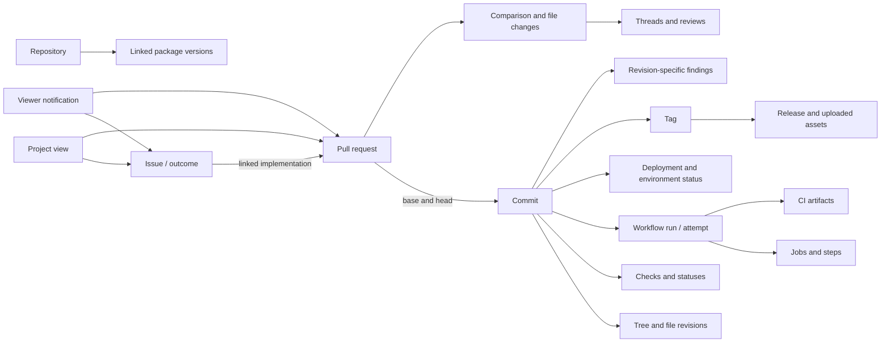
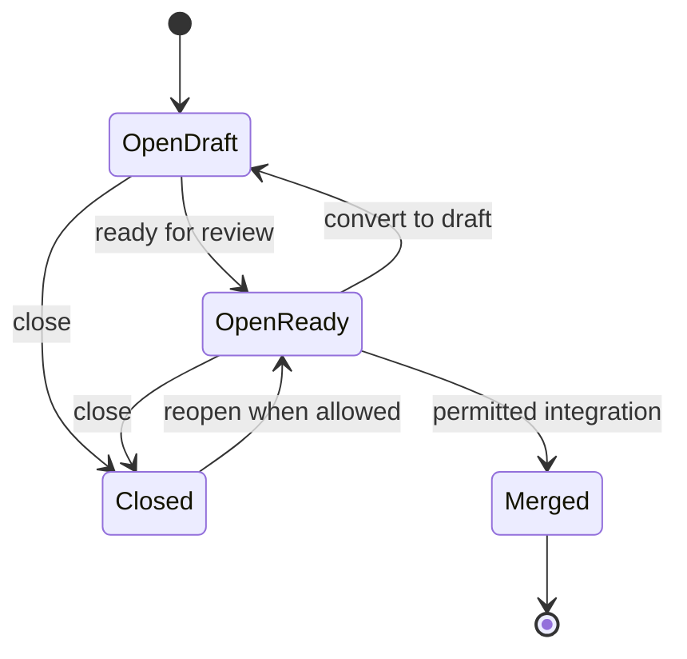

# Data, relationships and state model

This is a **proposed Beanstalk normalization model**, not a reconstruction of GitHub's private database. Feature behavior is grounded in the domain inventories and sources; field names and rendering envelopes below are design proposals. The model makes alternative visualizations reliable without coupling them to one screen.

## Objects behind the interface

| Object | Identity and key data | Relationships / views | Distinction to preserve |
| --- | --- | --- | --- |
| Repository | Stable ID, owner/name, visibility, default ref, capabilities | Root of code, work, automation and analytics | Rename changes path, not conceptual identity |
| Git blob | Object ID, bytes, encoding, size | File content through a tree entry | Blob has no intrinsic filename |
| Git tree / entry | Tree ID; entry path/name/mode/type/object ID | Directory browser at commit | Same blob can exist at multiple paths |
| Commit | ID, tree, parents, author/committer, message, timestamps | History, DAG, compare, signatures | Snapshot plus ancestry; timestamp order is not ancestry |
| Ref / branch | Ref name, current target | Branch selector/list, PR endpoints | Mutable pointer; not a copied folder |
| Tag | Named ref; optional annotated tag object, target, tagger/signature | Tag list/release anchor | Tag can exist without a release |
| File revision | Repository + commit + path | Blob, blame, history, line link | Path alone is not stable content identity |
| Comparison | Base/head IDs, mode, merge base, file changes | Compare or PR changeset | Two-dot snapshots differ from three-dot merge-base comparison |
| File change | Old/new path and blob IDs, status, additions/deletions, patch | Changed-file tree and diff | A rename is not only a deletion/new file in the UX |
| Hunk / line | Old/new range, side, content, context | Diff, suggestions, inline review | Old/new line numbers differ; context can move |
| Fork relation | Parent/source repository IDs and available refs | Fork list/network/sync | Different repo identity and permission boundary |
| Release | ID, tag, title/body, author, draft/prerelease/latest, publish time | Releases list/detail | Release content and publish date are not tag creation data |
| Release asset | ID, filename/type/size, digest/download metadata | Asset list/download | Uploaded binary differs from generated source archive |
| Issue | ID/number, title/body, author, state/reason, type, timestamps | Issue list/detail/timeline | Work item; independent of Git snapshot |
| Automated issue proposal / rationale | Issue, target attribute, proposed value, reason, provider confidence, pending/accepted/declined state | Suggestion panel, search and applied-action rationale | Confidence is an agent claim; held suggestion differs from current issue data |
| Work metadata | Labels, assignees, milestone, issue type/fields | Selectors, grouping, filters | Metadata scope varies: repo, organization, project |
| Issue relationships | Parent/sub-issue, blocked-by/blocking, linked PRs | Hierarchy and dependency views | Hierarchy and dependency are different edge types |
| Pull request | Stable ID/number, base/head repos+refs+SHAs, draft/open/closed/merged | Conversation/commits/checks/files | Evolving proposal; not one immutable changeset |
| Review | Reviewer, decision/body, reviewed revision, submitted time | Review summary/timeline | Approval is tied to review context and may become stale |
| Review thread / comment | Thread ID, author, diff location, original/current revision, resolution | Inline thread, outdated view, replies | Resolved and outdated are independent dimensions |
| Timeline event | Actor, event kind/time, source links and old/new values | Issue/PR/activity history | Event history is not current state |
| Discussion | Category/format, title/body, answer, votes/poll, lock/closure | Discussion list/detail | Answered Q&A differs from issue completion |
| Project / view / field | Owner+project ID, item IDs, typed fields, layout/filter/group/sort | Table/board/roadmap/charts | Can span repos; project status differs from issue state |
| Project item | Draft or linked issue/PR plus field values | Card/row/item panel | An issue may participate in multiple projects |
| Wiki page / revision | Separate wiki Git history, page path, content | Wiki navigation/history | Wiki repo is distinct from main source history |
| Workflow definition | Path/ref/version, name, trigger and declared jobs | Actions sidebar/source view | YAML definition differs from one executed run |
| Copilot automation definition | Creator+repository+ID, prompt/model, triggers/filters, tools, enabled state | Agents Automations and spawned sessions | Private to creator, stored outside Git; not an Actions file |
| Workflow run / attempt | Run ID, attempt number, trigger, branch/SHA, actor, status, timing | Run list/detail/retry history | Reruns create attempts; do not overwrite failure evidence |
| Job / matrix instance | Job ID, attempt, matrix values, dependencies, runner, status | Execution graph, job detail | Declared job can expand into many executions |
| Step | Job ID + step number, label, timing, result | Step log/progress | Skipped does not mean passed or waiting |
| Check suite / check run | App, commit, suite/run IDs, status/conclusion, output/annotations | PR checks and commit badges | Not all checks come from Actions |
| Commit status | Commit + provider context, state, description/target | Combined status and PR merge gate | Older status API has its own state vocabulary |
| Artifact / cache | Artifact ID or cache key, run provenance, size, expiry | Downloads/cache usage | CI artifact, cache, release asset and package are distinct |
| Deployment / status | Deployment ID, exact ref/SHA, environment, statuses, URL | Deployment dashboard/PR links | Success of a build does not prove a deployment is active |
| Environment / approval | Name, waiting job, gate type, reviewer decision; optional deployment ID | Approval card/history | A gated job can have no deployment record |
| Package / version | Registry+owner+name, version/digest, linked repository | Package summary/version/install | Registry package differs from release and CI artifact |
| Provenance attestation | Subject digest, builder, source revision, verification origin/result | Artifact/package integrity drilldown | Attestation differs from artifact bytes and claimed filename |
| Linked artifact metadata | Organization+source-system identity, digest, source repository, storage/runtime records | Linked artifacts boundary and repository security context | Metadata can describe an external registry; it does not store bytes |
| Alert / finding | Source/tool/rule, severity, state, remediation; secret validity separately | Security and quality lists/detail | Open/closed resolution differs from active/inactive/unknown secret validity |
| Alert occurrence | Alert ID + branch + analysis configuration; revision/path, raw state, last analysis | Branch/configuration finding detail | Default-branch header state and stale occurrence state can differ |
| Object access grant | Viewer, object ID, assignment/grant origin, effective/revoked state | Authorized individual alert view | Assignment can grant one secret alert without repository alert-list access |
| Advisory / report | ID, disclosure state, affected versions, collaborators, credit | Private triage/public advisory | Confidential content must not enter public aggregates |
| Actor / Git identity | Account/team/app/bot or Git name/email; explicit mapping | Avatar, author, reviewer, owner, executor | Commit author, pusher, workflow actor and approver differ |
| Subscription / notification | Viewer, repository/thread, mode/events; notification ID/reason/triage | Watch controls/attention inbox | Star, watch, unread, done and unsubscribe differ |
| Metric series | Measure, unit, population, window, buckets, scope, availability | Insights charts/export | Aggregate is not an authoritative object record |
| Development session | Viewer+repo+branch, environment ID/state | Codespace launch/resume | Local or saved workspace changes need remote commit/push |
| Agent session / attempt | Session ID, origin/kind, initiator, repository/base, prompt/trace, state, produced revisions; optional PR links | Agents list/log, assignment, invocation, PR creation and continuation | Pushed changes can precede PR creation; completion is not acceptance |
| Session access / query capability | Viewer+session, sharing/origin, query/steer/archive permissions | Trace visibility, synced history, sharing menu | Shared visibility does not grant steering or history-query access |
| Workflow trust decision | Revision/run context, gate kind, decision actor/time, provider raw state | Fork or agent PR workflow approval | Trust permission differs from PR review and environment approval |

Detailed evidence and object usage: [Code/Git](01-code-git-releases.md), [work/review](02-work-items-and-reviews.md), [automation/security](03-automation-delivery-security.md), [analytics/identity](04-insights-people-search.md). Git objects and hosting objects must retain separate identifiers even when their UI appears together.

## Cross-feature relationships



An arrow means a possible relationship, not guaranteed membership. A release need not have an Actions run; a deployment need not be implemented by Actions; a package need not expose source provenance. Show an absent relationship as unknown/unlinked, not inferred success.

Linked artifact storage and runtime deployment records retain their own source-system IDs. Associate them with a workflow output, package version or repository deployment only when explicit provenance establishes the relation. Their runtime records do not originate in the repository deployment dashboard; an equal environment name is insufficient to merge them. [Linked artifacts](https://docs.github.com/en/code-security/concepts/supply-chain-security/linked-artifacts).

## State dimensions and transitions

These are simplified UI state models. Use feature-specific provider values from document 03 when implementing; do not treat a diagram as an exhaustive API enum.



Draft is a property of an open PR in this simplified picture; a reopened PR can retain its prior draft flag. Model status, draft, mergeability computation, policy eligibility, review requirements, queue membership, locked conversation and archived visibility separately. A green check badge is only one input to permission to merge.

| Dimension | UI states to represent | Critical interpretation |
| --- | --- | --- |
| Fetch state | Initial/loading/ready/empty/error/partial/stale/offline | Loading or inaccessible is not zero |
| Repository capability | Available/disabled/not entitled/read-only/permission denied/unknown | Evaluate object-scoped grants separately from repository-wide access |
| Issue | Open/closed plus closure reason; independent type/hierarchy/project status | Closed as not planned is not delivered |
| PR | Open/closed/merged; draft; archived; mergeability unknown/conflict/policy blocked | Archive has visibility/moderation effects; see 02 |
| Review | Pending/commented/approved/changes requested/dismissed; current vs stale | New head/base can change relevance of approval |
| Review thread | Open/resolved; current/outdated; visible/restricted | Resolving discussion does not change content/check result |
| Execution | Queued/waiting/in progress/completed plus conclusion | Waiting for approval/runner/dependency are different explanations |
| Check conclusion | Success/failure/neutral/skipped/cancelled/timed out/action required/stale | Never compress all completed states into green |
| Merge queue | Requested/queued/checking/removed/merged | Queue candidate revision may differ from PR head |
| Deployment | Requested/pending/running/succeeded/failed/inactive; approval separately | Provider status and currently active version differ |
| Security finding | Resolution/reason; branch/configuration occurrence state and analysis age; secret validity separately | Dismissal does not prove a fix; default-branch presentation is not every occurrence |
| Release | Draft/published, prerelease/latest, mutable/immutable | Latest is designation, not newest tag timestamp |
| Notification | Read/unread/done/saved; subscription separately | Completing triage does not stop future subscription |
| Metric | Available/pending/limited/unsupported/partial/true zero | Include window, unit, population and exclusions |

Commit statuses use `error`, `failure`, `pending`, `success`; check runs expose separate `status` and `conclusion`. A normalized Beanstalk badge should retain its provider kind/raw values so a reviewer can inspect the actual meaning. [Commit statuses](https://docs.github.com/en/rest/commits/statuses), [check runs](https://docs.github.com/en/rest/checks/runs).

Code-scanning configurations can disagree when their analyses are stale. Preserve each occurrence and the default-branch presentation rather than reducing every alert to one revision/state. Secret-alert assignment can temporarily grant an otherwise unauthorized writer access to that individual alert; unassignment revokes that added access. See A079, A088 and A115 in [03](03-automation-delivery-security.md), [code-scanning alerts](https://docs.github.com/en/code-security/concepts/code-scanning/code-scanning-alerts), and [campaign assignment](https://docs.github.com/en/code-security/concepts/security-at-scale/about-security-campaigns).

An environment-referencing job with `deployment: false` can still wait for review or a timer while producing no deployment history. Model those job gates without requiring a deployment ID. A custom protection app needs a deployment record; its incompatibility failure differs from a reviewer rejecting the job. [Environment deployment behavior](https://docs.github.com/en/actions/how-tos/deploy/configure-and-manage-deployments/control-deployments).

Agent session visibility, query scope and control require separate capabilities. Cloud sessions are shared with repository readers by default; shared local sessions are view-only, and history queries use only the initiating viewer's synced sessions. Third-party coding agents do not support live steering. Copilot cloud-agent PR workflows require a distinct trust approval by default unless configured otherwise. Details and sources: W124–W141 in [02](02-work-items-and-reviews.md).

Copilot Automation definitions remain creator-private even from repository administrators; their spawned sessions have different visibility. Preserve that boundary in aggregates. Agentic Workflows instead have versioned Markdown/compiled lock-file definitions and ordinary Actions runs. Issue suggestion acceptance is a workflow convenience, not a server-enforced authorization boundary. Pending proposals do not become current labels/fields until applied. Details and sources: W142–W149 in [02](02-work-items-and-reviews.md) and A118 in [03](03-automation-delivery-security.md).

## Exact changeset and review coordinates

“Changeset” here means a comparison with resolved immutable base/head revisions, a declared comparison mode and a file-change list. It is not assumed to be a native GitHub object. The same PR can produce different changesets after a push, base update or rebase.

For each review location retain repository, comparison/head revision, old/new path, old/new blob IDs, side, start/end line, original location and current mapping status. A suggestion refers to a particular diff range. If the mapping becomes uncertain, display the original code and mark it outdated rather than attaching an old comment to an unrelated new line. Rename, binary file, deleted file, multi-line thread, generated file and truncated patch need their own presentations.

Counts have explicit denominators: **files loaded / total**, **current viewer's viewed files / loaded reviewable files**, **unresolved current threads / all threads**. GitHub's `viewerViewedState` is viewer-specific; a PR review decision is not per-file inspection evidence for the whole team. Do not infer another reviewer's file coverage from approval or absence of comments. Team-wide revision-bound file acknowledgments would be additional Beanstalk data. A viewed marker must not imply approval or complete review of newer content. A semantic grouping can reorder presentation while retaining a full file list and diff. [GraphQL changed-file data](https://docs.github.com/en/graphql/reference/pulls#pullrequestchangedfile), [review data](https://docs.github.com/en/rest/pulls/reviews).

## Retrieval and completeness constraints

| Retrieval boundary | Verified behavior | UI consequence |
| --- | --- | --- |
| General REST lists | Follow response pagination links; not every endpoint uses the same parameters | Never treat first page as total; preserve page/loading state |
| Code search | Login/default branch; nonexhaustive index, 100-result cap, no sorting | Do not imply selected-ref or exhaustive search; use separate index for additional capability |
| Compare commits | Unpaged response limited to 250 commits; changed files only on first page, up to 300 total | Large compare view must expose incomplete file coverage |
| Single commit JSON | File diff pagination above 300 files; up to 3,000 files | Track commit metadata separately from paginated files |
| PR changed files | Paginated; maximum 3,000 files | Large PR cannot be claimed fully inspected from that endpoint |
| Binary/large patch | Binary diff may omit patch; large diff/patch can time out | Use binary/too-large state and fetch source separately if available |
| Computed analytics | May return 202 while compiling; endpoint-specific size limits | Pending message, bounded retry and last-known timestamp |
| API limits | Primary/secondary rate limits and retry guidance | Show delayed freshness; respect retry/reset; no rapid retry loop |

Sources: [pagination](https://docs.github.com/en/rest/using-the-rest-api/using-pagination-in-the-rest-api), [commits and comparisons](https://docs.github.com/en/rest/commits/commits), [PR files](https://docs.github.com/en/rest/pulls/pulls), [statistics](https://docs.github.com/en/rest/metrics/statistics), [rate limits](https://docs.github.com/en/rest/using-the-rest-api/rate-limits-for-the-rest-api). API constraints establish integration limits; they do not prove that GitHub's own frontend has identical truncation behavior.

Actions' job API exposes timing/results/steps/runner metadata, but does not establish structured runtime matrix assignments, `needs` edges or wait reasons. Recover declarations from workflow source pinned to the executed revision; capture evaluated matrix values and scheduling reasons where runtime support permits. Dynamic expressions, prior-job outputs, reusable workflows and include/exclude rules can defeat static parsing. Missing mappings remain unknown, with a job list/timeline available. [Workflow job API](https://docs.github.com/en/rest/actions/workflow-jobs); declared/runtime workflow semantics in [03](03-automation-delivery-security.md).

## Proposed view envelope

Every Beanstalk panel should carry a snapshot and interpretation envelope. Example field names below are illustrative:

```json
{
  "repository_id": "repo_123",
  "view_kind": "change_review",
  "scope": {"base_sha": "<resolved-base>", "head_sha": "<resolved-head>", "diff_mode": "merge_base"},
  "observed_at": "2026-10-03T08:00:00Z",
  "completeness": {"state": "partial", "loaded": 300, "total": 420, "reason": "provider_limit"},
  "capabilities": {"can_comment": true, "can_merge": false},
  "source_links": ["<authorized-object-url>"],
  "presentation": {"mode": "table", "selection": ["change_17"]}
}
```

For charts add measure/unit, denominator, aggregation, branch/window/timezone, exclusions and collection origin. For proposed dependency/semantic edges add evidence kind, revision and confidence; **inferred**, **declared**, **static** and **observed runtime** should remain distinguishable.

Actions target current objects and enforce current permission/state. A pinned view preserves what the reviewer saw; it cannot grant authority or prove that a mutable branch still points to that revision. That model connects this inventory to Beanstalk's [existing canvas proposal](../03-jev-canvas-experience.md) without making the research an approved implementation plan.

## Minimum fixture matrix

Use representative data, not only a happy-path screenshot: empty repository; large monorepo; fork with divergent history; draft and stacked PR; rename/binary/deleted/mass-change diff; unresolved/outdated multi-line thread; changed head after approval; queue checks against a new base; waiting deployment; failed job with rerun; matrix partial completion; expired artifact; dismissed-vs-fixed alert; leaked-secret rotation; anonymous author; bot actor; permission-restricted user; archive/read-only state; pending/limited analytics; private project item linked from public work; missed/offline update.

Also include disagreeing/stale code-scanning configurations; active secret with closed resolution; assigned individual-secret access followed by unassignment and access revocation; environment-only review/timer wait without a deployment; custom-protection incompatibility; and external linked-artifact runtime metadata that shares an environment name with an unrelated repository deployment.

Exercise personal-fork maintainer-edit permissions with/without workflows; agent workflow approval before/after a push; first-use app authorization pending/failed; shared local-session reader versus initiating history-query user; third-party session without steering; and batched fixes targeting the existing branch versus a separate PR.

Include creator versus administrator visibility for automation definitions/shared sessions; disabled automation versus failed run; untrusted event ignored versus opted-in trigger; pending accepted/declined issue suggestions with intervening manual edits; and missing optional rationale on an otherwise valid issue change.

Document 07 records which verification was actually performed. These fixtures are acceptance material for future implementation, not tests already run against a Beanstalk app.
