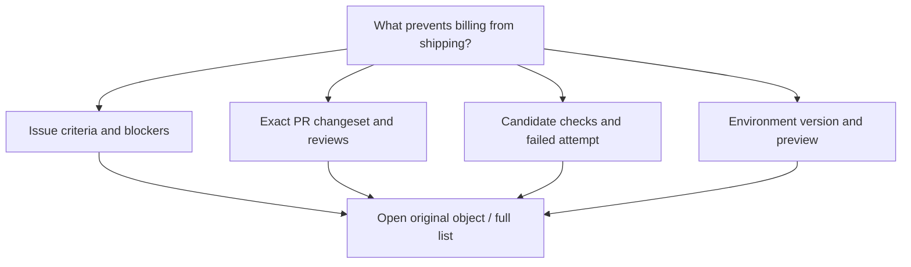

# Alternative ways to see repository data

These ideas are **hypotheses**. A better view makes a particular task more accurate or faster; visual novelty alone is not an improvement. They complement Beanstalk's [product exploration](../02-product-thesis-and-ideas.md) and [question-driven canvas](../03-jev-canvas-experience.md). Nothing here requires implementing all of GitHub before testing the strongest ideas.

## Design principles

- Keep exact files, unified/split diffs, lists and logs available as detail views. They already work well for precise reading and known-item retrieval.
- Generate a view around a question, with visible repository, branch/revision, time window and permissions. Preserve selection, focus and pinned layout when live values update.
- Every aggregate links to its members. Show missing, stale, partial, inferred and inaccessible data explicitly. Never turn a source limit into an apparently complete picture.
- Offer a table and keyboard path alongside spatial views. Use text plus icons for state, reduced motion for progress, stable grouping and accessible contrast.
- Separate observed state from prediction. Declared ownership differs from recent contribution; dependency differs from shared filename; file overlap differs from a semantic conflict; a passed check differs from demonstrated behavior.

## Opportunity catalog

| Idea | Question / source interface | Proposed view | Data required | When it might help | Main cost / familiar fallback |
| --- | --- | --- | --- | --- | --- |
| VZ01 Repository context bar | “What exactly am I looking at?” / tabs and selectors | Compact repository + feature + ref/range + freshness bar | Resolved scope, capabilities, snapshot | Cross-feature navigation and copied links | Avoid consuming code width; keep ordinary tabs |
| VZ02 Repository atlas | “Where does this behavior live?” / file tree | Directory map with selectable language, churn or ownership overlay | Tree at SHA; measured overlay + evidence | Onboarding into large codebases | Area/color can hide tiny critical files; tree/table |
| VZ03 Symbol relationship explorer | “Who calls this?” / symbols and search | Focused one-hop definition/reference graph with code preview | Language-aware index; revision and coverage | Following unfamiliar code | Static reference is not runtime call; text search/code |
| VZ04 Change neighborhoods | “Which parts changed together?” / changed-file list | Group by folder/owner/verified dependency; show group diffs | Full changeset, owners, typed edges | Large PR triage | Clustering can bury a critical file; sorted full file list |
| VZ05 Diff overview strip | “Where should I start?” / additions/deletions summary | File/hunk overview with unresolved threads, findings and viewed state | Current diff coordinates and annotations | Long diffs and review resumption | Overview is navigation, not approval; full diff |
| VZ06 Review evidence matrix | “What review evidence is missing?” / review summary | Files × ownership/thread/check evidence; separate PR decisions | Current viewer's file state; explicit revision-bound acknowledgments if added | Distributed review responsibilities | Team file inspection unknown without extra data; full diff/list |
| VZ07 Revision-aware review replay | “What changed since my last review?” / new-commit diff | Previous review → current diff; moved/outdated threads | Exact reviewed/current SHAs and mapping | Push/rebase during review | Mapping uncertainty; original thread + conventional diff |
| VZ08 Requirement-to-change view | “Does this change fulfill the issue?” / issue links and PR | Acceptance criteria beside supporting file changes/checks | Human criteria; explicit links and run evidence | Reviewing outcome rather than activity | Agent-generated links may be wrong; criteria table/diff |
| VZ09 Branch/stack lanes | “What depends on this PR?” / branches and stacked PRs | Compact ancestry/dependency lanes with status | Git parents, base/head, stack relation | Sequencing dependent work | Timeline alone cannot show DAG ancestry; PR/branch lists |
| VZ10 Merge readiness panel | “Why can't this merge?” / merge box/checks | Named requirements with blocker, owner and evidence | Current policy/reviews/check SHA/conflicts | Fast routing of remaining work | Not one green score; explicit requirements list |
| VZ11 Integration queue timeline | “Why is the queue stuck?” / merge queue | Candidate generations, wait/check time, invalidation events | Queue candidate SHAs and timestamps | Diagnosing wasted checks and queue delay | Predictions uncertain; queue position/details |
| VZ12 Conflict alternatives workspace | “Which resolution should we choose?” / conflict editor | Base/ours/theirs/resolved plus dependent checks and preview | Three revisions, resolution proposal, exact test evidence | Cross-file or behavioral conflicts | Semantic correctness not guaranteed; standard conflict editor |
| VZ13 Issue hierarchy + dependency switch | “What's left and what's blocking it?” / sub-issues | Hierarchical progress plus separately styled blocker edges | Parent-child, blocked-by, closure reasons | Planning nested work | Closed isn't always done; outline/list |
| VZ14 Work flow and aging | “Where are items stalled?” / issue/project board | Board with time-in-state and selectable historical flow | Event history, typed statuses, window | Finding process bottlenecks | Retroactive field edits confound history; board/table |
| VZ15 Milestone scope evolution | “Why did this release slip?” / milestone progress | Added/removed/completed scope over time | Milestone membership events and outcomes | Distinguishing scope growth from progress | Missing history needs collection; milestone list |
| VZ16 Discussion decision digest | “Was a decision made?” / long discussion | Answer/decision candidates plus source-linked thread map | Thread structure, accepted answer, explicit decisions | Repeated community questions | Summary may erase dissent; complete chronological thread |
| VZ17 Project portfolio facets | “Which projects contain this work?” / project links | Item-centered view of each project's fields/status | Authorized project memberships and fields | Cross-project coordination | Status meanings differ; native table/board/roadmap |
| VZ18 Wiki change map | “Which documentation drifted?” / wiki pages/history | Topic outline with recent edits and broken-link signals | Wiki Git revisions and parsed links | Maintaining large knowledge bases | Edit age doesn't prove staleness; page list/history |
| VZ19 Run timeline + DAG | “Where did execution time go?” / Actions graph | Switch dependency graph ↔ execution Gantt | Job API timing; pinned workflow edges; captured wait reasons | Parallel/matrix builds | Unknown edges/waits explicit; never invent ETA; logs/list |
| VZ20 Matrix results grid | “Is only one platform failing?” / expanded jobs | Matrix axes with state/duration/retry | Captured runtime matrix values plus attempt results | Large OS/version/test matrices | Names don't prove axes; unknown mapping → job list |
| VZ21 Failure-first log workspace | “What caused this failure?” / job log | Failed step, adjacent context, annotations and retry comparison | Exact attempt logs and line anchors | CI diagnosis across noisy logs | Heuristic cause can be wrong; raw searchable log |
| VZ22 Check evidence lineage | “Was this exact version tested?” / green badges | Branched commit/run → jobs/checks; separately linked artifacts/deployments | Exact revisions, attempts, explicit provenance; third-party checks/statuses | Reviewing release readiness | A check does not create/prove a deployment; checks table |
| VZ23 Environment version lanes | “What is running where?” / deployments | Environment rows with active SHA and transition history | Deployment/status chronology, URLs | Rollout/rollback assessment | Provider success isn't observed health; history table |
| VZ24 Release delta explorer | “What will users get?” / release notes/tags | Previous/current release → included PRs/files/assets | Tag targets, changeset, reviewed links | Understanding an upgrade | Notes aren't proof; release notes + assets |
| VZ25 Package provenance view | “Which binary came from which source?” / package/release assets | Registry version/digest linked to build/source evidence | Trusted provenance and dependency metadata | Distribution investigation | Version strings don't establish identity; install/version list |
| VZ26 Supply-chain impact map | “How are we exposed?” / dependencies and alerts | Dependency paths focused on selected advisory/version | Lockfile/dependency graph, alert, supported ecosystem | Transitive remediation | Path existence doesn't prove exploitability; dependency/alert list |
| VZ27 Security triage facets | “What should be handled next?” / alert lists | Severity × exposure × age × remediation evidence | Actual alert attributes and authorization | Large alert backlogs | No opaque risk score; filtered list and detail |
| VZ28 Secret incident trail | “Did we contain the credential?” / secret alerts | Detection → revoke/rotate → affected history → evidence | Provider validity and trusted remediation events | Separating deletion from containment | Never display raw secrets in overview; alert detail |
| VZ29 Code Quality trend/context | “Did recent work reduce this issue?” / finding dashboard | Categorical rating + rule/severity counts at comparable revisions | Standard vs AI findings; analysis scope; fresh uploaded coverage baseline | Maintenance and cleanup planning | Worst-severity rating is not a continuous score; findings list |
| VZ30 Linked analytics | “What changed around a release?” / Insights graphs | Aligned small multiples with event annotations | Typed metric series, units/windows, release events | Investigating change patterns | Correlation not causality; chart/table by measure |
| VZ31 People/responsibility directory | “Who can help here?” / contributors and CODEOWNERS | Ownership, review and contribution as separate facets | Explicit owners; scoped activity; identities | Finding reviewers without memorized names | Commit volume isn't ability/capacity; directory/filter |
| VZ32 Fork divergence explorer | “Which fork is useful?” / fork/network list | Sortable metadata plus ancestry/divergence mini-lanes | Available refs and actual comparisons | Finding active downstream development | Metadata ≠ divergence; forks table |
| VZ33 Attention queue | “What needs me?” / repository notifications | Work-item groups with next action and reason | Viewer-specific notifications and current object state | Reducing duplicate notifications | Triage ≠ unsubscribe; standard inbox |
| VZ34 Search evidence workspace | “Where is this implemented and why?” / search results | File/issue/PR/commit facets with preview and stable anchors | Multiple query engines; authorized cross-links | Moving from code to rationale | One syntax can't cover all engines; normal results |
| VZ35 Development sessions list | “Where is my unfinished work?” / Codespaces | Repo/branch, session lifecycle, unpushed work where supported | Session state and explicit local-vs-remote evidence | Resuming work safely | Can't infer unsaved data from a branch; session list |
| VZ36 Focused repository canvas | “What prevents this feature shipping?” / many tabs | A few source-linked panels: work, change, evidence, runtime | Query plan + exact authorized snapshot + typed panel schema | Questions crossing multiple domains | Generation can hide uncertainty; stable home and ordinary tabs |
| VZ37 Agent attempt/evidence lanes | “What did this task produce and what needs me?” / Agents sessions | Intent → separate attempts → proposed revisions → checks/review/outcome | Session/agent kind, initiator, authorized trace, exact PR/run links | Comparing concurrent attempts and resuming blocked work | Token use is not task progress; session list/log and ordinary PR |
| VZ38 Automated issue-change review | “Should this proposed triage change apply?” / suggestions panel | Current → proposed attribute delta, rationale and cited evidence | Authorized proposals, current issue snapshot, provider confidence and action state | Reviewing batches without confusing proposal and fact | Confidence is not permission or calibrated certainty; issue panel/list |

VZ concepts refer to inventory families: VZ02–05, 09, 24, 32 → [01](01-code-git-releases.md); VZ06–18, 37–38 → [02](02-work-items-and-reviews.md); VZ19–29 → [03](03-automation-delivery-security.md); VZ30–34 → [04](04-insights-people-search.md); VZ01, 35–36 → [00](00-repository-shell.md). All concepts must satisfy the [data/state contracts](05-data-and-state-model.md).

## Where familiar views already fit

| Task | Strong existing representation | Useful addition to test |
| --- | --- | --- |
| Find/open a known file | Tree, fuzzy file finder | Scope/ref visibility |
| Inspect an exact source edit | Unified or split diff | Thread/finding navigation and prior-review range |
| Read one long discussion | Chronological thread with anchors | Optional source-linked digest |
| Find a known issue/PR | Filtered sortable list | Clearer action-needed metadata |
| Read CI output | Monospaced searchable log with step grouping | Failed-step focus and attempt comparison |
| Track parallel dependency execution | DAG | Duration/wait timeline toggle |
| Compare exact numeric measures | Table | Small chart for pattern detection |
| Plan dated work | Roadmap | Dependency overlay when needed |
| Download a release | Release notes and named assets | Digest/provenance detail |

Avoid default 3D commit galaxies, endless graphs of every file, moving avatars for every agent, opaque health scores or progress circles with invented percentages. These tend to reduce legibility or overstate the available evidence. An optional graph is useful when it exposes a real relation a list hides.

## Prototype shortlist

This priority order is a design judgment, not a commitment to implementation.

| Prototype | Why start here | Minimal data | Evaluation task |
| --- | --- | --- | --- |
| 1. Review evidence matrix + diff strip | A bounded improvement on a frequent, precise task | One PR, owners, threads, checks at SHA; explicit file acknowledgments if tested | Locate file lacking ownership/review evidence and stale approval |
| 2. Run DAG/timeline/matrix switch | State/timing often spread across several views | One run with parallel matrix jobs, approval wait and rerun | Identify delay, failed axis and correct attempt |
| 3. Environment/release lineage | Connects “green” to “what shipped” | Two environments, two releases, artifact provenance | State exact active version and its tested source |
| 4. Issue hierarchy/blocker view | Uses explicit relations and real outcome distinctions | Parent issue, sub-issues, blockers and closure reasons | Identify work still required before parent completion |
| 5. Focused repository canvas | Tests the broader Beanstalk thesis after components work | Typed queries using the four prototypes | Explain shipping blocker and choose evidence-supported next step |

Data feasibility is part of each prototype: GitHub PR approvals do not prove per-reviewer file inspection, and viewer file flags are personal. Actions job responses alone do not provide matrix axes, dependency edges or exact waiting causes. Additional Beanstalk capture must be explicit; missing data remains unknown. See [05](05-data-and-state-model.md#retrieval-and-completeness-constraints).

## Validation protocol

Use identical fixtures for GitHub-style baseline and proposed views. Counterbalance task order so the second interface does not benefit solely from familiarity. Record correctness first, then time, navigation count, missed evidence and confidence. A faster answer that confuses revisions or hides a blocker is a failure.

Representative tasks:

1. Identify exactly which files changed after the reviewer's prior approval, including one rename and one now-outdated comment.
2. Explain why a PR with green checks cannot merge; distinguish a missing approval from checks against the wrong candidate.
3. Identify which matrix job is failing and whether the second attempt corrected it; separate wait time from execution.
4. Say which commit is active in production and whether a new release tag alone proves that deployment.
5. Trace a transitive vulnerable dependency and state which exposure claims remain unknown.
6. Explain the traffic change around a release without extrapolating beyond 14 days or claiming causation.
7. Find a responsible reviewer while distinguishing declared ownership from an occasional contributor.
8. Mark an attention item done without unintentionally changing thread subscription.

Before viewing results, set task-specific acceptance criteria. Proposed pilot gate: fewer revision/state interpretation errors than baseline, no lost critical evidence, and no deterioration in keyboard/table task completion. Set any numeric time-improvement threshold with the product owner before the study; no measured result is claimed here.

Test responsive layout, screen-reader/table paths, reduced motion and a stale/offline update. A live view should update values in place and signal a new version while a pinned review keeps its original snapshot. Test permission changes between view creation and action execution.

## Sketch: one question, linked evidence

The canvas adds relationships and task context. It does not replace source objects, invent runtime observations or silently decide what to merge. Panels should state the exact evidence missing when a question cannot be answered.
