# GitHub repository interface map

Research date: **2026-10-03**. Target: GitHub.com repository experiences, including linked feature views; configuration in the **Settings** tab is excluded.

This is a design research baseline for Beanstalk, not an implementation specification. It maps meaningful components and their data, behavior, states, and relationships. It does not count every DOM node or imply that all features appear in every repository. Alternative visualizations are proposals to test, not proven improvements.

The map contains **464 component groups**, **38 visualization proposals**, and **294 unique primary-source URLs**. Three subagents researched and cross-reviewed the feature domains; 19 review findings were corrected. Citation, component, local-link and source-reachability checks pass. See [the validation record](07-coverage-and-validation.md) for scope and live verification limits.

## Read the map

| Document | Coverage |
| --- | --- |
| [00 — Repository shell](00-repository-shell.md) | Identity, navigation, About, shared interaction components, search entry, subscriptions, development entry points |
| [01 — Code, Git, releases](01-code-git-releases.md) | Trees/files/renderers, edits, commits, blame, branches, tags, comparisons, forks, release assets |
| [02 — Work items and reviews](02-work-items-and-reviews.md) | Issues, PRs, changeset files, reviews/merges, Discussions, Projects, Wiki, Agents/Automations and issue suggestions |
| [03 — Automation, delivery, security](03-automation-delivery-security.md) | Actions in progress, jobs/steps/logs/checks, artifacts, deployments, packages, security and Code Quality |
| [04 — Insights, people, search](04-insights-people-search.md) | Analytics definitions, activity, contributors, fork networks, discovery, identities, notifications |
| [05 — Data and state model](05-data-and-state-model.md) | Objects/relationships, state machines, diff coordinates, retrieval constraints, reusable presentation contracts |
| [06 — Visualization opportunities](06-visualization-opportunities.md) | Alternatives across every domain, tradeoffs, data requirements, prototype shortlist and validation tasks |
| [07 — Coverage and validation](07-coverage-and-validation.md) | Coverage matrix, audit results, exclusions, source contradictions and remaining live UI checks |
| [Research artifacts](research/README.md) | Source registries, reproducible link/discovery checker, crawl results, structural validation and independent reviews |

## Scope boundary

Included: repository navigation; read and write flows for files, work items, reviews, releases and feature content; repository-linked people and discovery; analytics; Actions execution; deployment approvals; security alert usage; development entry points; contextual Copilot usage; reusable menus/dialogs/composers; empty/error/loading/truncated/stale/permission states.

Linked features such as Projects, package pages, profiles, notifications and Codespaces are included to the depth needed to understand their repository connection. Projects belong to users or organizations rather than being Git objects. Full account dashboards, complete profile/social products, the entire IDE, global Marketplace, organization administration, billing and all Settings configuration pages are outside the boundary. Read-only custom properties reached through the repository sidebar are recorded as a boundary link, because their destination is classified as Settings.

Configuration still affects the interface. The map therefore records **capability gates** such as role, plan, visibility, feature enablement, policy, archived state and preview availability. It does not specify the administration screens that set those gates. In-context content edits, label management, merge choices and deployment decisions remain included.

## Evidence legend

- **D**: behavior or data directly described by an official feature article. Citation confirms the capability, not necessarily today's pixel arrangement.
- **O**: repository UI observed in fetched public HTML/text. This establishes visible labels/links in that sample, not authenticated behavior or a screenshot inspection.
- **I**: inferred component decomposition or proposed presentation contract. A source may establish the underlying capability while the arrangement remains inferred.
- **V**: visually inspected screenshot or live graphical UI. No entry should claim V without a recorded inspection.

Rows may use D/I: documented behavior, inferred arrangement. A repeated component ID means a reference, not a second inventoried component. C, W, A, S and I prefixes distinguish Code, Work, Automation, Shell and Insights inventories; source IDs are separate.

## Repository navigation tree

```mermaid
flowchart TD
    Repo[Repository shell] --> Code[Code]
    Repo --> Issues[Issues]
    Repo --> PR[Pull requests]
    Repo --> Discussions[Discussions]
    Repo --> Actions[Actions]
    Repo --> Projects[Projects links]
    Repo --> Wiki[Wiki]
    Repo --> Security[Security and quality]
    Repo --> Insights[Insights]
    Repo --> Agents[Agents when enabled]
    Code --> Tree[Tree / file / blame / history]
    Code --> Refs[Branches / tags / commits / compare]
    Code --> Releases[Releases and assets]
    Code --> Dev[Clone / github.dev / Codespaces]
    PR --> Review[Conversation / commits / checks / files changed / conditional findings]
    Actions --> Run[Run / attempt / jobs / steps / logs / artifacts]
    Agents --> Sessions[Agent tasks / sessions / trace / continuation]
    Agents --> Automations[Creator-private Automations when available]
    Issues --> Suggestions[Conditional automated proposals / rationale / accept or decline]
    Repo --> Sidebar[About and linked resources]
    Sidebar --> People[Contributors / stars / watchers / forks]
    Sidebar --> Delivery[Packages / deployments / Pages site]
    Insights --> Metrics[Pulse / traffic / contributors / commits / frequency / network]
```

Tab visibility and wording vary by feature enablement, repository state, permission, viewport and rollout. The public `github/docs` page read during this research labels its security tab **Security and quality**; older articles and interfaces may say **Security**. [Public repository observation](https://github.com/github/docs), [current keyboard shortcut documentation](https://docs.github.com/en/get-started/accessibility/keyboard-shortcuts).

## How to use this for Beanstalk

1. Use component rows as the parity backlog; resolve I entries against a live fixture before copying placement or exact interactions.
2. Build the object/state contracts before designing overview charts. Every visual aggregate must lead to the underlying objects and retain its scope/denominator.
3. Start with the prototype shortlist in document 06, retaining familiar lists and diffs as detail views.
4. Use document 07 for completeness review and the remaining authenticated/visual validation work. Documentation coverage is not a claim of tested production UI parity.
